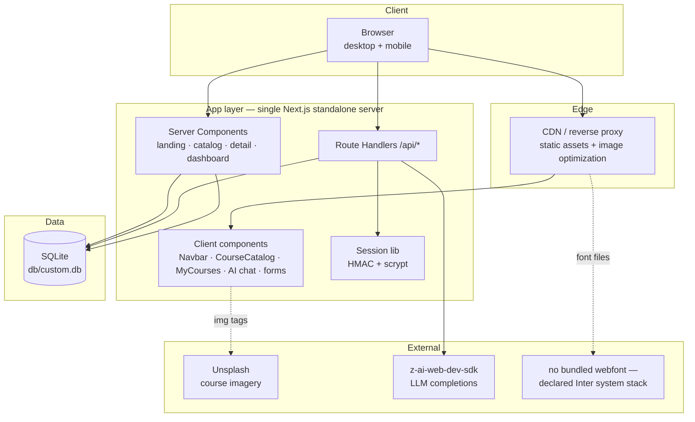

# NexusLearn — Master Project Architecture Document (PAD) v1.0

**Classification:** Internal Engineering Reference
**Status:** DEFINITIVE, PRODUCTION-LOCKED BLUEPRINT
**Companion Documents:** `README.md` (user-facing), `AGENTS.md` (agent gotchas), `CLAUDE.md` (workflow)
**Last Updated:** 2026-10-02 (session 35)
**Audience:** Senior Engineers, Tech Leads, DevOps, and Onboarding Engineers
**Rule:** Every architectural decision in this document traces to a specific rationale.
Nothing is here "because it's popular."

---

#### Revision Block — v1.0

- `[SYN]` Initial PAD for the NexusLearn clone build, generated after the full pipeline (recon → extraction → design spec → architecture → build → QA convergence) completed with all gates green: 26/26 computed-style assertions, 5/5 unit tests, 16/16 e2e tests, production build passing.
- `[SAN]` Three production defects found and remediated during QA are recorded as ADR-004 (Tailwind v4 HSL triplets), ADR-005 (pinned v3 palette), and §4.4 (SQLite path resolution).
- `[S3]` Session 3 parity pass (see `docs/remediation-plan-session3.md`): 11 residual gaps closed — landing AI section rebuilt as the reference 2-column layout (badge + `<br>` gradient h2 left, 4 glass cards right), instructor section rebuilt with image + floating "$12.5M+ Paid to Instructors" stat + CTA-after-features, pricing cards reworked (rounded-3xl, dark cosmic popular card, desc lines, check icons — landing + /Pricing), /Pricing hero rhythm (pt-16 pb-12) + FAQ single-column stack with CircleHelp icons + the 4 reference Q&As, category grid (sm:3/lg:4 + cursor-pointer overflow-hidden), eyebrows → text-sm spans, learning-path cards → borderless gray surface, newsletter centered 600px blur, hero "Start Learning" → /Courses, nav logo → /Home, login "Need an account? Sign up" single button. Test pyramid now 16 unit + 34 e2e (9 new parity specs, TDD red-first).
- `[S4]` Session 4 parity pass (see `docs/remediation-plan-session4.md`): 14 findings closed — every non-landing page rebuilt on the reference shell (root > `main.pt-20` > `div.min-h-screen.bg-gray-50`; the old shells rendered the /Courses + /Dashboard h1 at y=64 behind the 81px fixed navbar), CourseDetail "About This Course" expandable section (nullable `Course.longDescription`, 4 reference texts, Read More/Show Less toggle), seed imagery corrected (3 course covers + per-instructor avatar map), live lesson-count drift re-captured (Python 178, ML 245, WebDev 380, Business 156 → 1,904 total), hero rhythms (About/Contact/BecomeInstructor pt-16 pb-XX + direct-child blurs), Contact overlapping max-w-6xl container, AI assistant shell rework (max-w-3xl, Sparkles hero icon, min-h-[60vh] flex card, flex-1 messages, textarea composer, px-5 bubbles), nav Home → /Home, 5 footer href fixes, 404 rebuilt as the reference light-slate design with dynamic path. Test pyramid now 21 unit + 50 e2e (16 new session-4 specs, TDD red-first).
- `[S5]` Session 5 parity pass (see `docs/remediation-plan-session5.md`): 28 findings closed — full head parity (ONE root "SkillSphere…" description on every route, OG + Twitter cards, per-route canonicals incl. the CourseDetail query string, `/logo.png` favicon, `manifest.json`, apple web-app metas, viewport aligned to the reference's unlimited pinch zoom), login card rebuilt as the reference 5-view state machine (reset + reset-sent + signup + 6-digit verify views; slate Sign-in button; shadcn Alert errors; logo image with slate glow; OR divider) with three new routes (`/api/auth/signup`, `/api/auth/verify` with `User.emailVerified`, `/api/auth/forgot-password` — simulated email delivery, documented), newsletter converted to a client island (the native form POST navigated the browser to the raw JSON — real bug) with the reference in-place success state, CourseDetail unknown/missing id renders the in-page "Course not found" state (never the 404), EQ card eyebrow display map ("Personal Dev"), Home nav link active on `/` and `/Home`, Pricing FAQ answer paragraph (ml-7 + gray-600), About hero h1 base, BecomeInstructor structure (unwrapped h2s at md:text-4xl, left-aligned benefit cards with border hover, unwrapped CTA section, px-10 buttons). Test pyramid now 24 unit + 68 e2e (18 new session-5 specs, TDD red-first).
- `[S7]` Session 7 parity pass (see `docs/remediation-plan-session7.md`): 22 findings closed — the reference **display order** (the seed array now lists the courses in the live app's stable "Newest" order; ids `seed-1…9` + `sortOrder` follow the array index so the catalog's id-based "newest" sort and the landing featured subsequence both reproduce it), the category grid re-pinned (icons carry the reference's visually-dead `bg-gradient-to-r … bg-clip-text` classes — rendering near-black, with the `/10` tint wrappers carrying the color; Technology uses the monitor icon; tints pink/rose/emerald/violet for Marketing/Personal Development/Programming/AI), the featured section rebuilt as the reference flex header (`flex flex-col md:flex-row md:items-end md:justify-between mb-16` with the left title block + in-header "View All Courses" outline CTA — replacing the centered header + below-grid button), learning-path cards gained `border border-transparent hover:border-gray-100` + per-path icons (TrendingUp for Data Science, Target for Digital Marketing with the amber→orange gradient), the testimonials section redesigned to the reference cards (`relative bg-gray-50 rounded-3xl p-8 … hover:shadow-xl` + `lucide-quote h-10 w-10` + `img.w-11` avatar rows; order Sarah → Elena → Marcus with Elena's reference avatar), the landing button bases re-pinned (every button carries the shadcn `disabled:pointer-events-none disabled:opacity-50 [&_svg]:pointer-events-none [&_svg]:size-4 [&_svg]:shrink-0` trio + `hover:bg-primary/90` on gradient variants — hero, AI CTA, instructor CTA, pricing cards, path buttons, and the featured-header outline button), the Courses filter card (leading `lucide-sliders-horizontal` icon + `SelectTrigger` rebased on the v3-era reference string with `h-4 w-4` chevron — shared by /Contact), the level badge as a plain DIV with emerald Beginner + the reference class order, the CourseDetail lessons stat (CirclePlay), the Pricing page (hero h1 `text-3xl` base, FAQ `lucide-circle-help` inline SVG, plan buttons on the reference base), the Contact form (labels with the peer-disabled pair, `min-h-[60px]` textarea, the reference gradient Send button with the send icon, bare `text-gray-500` info anchors, `text-3xl` hero), the About stats (bare grid inside a `max-w-7xl` wrapper, `font-medium` labels), the BecomeInstructor hero (`text-3xl md:text-5xl`, 2-stop gradient text, Video icon, `font-bold text-lg` benefit h3s), the AI composer (`hover:bg-primary/90` + `[&_svg]` trio, `h-5 w-5` send icon) and the login Google icon (wrapped in the reference `div.-ml-4`). Mobile menu re-verified on both sites (no Tailwind v4 display bug; ARIA + scroll lock + route-close + Escape all green). Test pyramid now 32 unit + 107 e2e (22 new session-7 specs + 3 order unit tests, TDD red-first).
- `[S6]` Session 6 parity pass (see `docs/remediation-plan-session6.md`): 13 findings closed — per-route OG identity (og:title + twitter:title mirror the document title, og:url mirrors the canonical incl. the CourseDetail `?id=` query — new `routeMetadata()` helper in `src/lib/metadata.ts`; child openGraph/twitter objects replace the root's wholesale in Next.js, so the helper restates the full payload), CourseDetail "What You'll Learn" sidebar level row (`mt-6 pt-6 border-t` divider > Award icon text-amber-500 + "{level} Level" — every course), /Pricing cards overlap (`div.-mt-8` > `section.py-24.px-4.bg-gray-50`, desktop now byte-exact 2369), /Courses hero search input (`h-9` + `py-6` border-box collapse → reference 50px, type=text, `file:text-foreground`) + catalog fragment (hero/content are the gray wrapper's direct children), landing hero `min-h-[100vh]` + the reference classless main wrapper + grid bases (featured `grid-cols-1`, learning paths `lg:grid-cols-3` — was md, testimonials `grid-cols-1`), AI welcome bubble `py-16` + chat card without `overflow-hidden` (desktop byte-exact 1573), Enroll Now button verbatim shadcn base (`[&_svg]` trio, `hover:bg-primary/90`, `disabled:opacity-50`), card level badge variant classes (`hover:bg-primary/80 border-0`). Lesson counts re-verified (1,904 — no drift); mobile menu re-verified on both sites (no Tailwind v4 display bug). Test pyramid now 29 unit + 85 e2e (17 new session-6 specs + 5 metadata unit tests, TDD red-first).
- `[S8]` Session 8 parity pass (see `docs/remediation-plan-session8.md`): 3 findings closed — **seed idempotency** (Prisma's `update` skips undefined keys, so the session-7 reorder left the pre-reorder `longDescription` texts on seed-3/4/5 in BOTH `db/custom.db` and `db/e2e.db`, surfacing as phantom "About This Course" sections with the wrong texts — Cloud +203px / Business +203px / EQ +177px desktop drift; `prisma/seed.ts` now restates `longDescription: c.longDescription ?? null`, and the About-presence e2e matrix across all 9 courses guards it), the **tags-only "What You'll Learn" list** (the level rendered TWICE on the clone — once as the appended check row from the session-3 `whatYouLearnTopics()` helper and once in the session-6 Award divider; the live check list carries parsed tags ONLY with the level once in the divider — helper removed, CourseDetail uses `parseTags`), and **Dashboard class parity** (the bare reference stats grid without the `dashboard-stats` hook class, lucide-react stat icons `book-open/circle-play/award/trending-up` replacing hand-inlined svgs, and the MyCourses empty-state buttons on the shadcn base trio + `hover:bg-primary/90`). Both databases re-seeded and verified; desktop CourseDetail heights back to +1px; mobile menu re-verified on both sites (full battery — no Tailwind v4 display bug). Test pyramid now 31 unit + 122 e2e (15 new session-8 specs + the longDescription matrix unit guard + the topic-list spec re-pointed, TDD red-first).
- `[S9]` Session 9 parity pass (see `docs/remediation-plan-session9.md`): 6 findings closed — the **Tailwind v4 space-y engine trap** (v4 rewrote the space-y/space-x selector: v3's `.space-y-1 > :not([hidden]) ~ :not([hidden]) { margin-top }` at specificity (0,2,0) OVERRIDES a child's `.mt-3`, while v4's `:where(.space-y-1 > :not(:last-child)) { margin-block-end }` at ZERO specificity lets the child's `.mt-3` WIN — so any space-y container with an explicit-margin child renders different gaps despite byte-identical classes; the one case in this app was the mobile nav panel CTA `block mt-3`, which resurrected as a 12px gap + an 8px taller panel (413 vs the reference 405) — the clone now ships `block` without the mt-3, rendering the reference 4px gap and 405px panel, pinned by the session-9 e2e specs), plus the **navbar chrome drift** discovered via a NEW chrome-subtree (nav + footer) class diff the earlier `main *`-scoped audits could never catch: the desktop + panel "My Dashboard" buttons re-pinned with the shadcn base trio + `hover:bg-primary/90` (the live navbar received the same button-base sweep the landing got in session 7), the mobile trigger aligned to the BARE reference strings (`md:hidden p-2 rounded-lg text-white/80` / `text-gray-700` — the clone's hover/transition utilities removed; the ARIA wiring stays as documented a11y hardening), and the logo span normalized to the reference byte order. Test pyramid now 31 unit + 128 e2e (6 new session-9 specs, TDD red-first; 122 → 128).
- `[S10]` Session 10 parity pass (see `docs/remediation-plan-session10.md`): 2 findings closed — the **`/Home` hero-state navbar** (the live app renders `/Home` — the reference footer target — with the FULL landing hero treatment: `bg-transparent` navbar + `text-white` logo + `text-white/80` mobile trigger at scroll 0, flipping to the `bg-white/95` white-nav after scroll, byte-identical to `/`; the clone's `overHero` detection in `Navbar.tsx` covered only `/`, so `/Home` shipped the white-nav state at scroll 0 — fixed to cover both routes, pinned by 4 session-10 e2e specs incl. the scroll-flip and the mobile panel geometry on `/Home`), and the **404 wrapper hardening pin** (the live 404 ships a landmark-less `div.min-h-screen` inside `#root` with no nav/footer; the clone deliberately keeps the `main` landmark + the `min-h-dvh` page-root form per the documented URL-bar-warp hardening doctrine — the decision is now recorded in the component docblock AND pinned by a session-10 spec so a future chrome audit cannot "fix" it backwards). Audit-methodology addition: height sweeps must set BOTH agent-browser sessions' viewports in the same command (an initial CourseDetail sweep compared live@1920 vs clone@375 and produced a false +1300…+3300px drift). Test pyramid now 31 unit + 133 e2e (5 new session-10 specs, TDD red-first; 128 → 133).
- `[S11]` Session 11 parity pass (see `docs/remediation-plan-session11.md`): 3 findings closed via TWO new audit surfaces — the **visible-text content diff** (normalized `innerText` over `main` per route; catches copy + glyph drift that height and class sweeps structurally cannot) and **per-view state diffs** of the login card's 5 views. (1) The landing's Digital Marketing Pro learning-path card description drifted (`page.tsx` `LEARNING_PATHS[2]` shipped the pre-session-3 copy; the live string restored). (2) The testimonial quotes rendered typographic U+201C/U+201D via `&ldquo;`/`&rdquo;` entities where the live renders ASCII U+0022 (measured `charCodeAt` 8220/8221 vs 34/34). (3) **The login card-interior ownership**: the live 5-view state machine owns the WHOLE card interior — on reset/reset-sent/signup/verify the logo ring, h1, Google button and OR divider are ALL absent (each view is the card body, `div.w-full`-wrapped); the clone statically rendered the signin chrome around every view. The chrome moved into `LoginForm`'s signin branch (`login/page.tsx` is now the thin card shell), the non-signin views gained the `div.w-full` wrapper, and the reset email input got its own `text-base` variant (`RESET_INPUT_CLS` — the signup inputs keep `text-sm sm:text-base`, confirmed against the live DOM). Also NEW audit surface: the **breakpoint-zone sweep** (640/767/768/1024/1279/1280 — the trigger↔desktop-row flip happens at exactly 768px on both sites, grid columns flip identically; NO Tailwind v4 breakpoint bug). Test pyramid now 31 unit + 141 e2e (8 new session-11 specs, TDD red-first; 133 → 141).
- `[S12]` Session 12 parity pass (see `docs/remediation-plan-session12.md`): 1 High finding closed via TWO new audit surfaces — the **computed box-shadow + border-radius sweep** (walk every visible element per route, bucket the computed values, diff live vs clone) and the **hover-state computed-style diff** (Playwright-only: v4 wraps `hover:` variants in `@media (hover: hover)`, so touch-emulating headless sessions produce false negatives). **The Tailwind v4 shadow-scale shift (the FIFTH v4 trap)**: v4 renamed v3's `shadow-sm` (0 1px 2px rgb(0 0 0/0.05)) to `shadow-xs` and moved `shadow-sm` up to v3's bare-shadow geometry (0 1px 3px/0.1 + 0 1px 2px −1px/0.1) — every `shadow-sm` (the white navbar on every white-nav route, the login buttons, the hero secondary CTA, the ui primitives, 21 usages + every `hover:shadow-sm` incl. the 380-per-course lesson rows) rendered ONE NOTCH heavier with byte-identical classes; class diffs are structurally blind to token-value changes. Fix: the `--shadow-sm` token pin in `globals.css` `@theme inline` (the ADR-005 palette-pin precedent — one line, zero class changes); md/lg/xl/2xl were verified UNCHANGED and are pinned by GUARD specs. Also verified at parity (no action): `prefers-reduced-motion` (neither site ships an override), AI-chat streaming (the live's own chat is a one-shot `InvokeLLM` XHR rendering the complete answer in one frame), `rounded-sm` (both sites render 4px), the CourseDetail price card + lesson rows (identical shadows/radii like-for-like), and the v4 form variances (oklab color strings for alpha-modified colors, `calc(infinity*1px)` rounded-full, the empty shadow-composition slots, the 4-property `transition-transform` — all computed-identical to the reference). Dev-origins hardening: `next.config.ts` now carries `allowedDevOrigins: ["127.0.0.1"]` (Next 16's dev-origin protection was blocking dev chunks for the 127.0.0.1 origin — silent no-hydration; production unaffected). Test pyramid now 31 unit + 147 e2e (6 new session-12 specs, TDD red-first; 141 → 147).
- `[S13]` Session 13 parity pass (see `docs/remediation-plan-session13.md`): 3 findings closed via TWO new audit surfaces (both suggested by the session-12 transcript) — the **focus-ring parity sweep** (keyboard-focus every interactive element type, diff the computed ring/outline state) and the **scroll-behavior / scroll-reveal comparison**. (1) **The login inputs' focus-ring cascade flip (High)**: the reference (Tailwind v3 + the Base44 runtime) injects a page-level utility sheet AFTER its static build; on /login that sheet re-asserts `.focus:ring-slate-400:focus` at a later cascade position, winning `--tw-ring-color` over the static `.focus-visible:ring-ring` whenever both pseudos match — the reference's login inputs render a SLATE-400 keyboard-focus ring. The clone's single v4 sheet emits the focus-visible variant later, so the ring rendered near-black (`--ring`). A cascade-ORDER variance — byte-identical classes, invisible to class diffs (the third structural-blind-spot class, after the session-12 token VALUES and the session-13 nesting). Fix: the UNLAYERED cascade pin in `globals.css` (`.focus\:ring-slate-400:focus { --tw-ring-color: var(--color-slate-400); }` — unlayered beats every @layer rule; the selector matches only the login inputs' class strings). GUARD specs prove /Courses, /Contact and every button keep the `--ring` ring. (2) **The signin-view DOM nesting (Medium)**: the live ships `div.w-full > [div.space-y-3 (the Google button ONLY), the OR divider, the form]`; the clone nested the OR divider + form INSIDE the space-y-3 — the 24px gaps matched only by margin collapse (a latent v4 `:where()` space-y trap). Restructured to the reference nesting (byte-identical classes, gaps pinned at 24/24 by spec). (3) **The universal scroll-behavior (Low)**: the reference's runtime ships `* { scroll-behavior: smooth }` (every element computes smooth); the clone only smoothed `html` — the universal rule now lives in `@layer base`, also smoothing programmatic scrolls inside inner scrollers (Radix SelectContent keyboard nav). Audit-methodology additions: the UA-default `outline: auto` computes dynamic values (never probe it for parity); `transition-all` elements render focus rings mid-transition on immediate reads (wait ≥ 2× the duration); v4's ring composition prefixes empty slots (full-string reads required). Verified at parity (no action): the /Courses + /Contact form-control rings, every button ring, the nav links, html scroll-behavior + scroll-reveal (zero offscreen-hidden elements on either site). Test pyramid now 31 unit + 155 e2e (8 new session-13 specs, TDD red-first; 147 → 155).
- `[S14]` Session 14 parity pass (see `docs/remediation-plan-session14.md`): 7 findings closed via THREE new audit surfaces (suggested by the session-13 transcript) — the **print stylesheet comparison**, the **`::selection`/cursor/caret sweep**, and the **computed font/line-height surface + per-element space-y sibling-gap audit**. (1) **The rendered font differed — the reference ships NO webfont (High)**: `document.fonts` is empty on every live route (the Base44 runtime declares `body { Inter, system-ui, -apple-system, sans-serif }` inline but loads no @font-face — every visitor renders their system font); the clone's next/font Inter bundle rendered real Inter glyphs the reference never shows. This was the ROOT CAUSE of every documented "font-metric height band" (the −30/−49/−29 desktop and −299/−121/−46/−45/−22/−58/−22/−44 mobile bands, the CourseDetail +1/−25 bands) — after the fix (unbundling next/font + the `--font-sans` token in `@theme`), EVERY height measurement in the project is byte-exact for the first time: 11 routes × 2 viewports + all 9 CourseDetail pages. (2) **The v4 button-cursor preflight drop (High — the SIXTH v4 trap)**: v4 removed v3's `button, [role="button"] { cursor: pointer }` — 42 default-cursor elements on the clone's landing vs ZERO on the reference; restored in `@layer base` (a preflight delta is the FOURTH structural-blind-spot class with byte-identical classes). (3) **The line-height composition flip (High — the SEVENTH v4 trap)**: on elements carrying BOTH a responsive `text-*` and a plain `leading-*`, v3's variant-block emission makes the SIZE utility's own line-height win (hero H1 lh 1, hero P 1.75rem, CTA H2 1) while v4's `--tw-leading` composition makes `leading-*` win (1.25/1.625 — 90px vs 72px line boxes); four unlayered media-scoped pins restore the reference winners. (4) **The dead popular-card scale (High — the NINTH v4 trap + a session-13 record correction)**: the reference's scroll-reveal system pre-hides 35 landing elements (inline `opacity: 0; transform: translateY(20px)`) and, once revealed, leaves inline `transform: none` FOREVER — permanently killing the popular pricing card's `scale-105` (both live cards render unscaled, 498px); the clone applied v4's standalone `scale: 1.05` (5% larger). The unlayered `.scale-105 { scale: none }` pin replicates the resting state (hover variants untouched, GUARD-pinned). CORRECTION: session-13's "zero offscreen-hidden elements" record was wrong — the reveal system exists and fires on scroll; the entry ANIMATION stays a documented variance (end states match). (5) **The skills/docs/tests CSS leak (Medium)**: Tailwind v4's automatic source detection scanned the repo's agent documentation (283 class-bearing skills/ files + docs/ + tests/) and generated 1027 unused utility rules — 51% of the compiled sheet (canaries: the `.selection:bg-red-200` demo string from `skills/gift-evaluator/html_tools.py`); the `@source not` directives in `globals.css` restrict generation to app source (157KB → 82KB production CSS). (6) **The inline-label space-y gap loss (Medium — the EIGHTH v4 trap)**: v4's `:where()` engine assigns gaps to NON-LAST children as `margin-block-end` — INERT on the login form's inline `<label>`s (the 6px gap vanished; each field group 6px short, mobile /login −12px); a scoped follower-margin pin restores it. (7) **The overridden back-button gap (Medium — the TENTH v4 trap)**: a child's own margin utility replaces the `:where()` gap carrier (the login card's `-mb-2` back-button replaced the 16/24px header gap with −8px, pulling the view heading into the button on the signup/reset/verify views — desktop masked by the h-screen viewport clamp); the `-mb-2`-scoped follower pins restore the reference gaps. Verified at parity (no action): print (zero `@media print` rules on either side; print layout = screen layout), ::selection (inert everywhere — the live's 8 runtime-preset /login rules match nothing; accepted variance), caret-color (the documented `--ring` micro-delta family), cursor specials, user-select, the login signin/reset-sent views. Test pyramid now 31 unit + 171 e2e (16 new session-14 specs, TDD red-first; 155 → 171).
- `[S15]` Session 15 parity pass (see `docs/remediation-plan-session15.md`): 3 findings closed via TWO new audit surfaces (suggested by the session-14 transcript) — the **scroll-reveal ENTRY animation characterization** (frame-resolution curve sampling, per-route target inventories, stagger + mount + remount probes) and the **forced-colors / accessibility rendering sweep**. (1) **The scroll-reveal ENTRY animation — the last documented visible behavioral variance (High)**: the live (framer-motion, confirmed in its bundle) pre-hides **103 reveal targets** across 9 routes with inline `opacity: 0; transform: translate…` styles at mount — `/` 40, `/Courses` 12, `/Pricing` 10, `/About` 12, `/Contact` 6, `/BecomeInstructor` 13, `/AIAssistant` 3, `/Dashboard` 5, `/CourseDetail` 2, `/login` 0 — and **34 of them are classless motion-wrapper divs the clone had been missing for 14 sessions** (invisible to class-set diffs: the hero badge, the 7 category + 6 featured + 9 catalog card wrappers, the AI/BI section badge wrappers, the newsletter title, the /Contact info cards, the /BI hero CTA, the /Dashboard heading block, the /CourseDetail badge + price card). Measured families: A "snappy" (op ~310ms ease-out + transform spring ζ=0.561/ωn=27.1 — settle ~280ms, 12% overshoot to −2.4px), B "floaty" (op ~310ms + a slow back-loaded transform ease ~728ms, no overshoot), HERO (the `/` hero's 5 blocks — coupled ~735-770ms from y=30, staggered), FAQ (slower coupled ~500-610ms from y=10), X (±30px springs, 7-12% overshoot); sibling cards stagger ~100ms; only in-view targets reveal at mount (the /About values cards wait for scroll — an earlier mount-animated reading was a transcription error, corrected during GREEN); newly-mounted catalog cards re-reveal on search/filter (the live's remount); the end state is inline `opacity: 1; transform: none;` forever. Fix: SSR pre-hide styles (`data-reveal` + style props) + `src/components/reveal/RevealController.tsx` — a zero-dependency WAAPI controller whose keyframe tables are baked from the measured curves (per-parent sibling stagger, any-pixel IO, MutationObserver for remounts); the 34 classless wrappers added for structural parity; the controller mounts on EVERY render branch (a first-implementation bug shipped it on only one of /CourseDetail's two branches — the main render's targets stayed hidden forever; caught by the side-by-side inventory probe, pinned by spec). (2) **The post-gate worklog CSS leak (Medium)**: the session-14 worklog entry (written after the final e2e gate ran) quoted the `.selection:bg-red-200` canary; the repo-root `worklog.md` was the ONE root markdown file missing from the `@source not` set — the shipped session-14 tree failed its own leak spec (170/171 at the session-15 baseline). Fix: `worklog.md` joins the exclusion set + the process rule (the leak spec re-runs LAST, after every doc write). (3) **Forced-colors/contrast/inverted/dark-scheme emulations: VERIFIED AT PARITY** (every probe IDENTICAL — neither site ships a single forced-colors or contrast rule; the rendering is pure UA behavior on both). Verified at parity (no action): every standing surface re-swept GREEN at the byte-exact state — desktop/mobile heights ×11, CourseDetail ×9, class diffs, the space-y sweep, text diffs ×4, the full mobile-menu battery, the computed shadow sweep (46 documented pairs), the session-13 focus-ring pin; and the reveal system itself moved no layout (the height state stayed byte-exact through the 34 wrapper additions; GUARD-pinned). Test pyramid now 31 unit + 193 e2e (22 new session-15 specs, TDD red-first — 19/21 verified failing pre-fix; 171 → 193).

- `[S16]` Session 16 parity pass (see `docs/remediation-plan-session16.md`): 6 findings closed via TWO new audit surfaces (suggested by the session-15 transcript) — the **scroll-position-restoration / navigation-transition sweep** and the **performance surface (LCP/CLS/bundle-size)**. (1) **Back/forward scroll restoration: the reference snaps INSTANTLY, the clone GLIDED (High)**: the reference is a CSR SPA whose router never calls scrollTo — popstate restoration is the browser-native instant snap (10+ observations, zero misses); the clone's Next.js App Router restores via `window.scrollTo` after the route re-render commits, which the session-13 universal `* { scroll-behavior: smooth }` pin turned into a ~0.9-1.5s glide (reproduced on dev AND the production build), plus a dev-server restore-to-0 race when the navigation click fires mid-smooth-scroll (the reference restores correctly under identical conditions). Fix: `src/components/ScrollRestoreNormalizer.tsx` + the scoped unlayered `html[data-scroll-restore], html[data-scroll-restore] * { scroll-behavior: auto }` rule — the popstate window suppresses smooth so the restoration snaps like the reference while every other programmatic scroll keeps the pinned smooth behavior (the listener lands after Next.js's own but Next issues its scrollTo only in a post-commit effect, so the suppression is always in place first; verified by prototype before implementation). (2) **The reference's unmanaged in-app navigation scroll carryover (Medium — deliberate-better decision)**: the reference NEVER resets scroll on any in-app navigation (the position carries over, clamped by the new page's CSR loading shell ≈1573px — measured: `/`@2000 → /Courses lands 493, `/`@500 → /Courses 493, `/`@2000 → /AIAssistant 493, /Courses@800 → CourseDetail 492, `/`@7000 → /Pricing 1289); the clone keeps Next.js's managed reset-to-top (exact shell-clamp replication is impossible without faking the CSR loading shell, and the reference behavior lands users mid-page) — the unhardened-reference family, pinned by spec. (3) **The stale `document.title` on soft-nav (Medium — deliberate-better decision)**: the reference's router NEVER updates the title on soft navigation ("NexusLearn" after nav to /Pricing, /Courses, /About — fresh-load titles correct on both); the clone keeps the per-route update, pinned by spec. (4) **Focus after soft-nav (Low — documented)**: the reference keeps focus on the clicked link; the clone resets to body (the a11y-correct pattern). (5) **Reload scroll restoration (Low — accepted structural variance)**: the reference lands at 0 (CSR shell too short to restore); the clone restores natively (SSR full height) — the CSR/SSR family. (6) **Performance surface: VERIFIED AT PARITY** — CLS 0.0000 on BOTH sites on every probed route; the clone's production LCP/FCP comparable-or-better (1760/840 vs 1892/1000 on /, 712/196 vs 1076/800 on /Courses, 176/176 vs 1140/908 on /login, 800/244 vs 1236/1028 on /CourseDetail); resource mix structural (1 cached CSR bundle + XHR vs 12-15 code-split chunks + RSC prefetches). Verified at parity (no action): every standing surface re-swept GREEN at the byte-exact state (heights ×11 ×2, CourseDetail ×9, class diffs incl. the NEW open-menu class diff — the CTA's live-only `mt-3` re-confirmed as the documented session-9 dead-class decision, the space-y sweep, text diffs, the full mobile-menu battery, the shadow sweep, the focus pin, the reveal inventory COUNT-MATCH ×10) + the reveal system's back-nav re-animation IDENTICAL on both sites + the restoration battery (instant, correct positions, race-free) + the smooth rule preserved outside popstate. Also fixed: a session-15 spec flake (the pre-hide style-string probe could land in the SSR→normalized serialization gap — both serializations now accepted; the pin's intent unchanged). Test pyramid now 31 unit + 198 e2e (5 new session-16 specs, TDD red-first — 1 verified failing pre-fix, 4 green-by-design pins/guards; 193 → 198).
- `[S17]` Session 17 parity pass (see `docs/remediation-plan-session17.md`): 4 findings closed via THREE new audit surfaces (suggested by the session-16 transcript) — the **deep-link / query-parameter surface**, the **form-state persistence sweep** and the **print-to-PDF comparison**. (1) **Duplicate `?id=` keys crashed the clone's CourseDetail (High)**: Next.js App Router delivers a repeated search param as `string[]`; the naive `const { id } = await searchParams` passed the array to `prisma.course.findUnique` and rendered the production error boundary ("This page couldn't load", empty title) — BOTH `?id=<real>&id=x` and `?id=x&id=<real>` orders. The reference's `URLSearchParams.get` semantics take the FIRST value (the real-id-first order renders the course; the unknown-first order renders the in-page not-found state). Fix: the explicit `firstId()` normalization (`Array.isArray → [0]`) in BOTH the page and `generateMetadata` (`src/app/CourseDetail/page.tsx`), with the searchParams type widened to `string | string[]` to match what Next.js actually delivers. (2) **The landing's category hrefs used HYPHEN slugs where the reference uses UNDERSCORES (High)**: the reference's Personal Development / AI & Innovation cards deep-link to `?category=personal_development` / `?category=ai_innovation`; the clone linked `personal-development` / `ai-innovation` (probed from both landings' href lists — byte-diff on exactly those two; the other five match). On the reference the hyphen forms are UNKNOWN filters (0 cards). Fix: the two `CATEGORIES` slugs in `src/app/page.tsx` + the matching `CATEGORY_SLUGS` keys in `src/components/CourseCatalog.tsx`. (3) **Unknown `?category=` slug semantics (Medium)**: the reference maps the slug through its case-sensitive slug→name lookup; an unmapped slug leaves the filter in a NO-MATCH state (empty select trigger — the Radix placeholder state with an empty placeholder — 0 cards, "No courses found"); the clone's defensive fallback showed "All Categories" + 9 cards. An absent or EMPTY value (`?category=`, bare `?category`) is "all" on both. Fix: the raw-mapping initial state (`CATEGORY_SLUGS[x] ?? ""`) + the `SelectValue` placeholder `""` ("All Categories" renders via the `all` SelectItem itself, never the placeholder). (4) **Route-casing family (Medium)**: the reference's Base44 router matches every content route CASE-INSENSITIVELY (`/courses`, `/COURSES`, `/cOurSes`, `/home`, `/pricing` … all render, URL preserved, titles derived from the RAW path — "COURSES \| NexusLearn", "C Our Ses \| NexusLearn", artifact-grade); `/login` is EXACT-match (its variants 404 — a platform-level route outside the app's table); the reference's nav active-state is case-insensitive. The clone (Next.js case-sensitive) 404'd every variant. Fix: `src/proxy.ts` (the Next 16 `proxy` convention — `middleware.ts` is deprecated in 16.3) — a case-insensitive REWRITE over the nine content routes (URL preserved, never a redirect; `/login` deliberately excluded; unknown paths pass through to the 404) + the Navbar's case-insensitive `isActive`. Deliberate-better: canonical titles/canonicals on case variants (the reference's raw-path titles are the stale-title family of session 16). VERIFIED AT PARITY (no action): the form-state persistence sweep (the catalog search + the login form's typed values reset identically on navigate-away + back on both sites) and the print-to-PDF comparison (page.pdf() page counts match on `/` 11/11, `/Courses` 4/4, `/Pricing` 3/3 in both fresh and fully-revealed states; the reveal system's IntersectionObserver does not fire during print on either site — below-fold pre-hidden content is absent from the PDF on both). Also verified matching: hash fragments (no anchor scroll on either), `?ID=` param casing, extra unknown params, trailing slashes, `?level=`/`?sort=`/`?search=` ignored by the catalog (only `?category=` is read), `/AIAssistant` + `/Dashboard` params ignored, the no-results DOM byte-identical. Every standing surface re-swept GREEN at the byte-exact state (heights ×11 ×2 — the proxy moved no layout; class diffs; the space-y sweep; text diffs; the full mobile-menu battery; the shadow sweep; the focus pin; the reveal inventory COUNT-MATCH ×10). Test pyramid now 31 unit + 214 e2e (16 new session-17 specs, TDD red-first — 13 verified failing pre-fix, 3 green-by-design guards; 198 → 214).
- `[S18]` Session 18 parity pass (see `docs/remediation-plan-session18.md`): 7 findings closed via THREE new audit surfaces (suggested by the session-17 transcript) — the **error/empty-state sweep (API failure modes)**, the **keyboard-navigation/element-tag pass** and the **data-mutation deep-dive** — plus the **form-control attribute surface** and the **per-route token map** discovered during the failure-UX probing. (1) **The /Contact message placeholder drifted (High)**: the live ships `placeholder="Tell us how we can help..."`, the clone "How can we help you?" — visible in every empty-form render yet invisible to every previous surface (placeholders are ATTRIBUTES: innerText diffs read rendered text nodes only, class diffs read `class` only). (2) **The AI chat loading bubble differed (High)**: the live renders a spinning `lucide-loader-circle` + "Thinking..." text in a `px-5 py-3 flex items-center gap-2 text-gray-400` bubble; the clone shipped three `animate-bounce` dots in a `px-4 py-3` bubble — a TRANSIENT state (exists only while the request is pending) that every settled-DOM audit structurally cannot see; the same family as the session-11 per-view lesson. (3) **The /Pricing CTAs were double-focusable Link-wrapped buttons (High)**: the live's three card CTAs are bare INERT `<button>`s (network-verified — no navigation); the clone's `next/link` wrappers made each CTA TWO tab stops (anchor + nested button) and navigated to /login. Element TAGS are invisible to class diffs (an `<a>` styled exactly like a `<button>` passes every class-set diff) — a new structural-blind-spot family. The `<Link><button>` nest on the landing and other routes is reference-matched (only /Pricing diverges). (4) **The newsletter + contact PENDING labels (Medium)**: the live's buttons replace their ENTIRE content with the literal `...` / `Sending...` (three ASCII periods, charCodes 46,46,46 — byte-verified, not the U+2026 ellipsis glyph; no icon) while disabled in flight; the clone kept the full labels. (5) **The /login ZINC token theme (Medium)**: the Base44 runtime injects PER-PAGE token sheets — 10 of 11 routes carry the shadcn NEUTRAL theme (byte-equal to the clone's `:root`), but /login alone carries ZINC (`--ring: 240 10% 3.9%` → the card buttons' focus rings render `rgb(9,9,11)` vs `rgb(10,10,10)`; the same 1-3 sRGB-unit family as the ADR-005 palette pin). Fix: the `body:has(main[data-login-theme])` zinc block in `globals.css` (media-wrapped to light scheme; body-level custom properties cover the navbar + card + footer like the live's document-level sheet). (6) **The instructor portrait alt (Low)**: the live ships `alt=""` (decorative — the name is in the adjacent paragraph); `alt={instructorName}` made screen readers announce the name twice. (7) **The catalog search input type (Low)**: the live's input carries NO type attribute (the session-6 `type="text"` note was stale). VERIFIED AT PARITY: the login wrong-credentials error ("Invalid email or password" both), the native HTML5 validation on both forms, the newsletter success swap, the select dropdowns' rendered values, the tab order on every route, the tag/attribute surface on all other routes, the reference dashboard's EMPTY state (VLM-verified against `docs/nexuslearn-template-dashboard.png`). DELIBERATE-BETTER (documented + spec-pinned): the clone's explicit AI-chat error bubble + retryable newsletter/contact buttons (the live's failures leave PERMANENTLY-STUCK "Thinking..."/"..."/"Sending..." states — its contact endpoint never completes on ANY submit, verified at +15s) and the fully-functional enrollment flow (the live's "Enroll Now" is INERT — a real click fires only analytics requests; no enrollment, no persistence). Every standing surface re-swept GREEN at the byte-exact state (heights ×11 ×2; class diffs; the space-y sweep; the mobile battery; the shadow sweep; the focus pin incl. the re-verified slate-400 inputs; the reveal inventory COUNT-MATCH ×10). Test pyramid now 31 unit + 231 e2e (17 new session-18 specs, TDD red-first — 11 verified failing pre-fix, 6 green-by-design guards; 214 → 231).

- `[S19]` Session 19 environment-integrity pass (see `docs/remediation-plan-session19.md`): 1 HIGH fix + 1 LOW fix + 3 fresh-eyes audit surfaces (response-headers, viewport-resize, locale/intl formatting — all clean). (1) **The database could be created OUTSIDE the repository (High — the reported bug)**: a shell carrying an ABSOLUTE `DATABASE_URL` export (the sandbox harness injects `file:/home/z/my-project/db/custom.db` into every shell) silently wins over the repo `.env` for both the Prisma CLI and the Next runtime — `db:push` created the database outside the repo, and `dev`/`standalone` failed outright (`Error code 14`) or served zero courses. Reproduced three ways (including a re-verification that corrected an initial false-positive probe — a `grep | head` pipeline had masked the standalone failure). Fix (TDD, 8 new unit specs in `tests/db-url.test.ts`, RED-first): `prisma/db-url.ts` v2 — the **pollution guard** (a RELATIVE `.env` declaration beats an ABSOLUTE shell value; relative shell values like the e2e suite's `file:../db/e2e.db` still win; declared absolute URLs always pass) + the exported `readDeclaredDatabaseUrl()`; the new `prisma/db-cli.ts` wrapper re-exports the `.env` value over the shell value for every `db:*` package script (the CLI never consults db-url.ts). The `.env` file is now the enforced source of truth: `DATABASE_URL="file:../db/custom.db"` → `<repo>/db/custom.db` for CLI, dev, seed, build, standalone and e2e alike, under any polluted shell. (2) **The dev-origin allowlist (Low)**: `allowedDevOrigins` gains the `*.space-z.ai` wildcard (the sandboxed preview proxy family — the same unhydrated-page failure family as the session-12 `127.0.0.1` gotcha). (3) **The /Contact subject SelectTrigger class ORDER (Low — accepted variance)**: the live interleaves the call-site additions, the clone appends them; token sets identical, rendering identical, and the live's own /Courses triggers use the appended form. VERIFIED AT PARITY: every standing surface — heights ×11 ×2 byte-exact (incl. CourseDetail 34246.25/38745 and the /login 762 mobile pin), class diffs (documented variance families only), the FULL mobile-menu battery (405px panel, 8 links, 4px pre-CTA gap, toggle + route-change close, scroll lock, ARIA — **no Tailwind v4 bug**), the dashboard empty state (matching `docs/nexuslearn-template-dashboard.png`), the AI chat end-to-end (SDK answer rendered + captured), the /Courses select triggers byte-identical, response headers (CDN/proxy infra only), viewport-resize (the 768px breakpoint swap identical) and intl number formats. Test pyramid now 39 unit + 231 e2e (8 new db-url specs; 31 → 39).
- `[S20]` Session 20 element-tag drift pass (see `docs/remediation-plan-session20.md`): 2 findings closed via TWO new audit surfaces — the **line-by-line `innerText` comparison** (all 11 routes; blank-line signatures expose tag/structure drift invisible to text-presence checks) and the **tag-of-shared-class map** (for each class string present on BOTH sites, compare the tag set — a one-tag-vs-one-tag mismatch is drift). Both findings are the session-18 element-tag blind-spot family probed one level deeper: identical class strings on DIFFERENT tags are indistinguishable to every class-set diff, height sweep and screenshot (the flex row blockifies `<p>` and `<span>` alike). (1) **The /Courses course-count tag (Medium)**: the live renders `<span class="ml-auto text-sm text-gray-500">` (and `<span class="text-sm text-gray-500">` filtered), the clone rendered the identical classes on a `<p>` — the same layout, but Chrome's `innerText` algorithm gives `<p>` elements DOUBLE line breaks, so the clone's `main.innerText` carried blank lines the live does not have ("Newest / ␊ / 9 courses / ␊ / Beginner"). Fix: `<span>` in `src/components/CourseCatalog.tsx` (the parent flex row blockifies it exactly like the live's own span — computed display block, ml-auto effective). (2) **The /AIAssistant composer wrapper tag (Medium)**: the live wraps the textarea + send button in `<div class="flex gap-3">` (Enter-to-send via a runtime keydown listener — verified with a real Enter keypress; ZERO `<form>` elements in the live's /AIAssistant main), the clone wrapped them in `<form className="flex gap-3" onSubmit>` — and the textarea's own `onKeyDown` already drove Enter (preventDefault), so the form's submit path was dead code. Fix: the `<div>` wrapper + the button's explicit `onClick` (no `type` attribute — the live's form) in `src/components/AIAssistantChat.tsx`. GREEN-phase correction: one pre-existing spec's locator (`p.text-sm` for the count) updated to the tag-agnostic `getByText(/^\d+ courses?/)`. VERIFIED AT PARITY: heights ×11 ×2 byte-exact through the change, innerText 11/11 identical, tag drift 0 on shared classes, the class-set sweep (all 78 diff lines in the documented variance families — the panel-CTA family re-verified down to the byte-identical CTA button strings), the FULL mobile-menu battery (405/404px panel, 8 links, toggle + route-change close, icon swap — **no Tailwind v4 bug**), the landmark/roles structure, the AI chat end-to-end through the Enter-key path (SDK answer), the dashboard. Test pyramid now 39 unit + 233 e2e (2 new session-20 specs, TDD red-first — both verified failing pre-fix for the pinned reasons; 231 → 233).
- `[S21]` Session 21 console-hygiene + a11y-exposure pass (see `docs/remediation-plan-session21.md`): 1 fix + 4 accepted/documented variances via FIVE new audit surfaces — the **console-error surface** (a console listener on every route + interaction flow), the **full a11y-tree snapshot** (`ariaSnapshot()` per route), the **link/image inventory** (href/src/alt/target/rel VALUES), the **pseudo-element sweep** (0 on both sites) and the **SVG class-histogram diff**. (1) **The /Pricing FAQ icons' kebab-case SVG props (Medium — the fix)**: `stroke-width`/`stroke-linecap`/`stroke-linejoin` as JSX props render PERFECTLY (React passes the attribute through) but log three React `Invalid DOM property … Did you mean strokeWidth?` console errors on every dev-server /Pricing load — invisible to every DOM/class/height diff for 20 sessions; the live's console carries zero app-level errors. Fix (TDD): `tests/svg-props.test.ts` (2 specs — the source sweep over every `.tsx` under `src/` + the camelCase pin) RED-first, then the three props → camelCase in `src/app/Pricing/page.tsx` (rendered DOM byte-identical — React maps `strokeWidth` to the same `stroke-width` attribute, pinned by the session-21 e2e FAQ-attribute spec). (2) **lucide-react's aria-hidden default (accepted — the a11y-exposure variance)**: lucide-react 0.525 adds `aria-hidden="true"` to every icon; the live's runtime ships its icons EXPOSED as ~405 NAMELESS a11y img nodes per page (the dominant root cause of the a11y-tree diff — the exposed icons split adjacent text into separate nodes and turn named buttons into unnamed containers). The clone's hidden form is the WCAG-correct deliberate hardening (the same family as the mobile-trigger ARIA + footer-social aria-labels), and the SVG inventory is proven IDENTICAL on every route (per-class histograms byte-exact) — the attribute is the sole svg difference. Pinned by the session-21 e2e sweep spec (every svg hidden via self or wrapper aria-hidden). (3) **The `<next-route-announcer>` element (accepted — framework infra)**: Next.js's screen-reader route announcer (the `- alert` a11y node) renders on every clone page; the Base44 live has no equivalent. (4) **The /login logo hosting (accepted — platform variance)**: the live serves the logo from its Supabase CDN, the clone self-hosts `/logo.png` — the ASSET is byte-identical (md5). (5) The footer-social aria-labels re-surfaced by the link inventory — already-documented deliberate hardening. VERIFIED AT PARITY: heights ×11 ×2 byte-exact through the fix, innerText 11/11 identical, tag drift 0, the class sweep (all 78 diff lines in the documented families), the FULL mobile-menu battery (405/404px panel, 8 links, toggle + route-change close, scroll lock, ARIA — **no Tailwind v4 bug**), the link + image inventory, the dev console CLEAN after the fix (only the live's platform noise remains in the diff). Test pyramid now 41 unit + 236 e2e (2 unit + 3 e2e new, TDD red-first for the defect specs; 39+233 → 41+236).
- `[S22]` Session 22 interaction-modality + persistence pass (see `docs/remediation-plan-session22.md`): ZERO source defects — the audit's five newest fresh-eyes probe families (the **keyboard Tab-order inventory** with static + REAL Tab-key walks, the **storage surface** (localStorage/sessionStorage/cookie inventory), the **network-request surface** (fetch/XHR per route), the **media-emulation sweep** (prefers-reduced-motion / dark-scheme / print) and the **text-scaling surface** (root font-size 16→20→24px)) closed the last never-probed interaction surfaces, and every one came back at parity or deliberate-hardening: (1) **the keyboard Tab order is IDENTICAL on every probed surface** — desktop `/` + `/login` walks byte-matched, the mobile closed-panel walk byte-matched (trigger → first body link on BOTH sites), the Tab-after-open sequence byte-matched, and focus-after-close returns to the trigger on both sites; the collapsed mobile panel (grid-rows-0fr + overflow-hidden + opacity-0) is empirically NOT tabbable in Chromium — **no invisible-focus bug** (previously an assumption, now verified + pinned); (2) **the form-control accessible-name hardening family (accepted — documented + pinned)**: the clone's /Courses search input + three filter selects, AI composer textarea + icon-only send and newsletter input carry STABLE aria-labels where the live names by PLACEHOLDER (vanishes on input) or by select VALUE (mutates with state) — the WCAG-robust form, same family as the mobile-trigger ARIA; pinned so no future session "fixes" it into drift; (3) **Escape-to-close on the mobile menu (accepted — the live keeps its panel open on Escape; the clone closes it, geometry-verified through the collapse transition; the existing spec already pins it)**; (4) **the `nextjs-portal` dev-mode Tab stop (accepted — Next.js DevTools chrome AFTER the last app focusable; ABSENT in the standalone production build, walk-verified — same family as the route announcer)**; (5) **the storage surface (verified — pinned)**: the clone persists ZERO localStorage/sessionStorage entries on every route with the session exclusively in the HttpOnly `nexus_session` cookie; the live persists 8 base44 platform keys + mixpanel session keys (platform infra); (6) **the network surface (verified)**: the live fires 3–6 client-side XHR calls per route (its entities API + app-logs + analytics); the clone fires ZERO on load — all data server-rendered through Prisma (architecture variance); (7) **the media-emulation sweep (verified — pinned)**: under reduced-motion, dark-scheme AND print, NEITHER site changes any probed computed style (both fixed-light, print-unstyled, motion-unadapted — the parity contract is frozen by spec); one cosmetic computed-slot variance documented (the live's `animation-duration: 0.5s` with `animation-name: none` vs the clone's `0s` — no animation runs on either site); and (8) **the text-scaling surface (verified)**: body heights byte-identical between the sites at 16px AND 20px (125%) on all 5 probed routes with equal ratios at 24px (150%) except a single 1px rounding flip on `/` (11394 vs 11395 — sub-pixel rounding boundary, not structural drift). METHODOLOGY (gotcha 51): the REAL Tab-key walk is ground truth — checkVisibility({checkOpacity})-filtered inventories falsely drop the live's pre-reveal opacity-0 controls while unfiltered ones falsely include display:none subtree members; and a child's getBoundingClientRect().height stays >0 inside a collapsed overflow-hidden container (visibility must be measured on the CONTAINER). Test pyramid now 41 unit + 244 e2e (8 new e2e pins, green-by-design guards; 41+236 → 41+244).
- `[S23]` Session 23 security-headers + axe-WCAG pass (see `docs/remediation-plan-session23.md`): the standing parity re-audit GREEN on every surface (heights ×11 routes ×2 viewports byte-exact, innerText 11/11 identical, tag drift 0, class diffs all in the documented variance families, the FULL mobile battery green — the open panel 405px on both sites with IDENTICAL link positions 81/129/177/225/273/321/369/417, the 4px pre-CTA gap present on both (carried by the v3 margin-top engine on the live vs the v4 margin-block-end engine on the clone — the documented session-9 engine variance), **no Tailwind v4 bug**, the console clean) + TWO new probe families. (1) **The HTTP security-headers surface — the session's one remediation**: the live's platform layer (Cloudflare + Caddy) ships `strict-transport-security: max-age=31536000`, `referrer-policy: strict-origin-when-cross-origin` and `x-content-type-options: nosniff` on every response; a bare Next.js app ships none — the baseline set now ships IN the app via `headers()` in `next.config.ts` (plus `x-frame-options: SAMEORIGIN` and a `permissions-policy: camera=(), microphone=(), geolocation=()` deny-list; HSTS is inert over plain HTTP and activates behind TLS; NO CSP this session — the nonce middleware pattern is documented future work), pinned by an e2e spec (deliberate-better hardening, same family as the ARIA/scroll-lock/Escape additions). (2) **The axe-core WCAG surface (the sixth a11y probe family, the session-22 suggested direction)**: color-contrast + heading-order violations are the REFERENCE'S OWN DESIGN (identical node counts live-vs-clone on every route — 371 gray lesson-row icons + the line-through `$149.99` + one gray caption on CourseDetail, 1 node on the marketing routes, 0 on /login); the live fires `link-name` (its 4 footer social links) + `button-name` (its icon-only AI send button) — ZERO on the clone, the aria-label hardening family now QUANTIFIED by axe; pinned by three e2e specs (the accessible-name guard, the reference-design rule-set contract {color-contrast, heading-order}, the fully-clean /login scan). METHODOLOGY (gotcha 52): the live's progressive CourseDetail render resurfaces under axe — a 1000ms settle races a half-rendered page (0 vs 373 nodes, a phantom finding); settle ≥2500ms. Test pyramid now 41 unit + 248 e2e (4 new e2e pins; 41+244 → 41+248).
- `[S24]` Session 24 CSP-nonce + performance/canonicalization pass (see `docs/remediation-plan-session24.md`): the standing parity re-audit GREEN on every surface (heights ×11 routes ×2 viewports byte-exact, innerText 11/11 identical, tag drift 0, class diffs byte-identical to the session-23 baseline report, the FULL mobile battery green — the open panel 405px on both sites with IDENTICAL per-link geometry (y-positions 81/129/177/225/273/321/369/417, heights 44×7+36), **no Tailwind v4 bug**, the console clean) + TWO new probe families. (1) **The performance / web-vitals + resource-inventory surface (the session-23 suggested direction)**: the clone is dramatically faster on every route and metric — TTFB 5–61ms vs the live's 209–575ms, FCP 132–288ms vs 856–1752ms, LCP 544–1292ms vs 876–2128ms (the SSR-vs-SPA architecture difference; the clone's being the better loading story); the 1.1MB logo ships as favicon + login logo on BOTH sites as the byte-identical asset (md5-pinned since session 21 — the reference's own design, do not compress); the `/_next/static` chunks ship the immutable content-hash cache (now spec-pinned against config regressions). (2) **The response-status / URL-canonicalization surface**: the live's SPA platform returns HTTP 200 for EVERY path (trailing-slash variants render directly; unknown routes + /login case variants render the in-app 404 view with raw-path title artifacts); the clone ships the canonical forms — a 308 redirect for trailing slashes and REAL 404 statuses (the SEO-correct deliberate-better family, pinned by three e2e specs so a future audit cannot "fix" them toward the live's 200-for-everything posture). **The session's one remediation — the CSP nonce pattern (the session-23 documented future work)**: neither site shipped a Content-Security-Policy; `src/proxy.ts` now generates a per-request nonce, exposes it on the request headers (Next.js auto-nonces its bootstrap scripts) and ships `script-src 'self' 'nonce-X' 'strict-dynamic'` — per-request nonces are the ONLY script trust root — with the conservative directive set (object-src 'none', base-uri/form-action 'self', frame-ancestors 'self' mirroring XFO SAMEORIGIN, img-src allowlisting images.unsplash.com, style-src 'self' 'unsafe-inline' for the inline style ATTRIBUTES (the reveal pre-hide + the Navbar grid animation), font-src 'self' (no webfonts — session 14), connect-src 'self' (zero client-side data calls — session 22), dev-only 'unsafe-eval' + ws: (HMR), and deliberately NO upgrade-insecure-requests (the standalone template runs plain HTTP locally — the directive upgrades same-origin subresource URLs to https and breaks them; HSTS handles the deployment layer)). The companion fix (gotcha 53): `export const dynamic = "force-dynamic"` in the ROOT layout — static-prerendered pages bake nonce-less HTML at build time where no nonce exists, and under strict-dynamic their scripts BLOCK leaving the pages UNHYDRATED (the spike-verified `/login?` native-submit failure, the gotcha-32 symptom); per-request rendering on every route (incl. /_not-found) lets the nonce reach every script. Verified by the full-route battery (100% nonced scripts + ZERO CSP violations on all 11 routes incl. the 404, the login flow end-to-end, the client islands, the 404's client-router Go Home) and pinned by three e2e specs (header shape, per-request nonce, script nonces + zero violations); TTFB cost measured negligible (11–56ms post-change). Test pyramid now 41 unit + 255 e2e (7 new e2e pins: 3 CSP + 3 canonicalization + 1 static-cache; 41+248 → 41+255).
- `[S25]` Session 25 CSSOM inventory + crawler/SEO-file pass (see `docs/remediation-plan-session25.md`): the standing parity re-audit GREEN on every surface (heights ×11 routes ×2 viewports byte-exact, innerText 11/11 identical, tag drift 0, class diffs byte-identical to the session-24 baseline report via a scripted set-comparison, the FULL mobile battery green — the open panel 405px on both sites with byte-identical per-link geometry, **no Tailwind v4 bug**, the console clean) + TWO new probe families. (1) **The CSSOM inventory surface** — the complete stylesheet STRUCTURE diff (the full custom-property map extending the session-18 six-token probe to every declared var, the `@media` census, the `@keyframes` census, across every sheet incl. runtime-injected ones): ZERO rendered drift; every delta is engine architecture (v4's `@theme` emits every theme value as a CSS custom property — 113 clone-only vars like `--color-amber-500`/`--animate-pulse`/`--blur-xl`; the live's v3 `--tw-*-opacity` engine vars; its unused shadcn library tokens `--sidebar-*`/`--chart-*` + the `accordion-*` keyframes) or platform chrome (its /login loads THREE platform sheets — 786 platform vars, 43 platform keyframes, 29 platform media queries; the Base44 login UI kit, not app design). The probe's one actionable lead — v4's rem-based media queries vs the live's px-based — PROVEN INERT: **CSS media queries evaluate `rem` against the INITIAL font size, not the document root's computed size** (the MQ spec rule), so page-level text scaling shifts layout rems but never breakpoint rems on either engine; probed identical at 700–1300px × 16/20px roots (the mid-zone extension of the session-22 text-scaling surface, one 1px rounding at 700px/125%). (2) **The crawler/SEO-file surface** — the FILE bodies crawlers fetch (`robots.txt`, `sitemap.xml`, `manifest.json`) body-compared for the first time (the sessions-4/5 specs pinned the `<head>` tags; the files themselves were never compared): **one real gap — the manifest's `scope` field missing** (the live's ninth field), added in the relative portable form `"/"` (the same deliberate-better family as the relative `start_url`; the live's are origin-absolute); everything else field-for-field identical modulo the documented families (icons src hosting — the session-21 byte-identical-asset variance; start_url/scope portability). The remaining file deltas (robots `User-agent` casing vs the Next builder's `User-Agent`, the sitemap's flat `1` vs the live's `1.0` priority serialization, 4-space-vs-flat indentation, the landing-loc trailing slash) are the canonical Next.js builder output vs the live platform generator's artifact forms — semantically identical to every spec-compliant parser, PINNED (the session-24 keep-the-canonical-form decision) so a future audit cannot "fix" them toward the live. Also documented: the live's `<link rel="icon">` declares `type="image/svg+xml"` on a PNG asset (the platform generator's own mislabel; the clone's untyped link is the correct form) and its `/manifest.json` is a platform 302. Test pyramid now 41 unit + 257 e2e (2 new e2e pins: 1 manifest field-set + 1 crawler-file response contract; 41+255 → 41+257).
- `[S26]` Session 26 HTTP verb-matrix + form-control-metadata pass (see `docs/remediation-plan-session26.md`): the standing parity re-audit GREEN on every surface (heights ×11 routes ×2 viewports byte-exact, innerText 11/11 identical, tag drift 0, class diffs byte-identical to the session-25 baseline report, the FULL mobile battery green — the open panel 405px on both sites with byte-identical per-link geometry, **no Tailwind v4 bug**, the console clean) + TWO new probe families. (1) **The HTTP verb/method matrix surface** — the METHOD dimension of the response contract, never probed by the sessions-23/24/25 GET-only response audits: the live's platform layer 405s EVERY non-GET/HEAD verb on every non-API path, while the clone held three invisible divergences — the App Router pages rendered full HTML with **200 for POST/PUT/DELETE**, **OPTIONS answered 400**, and the static file handler crashed with a **500** on POST `/logo.png`/`/manifest.json`. The remediation — the **proxy method guard**: non-GET/HEAD outside `/api/` returns 405 + `Allow: GET, HEAD` + the first-party `{error}` JSON body; the guard runs BEFORE the canonical rewrites (**method beats path resolution** — POST on unknown paths 405s like the live while GET keeps the session-24 real-404 pin); `/api/*` keeps handler-owned verb semantics (405 wrong-verb, 204 auto-OPTIONS preflight — the first-party contract, pinned); the matcher gains the static public files (`favicon.ico`/`logo.png`/`manifest.json`) so the guard covers the 500 class (GETs pass through with the CSP header attached — inert on non-document responses). Every mutating flow in the app goes through `/api/*` fetch calls — a page-route POST is never legitimate (verified: zero non-API fetches in `src/`, zero page-POSTs in the e2e suite). (2) **The form-control metadata surface** — the autocomplete/inputMode family (password-manager + virtual-keyboard metadata), the never-swept extension of the session-18 attribute surface: the live ships NO metadata anywhere; the clone's login card carried a PARTIAL hardening (signin `email`/`current-password` + verify `one-time-code`/numeric were shipped; **signup was bare** — the one view where password managers GENERATE new passwords). Completed: signup `email`/`new-password`/`new-password`; the whole contract PINNED (with GUARDs proving the other forms — newsletter, Courses search, AI composer, Contact — stay reference-faithful bare; the hardening's scope is the login card only). ALSO documented: the session-cookie attribute probe closes as a dead end (the live persists NO session cookie — its platform auth lives in localStorage, the session-22 architecture variance) and the auto-requested well-known files (`/favicon.ico`, `/apple-touch-icon.png`, `/site.webmanifest`) are platform-fallback artifacts (the live 302s them; the clone 404s; neither site's browsers auto-request them — both ship the `<link rel="icon">` tag). Test pyramid now 41 unit + 261 e2e (4 new e2e pins: 2 verb-matrix + 2 form-metadata; 41+257 → 41+261).
- `[S27]` Session 27 compression + cache-revalidation/Range pass (see `docs/remediation-plan-session27.md`): ZERO source defects (the session-22 precedent — both fresh-eyes families verified clean at the app layer, previously unpinned). The **compression/content-encoding surface** (the ENCODING dimension; probed via raw Node HTTP — browser fetch cannot set `Accept-Encoding`, a forbidden header): the app's standalone gzip tier is correct and complete (dynamic pages + API JSON + `/_next/static` chunks, each `Vary: Accept-Encoding`-guarded), while **brotli + public/-static compression are proxy-layer capabilities** the live's Cloudflare edge carries and a standalone Node server cannot (documented in `docs/DEPLOYMENT.md` §8 with the reverse-proxy recommendation; `compress: true` pinned explicitly in `next.config.ts`). The **cache-revalidation + Range surface** (the VALIDATOR dimension): the static tiers ship the full production-grade contract (weak ETag + Last-Modified, 304 on both revalidators, `Accept-Ranges: bytes` + correct 206 partials — public/ statics AND chunks) and the dynamic pages deliberately carry NO validators (`no-store`, the per-request CSP-nonce companion). The live's platform artifacts documented (SPA-fallback statics with LM-only validators + the empty-body 206 quirk; its bundle's 7-day non-immutable cache; the supabase favicon + platform manifest 302 — byte-identical assets, the session-25 documented variances). Test pyramid now 41 unit + 266 e2e (5 new e2e pins; 41+261 → 41+266).
- `[S28]` Session 28 image attribute/loading + form-validation constraint pass (see `docs/remediation-plan-session28.md`): the standing re-audit GREEN on every surface (the full baseline gate 266/266; the mobile battery re-run against the live — trigger byte-identical, panel geometry identical at 405px with byte-identical link y-positions, **no Tailwind v4 bug**) + TWO new probe families and the session's ONE source fix. (1) **The image attribute/loading surface** — the LOADING family (`loading`/`decoding`/`fetchpriority`) plus the complete src/alt VALUE inventory, never swept (the session-21 sweep pinned src VALUES; the loading-family attributes are invisible to every innerText/class/height diff — the session-18 attribute lesson on its fourth appearance): the live ships ZERO loading-family attributes (0/36 images — plain EAGER everywhere), while the clone had drifted to `loading="lazy"` on 33/36 (the CourseCard cover + instructor avatar + the testimonial avatar — three sources). Undocumented drift, NOT the session-26 invisible-metadata hardening family: `loading` changes the FETCH BEHAVIOR itself (the live fetches every image at page load; lazy defers below-fold images until scroll). **Fixed toward the live** via a genuine RED→GREEN TDD cycle (the spec failed on the baseline with 33 lazy images, passed after the 3-line fix); pinned by the session-28 e2e block + a SOURCE-LEVEL unit guard (`tests/img-attributes.test.ts`, which also catches an accidental `next/image` migration — its default `loading="lazy"` would drift the whole surface silently). Inside the same probe: **the live's Advanced Python cover is a BROKEN image** — its seed URL `photo-1515879218367-8466d910auj7` is a malformed Unsplash id (non-hex chars in the 12-char suffix) that 404s and renders broken on every page of the live (naturalWidth 0 on `/`, `/Courses` and its own CourseDetail); the clone ships the working `photo-1526379095098-d400fd0bf935`, now pinned at the seed + e2e layers as the deliberate-better variance (the session-25 asset-re-host family: replicate the app's INTENT, not its data typos). (2) **The form-validation constraint surface** — the CONSTRAINT dimension (type/required/maxLength/pattern/min/max/step — the native validation semantics, the companion to the session-26 metadata sweep): verified IDENTICAL on every route of both sites (/login: email type+required + password type+required; /Contact: name required (type-less) + email type+required + message required; the /Courses search + /AIAssistant composer BARE; /BecomeInstructor zero form controls; no length/pattern/range constraints anywhere) — now pinned so neither a removal (parity break) nor a "hardening" addition (beyond-reference drift) can land silently. The session's SECOND source fix arrived during the capture-verification pass (finding 3b — the login CLIENT-VIEW constraint drift): the signup + reset views are CLIENT-side state switches whose inputs do not exist in the DOM until the view flips, and the signup password had shipped `minLength={8}` since session 5 while the live ships NO minlength anywhere — a FUNCTIONAL drift (the live enforces the 8-char minimum in JS with an IN-DOM error "Password must be at least 8 characters long"; the attribute swapped the clone to the browser's NATIVE validation tooltip, blocking the submit event and making the clone's own JS length check DEAD CODE with a slightly-wrong text). Fixed toward the live (attribute removed + the live's exact error text) and pinned incl. the short-password in-DOM-error guard; the password-mismatch path verified IDENTICAL. METHODOLOGY (gotcha 57c-2): CLIENT-SIDE VIEW MACHINES need per-VIEW attribute inventories — the default render reads only view #1. ALSO documented: the HTTP protocol posture (the live speaks h2+h3 via its Cloudflare edge; the standalone server HTTP/1.1 only — the same proxy-layer family as brotli, added to `docs/DEPLOYMENT.md` §8) and the PWA surface (identical — zero service-worker registrations on either site, same manifest link; an offline-first PWA would be a beyond-reference feature requiring the documentation gate). Test pyramid now 44 unit + 272 e2e (6 new e2e pins + 3 new unit specs; 41+266 → 44+272).
- `[S29]` Session 29 locale / number-formatting + print + resource-hints pass (see `docs/remediation-plan-session29.md`): the standing re-audit GREEN on every surface (the full baseline gate 272/272; heights ×11 routes ×2 viewports byte-exact; innerText 11/11 identical; tag-of-shared-class-string drift 0; class diffs 12 lines all in the documented gradient-notation family; the mobile battery re-run against the live — trigger byte-identical `md:hidden p-2 rounded-lg text-white/80`, panels 375×469 identical with byte-identical link geometry, **no Tailwind v4 bug**; console clean) + THREE new probe families and the session's ONE source fix. (1) **The locale / number-formatting surface** — the LOCALE dimension of the rendered-number contract: the student counts are the site's ONLY locale-sensitive rendering (prices `toFixed(2)`, ratings `toFixed(1)` — invariant, verified identical under de-DE on both sites). The live (a CSR SPA) formats every count with the BROWSER locale (de-DE `12.450`, fr-FR `12\u202f450` on /Courses, the landing featured grid and CourseDetail alike); the clone's client-rendered catalog matched, but its **SSR surfaces baked the Node runtime's `en-US` format into the HTML regardless of the visitor** (protocol-level proof: the landing HTML under `Accept-Language: de-DE` carries `12,450` and no `12.450`), AND the /Courses catalog — a CLIENT boundary that Next.js still server-renders — carried the drift INTO hydration: under every non-en-US visitor React threw **"Hydration failed"** and regenerated the whole tree (a real page error). The blind spot: every prior text audit ran under a default en-US context where the Node runtime locale and the browser locale AGREE. **Fixed** via a genuine RED→GREEN TDD cycle: the pure seam `src/lib/number-format.ts` (`pickLocale()` — q-weight Accept-Language parsing, `*`/garbage/q=0 skipping, `de-de`→`de-DE` canonicalization, `en-US` fallback) resolves the visitor's locale from `headers()` and passes it EXPLICITLY into the count-formatting calls on ALL THREE surfaces — the landing featured grid + CourseDetail (RSC output) and the Courses page → CourseCatalog → CourseCard prop chain (the client boundary's SSR pass and hydration render now format identically). Playwright's default context sends NO Accept-Language header (echo-server verified) so the `en-US` fallback keeps every existing expectation byte-identical; Bun, Node and Chromium all format fr-FR with U+202F (verified — no cross-runtime hydration seam). Pinned by the session-29 e2e block (de-DE + fr-FR + default-context specs incl. the clean-console guard) + the SOURCE-LEVEL guard `tests/locale-format-source.test.ts` (no bare runtime-locale call anywhere in `src/` + the wiring guard) + 7 parser specs. METHODOLOGY (gotcha 58a): the SSR tier needs the REQUEST HEADER, not the runtime default — locale-sensitive rendering must be probed under a SIMULATED non-en-US visitor; a bare count-formatting call is the drift class itself. (2) **The print surface** — the PRINT dimension of the rendering contract (the frozen-adaptation family's third member, after dark-scheme and reduced-motion): the live ships ZERO `@media print` blocks and ZERO `media` attributes on every route of both sites, and emulated `media: print` changes NOTHING on either site (scrollHeight + h1 geometry identical). Now FROZEN by spec (census + emulated-print geometry, integer-px rounded — media toggling re-snaps `getBoundingClientRect` with sub-pixel float dust, the documented session-22/25 rounding family); a future print stylesheet is beyond-reference drift requiring the documentation gate. (3) **The resource-hints / first-load surface** — the PRELOAD dimension of the document head: the live's CSR platform ships ZERO image preloads on every route (it cannot preload data-dependent images in HTML; its /login additionally carries 62 platform `modulepreload`s — the documented Base44 login-kit variance), while the clone's React 19 SSR hoists a `<link rel="preload" as="image">` per unique rendered img src: the landing's 12 deterministic; the /Courses settled census the racy 10..16 (the SSR subset at 10; the client Float backfill completing the unique-img set at 16); `/CourseDetail` 2, `/About` 1, the image-free routes 0; `unmatched=0` on every route of every tier — every href an exact rendered img src. The deliberate-better SSR family behind the documented faster-FCP/LCP posture (session 24) — never to be "fixed" toward the live's zero posture; the guarded contract is the MATCHING rule (no double-fetch, no unknown asset) + zero preconnect/dns-prefetch, pinned by the session-29 specs. Test pyramid now 53 unit + 278 e2e (6 new e2e pins + 9 new unit specs; 44+272 → 53+278).
- `[S30]` Session 30 request-payload-integrity + router-scroll pass (see `docs/remediation-plan-session30.md`): the standing re-audit GREEN on every surface (the full baseline gate 278/278; heights ×9 routes ×2 viewports byte-exact 18/18; innerText 18/18 identical; tag-of-shared-class-string drift 0 with the documented SVG-subtree-skip methodology; the mobile battery re-run against the live — trigger byte-identical `md:hidden p-2 rounded-lg text-white/80`, trigger geometry 40×40 identical, panels 375×469 identical with byte-identical link geometry y 81/129/177/225/273/321/369/417 heights 44×7+36, **no Tailwind v4 bug**; console clean) + TWO new probe families and TWO source fixes. (1) **The request-payload-integrity surface** — whether every id in an authenticated API payload belongs to the caller's entity graph: `POST /api/enrollments/progress` validated the enrollment's ownership but never the lesson's membership in the enrollment's course, so a signed-in user could POST a foreign-course `lessonId` and the route upserted a cross-course `LessonProgress` row (verified live: seed-2's first lesson on a seed-1 enrollment returned 200 + `completedLessons: 1`; the progress percentage divides foreign completions by the own course's total, and the dashboard checklist never renders the foreign ids — silent data corruption; the FK constraint only catches NONEXISTENT ids, not existing-but-foreign ones). **Fixed** via a genuine RED→GREEN TDD cycle with the membership guard (`enrollment.course.lessons.some(...)` — the lessons are already loaded as the progress denominator, zero extra queries) returning 400 + the house `{ error }` shape; pinned by three e2e specs (the foreign id → 400 with zero persistence, the nonexistent id → 400, a real own-course lesson → 200 with progress — the spec reads the foreign lesson id from the isolated e2e database through a spec-side PrismaClient). METHODOLOGY (gotcha 59a): the session-26 verb matrix covers which METHODS a route accepts; this surface covers whether the payload's REFERENCES are legal for the authenticated caller — probe with cross-entity ids from other users/courses/enrollments. (2) **The router-scroll modality surface** — the Next.js router-scroll contract: the root `<html>` carried no `data-scroll-behavior="smooth"`, so the App Router's own scroll operations (the nav reset-to-top, the popstate restore) ran unsuppressed under the session-13 universal smooth-scroll parity pin — every in-app navigation reset GLIDED (~600ms for 2000px, acknowledged in the session-16 spec's own comment) and the dev console carried the framework's `Detected scroll-behavior: smooth…` warning on the first CLIENT-SIDE transition (invisible to every per-route `page.goto()` console sweep — the warning only fires on a soft navigation; the login-form submit is the probe that surfaces it; the mechanism verified in the Next.js 16.3.6 source: `disable-smooth-scroll.js` engages only when `html.dataset.scrollBehavior === "smooth"`, the consumer is `layout-router.js`). **Fixed** with the Next.js-documented declaration — `<html lang="en" data-scroll-behavior="smooth">` — which scopes the suppression to the router's programmatic scrolls while user-facing smooth scrolls (anchor clicks, the Radix Select viewport) keep the session-13 pin; the reset now lands at **0ms** (measured three rounds; pre-fix glide 600ms+). Pinned by two e2e specs (the attribute contract + the 250ms instant-reset landing window, designed so the smooth animation physically cannot pass it) + the unit source guard `tests/layout-attribute.test.ts`; the session-16 spec's assertions unchanged (the 2000ms settle tolerates both eras). ScrollRestoreNormalizer stays (the popstate window is now double-covered; harmless defense in depth). Also cleaned: three dead-code `{ }` JSX artifacts in `CourseCard.tsx` + `MyCourses.tsx` (leftovers from the session-28 loading-attribute removal). Test pyramid now 54 unit + 283 e2e (5 new e2e pins + 1 new unit guard; 53+278 → 54+283).
- `[S31]` Session 31 request-size + rate-limit pass (see `docs/remediation-plan-session31.md`): the standing re-audit GREEN on every surface (the full baseline gate 283/283; heights ×9 routes ×2 viewports byte-exact 18/18 — the one first-run /Dashboard diff was the known enrollment-state artifact, re-seeded and re-probed byte-exact; innerText 18/18 identical; tag-of-shared-class-string drift 0; the mobile battery re-run against the live — trigger byte-identical `md:hidden p-2 rounded-lg text-white/80`, trigger geometry 40×40 @ (319,12) identical, panels 375×469 identical with byte-identical link geometry, **no Tailwind v4 bug**; console sweep 9/10 CLEAN — the 10th is the by-design 404 route) + TWO new probe families and TWO source fixes, both in the deliberate-better hardening family. (1) **The request-size / payload-depth surface** — whether a route bounds WHAT IT PERSISTS: the clone's public writing routes accepted and persisted unbounded strings (verified at the API level on the dev server: a 1,048,588-char newsletter email → 200 + the row; a 2MB contact message → 200 + the row; a 1MB signup email → 200 + a User row whose derived name was also ~1MB — one curl per row could bloat the SQLite file without limit; the junk rows inspected in the dev database then cleaned). The deep-JSON probes (5k/50k nesting, 10k-item arrays, JSON string/null bodies, wrong content-types) all fail CLEANLY into the existing 400 catch — only the persisted-STRING LENGTH needed guarding. The live reference offers no contract for these shapes: its platform layer 405s every external POST to /api/newsletter, /api/contact and /api/ai/chat (regardless of content-type or browser-header spoofing) and demands "Security verification" on login — its SPA submits through the Base44 internal channel, so the clone owns this surface entirely (the keep-our-own-forms family, session 26). **Fixed** via a genuine RED→GREEN TDD cycle: the two-layer guard `src/lib/request-guard.ts` — the `Content-Length` pre-check (strictly > 1MB → **413** before any parse, the cheap rejection; the largest legitimate request is the ai-chat history ≈ 48KB) + the field caps after extraction (**400** with the specific message; email 254 = RFC 5321 max, password 1024, name/subject 200, message 10,000, ai-chat turns 100 — every cap ≥ 40× the seeded catalog's longest field). Wired into all six public POST routes. Pinned by six e2e specs (the newsletter/contact/signup/login field caps incl. the zero-persistence assertion via the spec-side PrismaClient, the 413 body pre-check, the ai-chat turn cap, the contact happy-path guard) + 4 unit specs (the boundaries + the FIELD_LIMITS table pin) + the api-guard source pin. METHODOLOGY (gotcha 60a): the live's API protection is a PLATFORM WALL, not app code — probe it before believing any API contract; and bound what a route persists, not just the references it accepts (the session-30 lesson's string-field complement). (2) **The rate-limiting / abuse-throttle surface** — the TIME/FREQUENCY dimension of the public API contract: NEITHER site throttles (12-request rapid bursts ×4 sequences against auth/contact/newsletter on both sites produced zero 429s, zero Retry-After, zero x-ratelimit headers) — but the live is protected by its platform wall (its own UI bypasses it through the internal channel) while the clone's first-party API was wide open: any script could hammer /api/auth/login (a scrypt CPU burn per attempt), the newsletter/contact DB bloat and the ai-chat LLM cost with no ceiling. **Fixed** via a genuine RED→GREEN TDD cycle: the in-memory fixed-window per-IP throttle `src/lib/rate-limit.ts` (429 + `Retry-After` + the house `{error}` body; login 30/min, signup + forgot-password 10, newsletter + contact 15, ai-chat 30 — thresholds sized ≥ 4× the MEASURED e2e load (~7 real logins, ~2 newsletter, ~1 contact, 0 real ai-chat per 5.3-minute suite; the AI specs intercept the route); `clientIp()` = x-forwarded-for first value → x-real-ip → the "local" sentinel; the expired-bucket sweep bounds the tracked-key map at 5,000 against spoofed x-forwarded-for; the authed routes — enrollments, progress, logout, me — deliberately unthrottled, documented). Wired as the FIRST statement of each of the six handlers (before any parse — a 429 must not pay the parse cost). Pinned by two e2e specs (the happy-path guard + the 20-request burst tripping 429 + Retry-After — the burst spec is deliberately the suite's LAST API-touching spec; its bucket stays poisoned for the window's remainder and every full-suite run boots a fresh server process) + 12 unit specs (the verdicts/rollover/isolation/sweep/clientIp-precedence battery). DEPLOYMENT.md §9 documents the per-process scope (one instance per deployment, or move the bucket store to shared memory for multi-instance). Test pyramid now 77 unit + 291 e2e (8 new e2e pins + 23 new unit specs; 54+283 → 77+291).
- `[S32]` Session 32 auth-session-lifetime + dependency-hygiene pass (see `docs/remediation-plan-session32.md`): the standing re-audit GREEN on every surface (the full baseline gate 291/291; heights ×9 routes ×2 viewports byte-exact 18/18 after the standard re-seed; innerText 18/18 identical; tag-of-shared-class-string drift 0; the mobile battery — trigger byte-identical `md:hidden p-2 rounded-lg text-white/80`, geometry 40×40 @ (319,12), panels 375×469 with byte-identical link geometry, **no Tailwind v4 bug**; console sweep 9/10 CLEAN — the 10th is the by-design 404 route) + THREE new probe families and FIVE fixes (two deliberate-better source hardenings, one dependency override, one lockfile hygiene fix, one a11y hardening). (1) **The auth-session-lifetime / cookie-hardening surface** — the TIME dimension of the session contract: the server NEVER enforced the advertised 7-day window (`verifySessionToken` decoded the token's embedded `iat` but never bounded it, so the promise lived ONLY in the browser cookie jar — a restored/backed-up/exported `nexus_session` authenticated FOREVER; verified: a token re-signed with the same secret but `iat` shifted 30 days past returned the user from `/api/auth/me`; the future-`iat` direction equally unbounded; the mangled-signature and no-userId controls correctly rejected). The live reference stores its JWT in `localStorage` (`token`, `base44_access_token` — probed; no Set-Cookie at all, no server-visible expiry), so this is NOT a parity gap but deliberate-better hardening of the clone's own first-party-cookie contract. **Fixed** via a genuine RED→GREEN TDD cycle: the `iat` bounds in `src/lib/session.ts` (missing/malformed → reject; future beyond `SESSION_CLOCK_SKEW_MS` = 60s → reject; older than `SESSION_MAX_AGE_MS` = 7d → reject) with the constants hoisted to the single source of truth (`SESSION_MAX_AGE`/`SESSION_MAX_AGE_MS`/`SESSION_CLOCK_SKEW_MS` — the cookie `maxAge` and the verify window are the same number by construction; `src/lib/auth.ts` re-exports). The same sweep fixed the **logout deletion-cookie attribute asymmetry** (the clearing Set-Cookie now spreads `sessionCookieOptions` with `maxAge: 0` — HttpOnly/SameSite/Secure/Path present on the deletion header, not just the setting one). Pinned by 11 unit specs (the boundary battery: fresh/6d23h accept, 8d/7d+1h reject, future+2min reject, future+30s skew accept, no-iat/malformed reject, the constants pins) + 3 e2e pins (the stale 30d token → `user: null`, the future+2min token → `user: null`, the fresh-token control proving the mint is faithful — minted with the e2e `AUTH_SECRET`). (2) **The dependency-audit surface** — `bun audit` + lockfile hygiene: ONE HIGH flagged (GHSA-ggr8-5vv4-36mx — `deepmerge-ts` < 8.0.0 stack exhaustion, via `prisma@6.19.3 → @prisma/config → deepmerge-ts@7.1.5` exact-pinned; no patched 7.x, prisma 8 RC-only; the vulnerable path is CLI-time config merging, never reachable over HTTP — real exploitability ≈ nil). **Fixed** with the bun `overrides` field (`deepmerge-ts@^8.0.2` — the same `deepmerge` named export `@prisma/config` imports dynamically; verified by the db:push + db:seed round-trip and the full gate; `bun audit` clean) + the removal of the scaffold-era stale `package-lock.json` (silently drifted — missing `@axe-core/playwright` etc.; `bun.lock` is the single authoritative lockfile, gotcha 61c). Pinned by `tests/dependency-pin.test.ts`. (3) **The aria-live politeness surface** — the ANNOUNCEMENT dimension of the a11y contract: NEITHER site exposes any `aria-live`/`role=status|log|alert` surface on /AIAssistant (probed static + mid-thinking on both; a blind learner gets zero feedback after pressing Enter). **Fixed** deliberate-better (the aria-label family of sessions 18/22): `aria-live="polite"` on the chat's messages region + `role="status"` on the Thinking bubble — attributes invisible to the class/height/innerText/tag parity surfaces (re-verified: heights 18/18, innerText 18/18, drift 0 after the change). Pinned by 1 e2e pin (aria-live present + the Thinking bubble announces + the real answer flow completes). METHODOLOGY (gotcha 61): the browser cookie jar's `maxAge` is not an enforcement — the SERVER must re-validate every claim inside the token; audit the dependency tree (`bun audit`) and the lockfile CONSISTENCY (which lockfile is authoritative, does it match `package.json`), not just the code. Test pyramid now 92 unit + 296 e2e (5 new e2e pins + 15 new unit specs; 77+291 → 92+296).
- `[S33]` Session 33 verify-guard-net + timing-equalizer + enforced-secret pass (see `docs/remediation-plan-session33.md`): the standing re-audit GREEN on every surface (the full baseline gate 296/296; heights ×9 routes ×2 viewports byte-exact 18/18, innerText 18/18 identical, tag drift 0, the mobile battery identical — no Tailwind v4 bug — console 9/10) + FOUR probe families. (1) **The seventh-public-POST-route surface**: `POST /api/auth/verify` — the signup-verification route that MINTS the session cookie — had escaped the session-31 guard net entirely (a 14× burst returned 14× 200 with every request minting a cookie; a >1MB body was parsed, not 413'd; a 100KB email reached the DB lookup un-capped). Fixed: the full guard stack wired (limiter-first + the 413 pre-check + the email field cap; `RATE_LIMITS.verify = 10`), the source pin re-pinned to the exact SEVEN-route set. (2) **The login-timing enumeration surface**: the 401 path leaked user existence through response timing (~6ms not-found vs ~35ms user-exists — a 29ms oracle, 12/12 pairs separated). Fixed: `user?.passwordHash ?? timingEqualizerHash()` — the lazily-cached dummy scrypt hash that makes BOTH paths pay the same compare (post-fix drift 0ms). (3) **The forgeable-fallback surface**: a production deployment without AUTH_SECRET signed/verified tokens with the PUBLIC repo fallback constant — a forged token was accepted end-to-end. Fixed: `resolveSessionSecret()` throws the typed `SessionSecretError` in production (the minting routes rethrow it past their catch-alls — fail LOUD with the actionable message); dev/test keep the zero-config fallback; anonymous pages keep rendering. (4) **The bundle-size surface recorded** (live 727 KB SPA per route vs clone 766 KB chunk pool — no action). TDD: 15 new unit specs + 4 new e2e pins (incl. the scrypt-timing floor + the verify burst — deliberately the suite's LAST spec). Test pyramid 106 unit + 300 e2e (406 total).
---

1. [System Overview & Decisions](#1-system-overview--decisions)
2. [High-Level System Topology](#2-high-level-system-topology)
3. [Application Architecture](#3-application-architecture)
4. [Data Architecture](#4-data-architecture)
5. [Design System Reference](#5-design-system-reference)
6. [Security Architecture](#6-security-architecture)
7. [Testing Strategy](#7-testing-strategy)
8. [Build & Deployment](#8-build--deployment)
9. [Developer Handbook](#9-developer-handbook)
10. [Known Issues & Outstanding Tasks](#10-known-issues--outstanding-tasks)
11. [Key Files Reference](#11-key-files-reference)
12. [Glossary](#12-glossary)

---

- `[S45]` Session 45 orientation-rotation + print-to-PDF + auth-expiry + cross-tab pass (see `docs/remediation-plan-session45.md`): the standing re-audit GREEN on every surface (the full baseline gate 380/380 e2e; heights x9 routes x2 viewports byte-exact 18/18; the mobile battery identical — no Tailwind v4 bug; console 13/13 clean) -> FOUR fresh-eyes families, all three of the session_97 suggested directions probed. (1) THE MD-CROSSING SCROLL-LOCK LEAK (the headline — the session_97 direction (a), the mid-session orientation-rotation tier): the mobile menu's body scroll lock was gated ONLY on the React open-state while the panel's visibility is pure CSS (md:hidden) — crossing the md breakpoint with the menu open (a rotation past 768px, a foldable expanding, a window dragged across 768) CSS-hid the panel + trigger but left body overflow hidden on a page whose menu was INVISIBLE: the page was unscrollable until the user rotated back below md and closed the menu (probed at 700x1000 -> 1000x700: the user wheel clamped; the LIVE ships no scroll lock at all — its platform family — so it never leaks). FIXED: the lock is gated on window.matchMedia("(min-width: 768px)") — the codebase's FIRST matchMedia call — with a change listener that releases/re-applies on the crossing itself; the open-STATE machinery is untouched (the menu-state survival across the md round trip is the probed PARITY contract: BOTH sites re-open the panel at the identical geometry after crossing back). PINNED: tests/navbar-source.test.ts (the md-gate source pins) + the session-45 rotation e2e quartet (the leak release with the USER-wheel proof + the portrait-lock GUARD + the round-trip state survival with the re-applied lock + the portrait/landscape geometry). THE METHOD NOTES: a programmatic window.scrollTo BYPASSES the body lock (the honest scroll probe is the USER wheel — page.mouse.wheel), and a synchronous scrollY read after scrollTo under the universal smooth pin returns the START position (the s20 family — wait out the glide). Everything else at the rotation tier MATCHED: the panel geometry at every tier (portrait-open 389x405, landscape 681x405, 700w 714x405, crossed 0x0, round-trip re-open), the trigger geometry, the docHeight reflow (15227/10960 byte-identical), orientationchange + resize both firing. (2) THE PAGINATED PRINT-TO-PDF CENSUS (the session_97 direction (b); the s29 print census covered the print STYLESHEET — zero @media print rules on either site — the paginated OUTPUT was never probed): page.pdf() A4 across the 9 routes — page counts MATCH 9/9 (landing 11, courses 4, coursedetail 32, pricing 3, about 3, contact 2, becomeinstructor 4, aiassistant 2, dashboard 2; the initial 3-vs-2 dashboard DIFF was the e2e-db enrollment artifact — the :3100 standalone's demo user carries 3 e2e-suite enrollments vs the live's 0, PROVEN by the custom.db re-probe printing 2 pages = the live's 2). THE REVEAL-IN-PRINT CONTRACT: BOTH sites print the landing with below-fold reveal content effectively INVISIBLE pre-scroll (opacity-0 glyph runs emitted, the below-fold IMAGES not even embedded) and FULLY after a complete scroll — and the PAGINATION is reveal-INVARIANT (11 pages pre AND post: opacity-0 elements reserve their space, only the ink differs): "Ctrl+P without scrolling prints an empty-ish page" is the REFERENCE's own behavior — parity, not drift (the s41 reveal-parity contract extended to the print tier). printBackground:true -> 11 pages both. PINNED: the session-45 print e2e pair. THE METHODOLOGY NOTES: Chromium PDFs emit glyph runs as HEX strings so literal-string text extraction reads NOTHING (count pages from the page tree — the /Type /Page regex); the PDF BYTES are asset-variance (image variants + font subsetting — the s44 gotcha-73e lesson applied to print) — the page COUNT is the comparable. (3) THE SESSION-LAPSE FLIP DIVIDE (the session_97 direction (c), the long-session auth-expiry UX): the clone's lapse tiers (a stale-iat cookie past the s32 7-day window, a future-iat cookie beyond the skew, no cookie) all land on the SAME silent contract — {user: null} + the signed-out public dashboard (h1 "Welcome back" — no name, zeroed stats, 0 cards), no error, no redirect. At the lapse boundary the CLONE flips to the signed-out truth at the FIRST navigation (every RSC fetch re-verifies the cookie — probed in-place: the mid-visit stale-cookie swap + one soft-nav flipped the view) while the LIVE holds its in-memory signed-in view through arbitrary soft-navs until a full RELOAD (its SPA auth state — the s16 stale-state family extended to AUTH). The lapse VIEW itself matches. (4) THE CROSS-TAB SHARED-SESSION MATRIX: the shared session (one cookie jar), the static un-navigated view after the remote end, and the reload truth all MATCH; the SOFT-NAV tier divides exactly like the lapse family (the clone's tab B flips at its next navigation after tab A's API logout; the live's stays signed-in until reload); the raw storage event fires on both sites, no app listener either site (the s44 census). PINNED: the session-45 session-lapse e2e pair (the cookie-lapse flip + the cross-tab logout flip). TDD: +4 unit (tests/navbar-source.test.ts) +8 e2e (the rotation quartet + the print pair + the session-lapse pair) = 703 total (315 unit + 388 e2e); the GUARD re-ran the ENTIRE standing parity battery (heights 18/18 byte-exact, mobile identical — NO Tailwind v4 bug — console 13/13 clean).

- `[S46]` Session 46 print-dialog + file-download + multi-window pass (see `docs/remediation-plan-session46.md`): the standing re-audit GREEN on every surface (the full baseline gate 388/388 e2e; heights x9 routes x2 viewports byte-exact 18/18; the mobile battery identical — no Tailwind v4 bug; console 13/13 clean) -> THREE fresh-eyes families, all three of the session_100 suggested directions probed, ALL THREE PARITY-CLEAN — no source change shipped (the s44 precedent: the pins are the deliverable). (1) THE PRINT-DIALOG HEADER/FOOTER + MARGIN TIER (the session_100 direction (a); the s45 census pinned the BARE page.pdf() model, the Chrome print dialog's DEFAULT model never was): the MARGIN tier re-fragments every route IDENTICALLY on both sites (landing 11->17 pages, courses 4->10, pricing 3->5, contact 2->3, aiassistant 2->3 at 0.6in top/bottom + 0.4in sides — the post-scroll full-ink model), and the header/footer stamps ride INSIDE the margin box: hfPages == marginPages on every route with BOTH custom templates (the pageNumber/totalPages footer) and the Chrome-default templates (date/title/url) — displayHeaderFooter NEVER changes pagination; only the MARGINS do. The bare counts re-verify the s45 census (11/4/3/2/2). PINNED: the session-46 print-dialog e2e pair. (2) THE FILE-DOWNLOAD / CONTENT-DISPOSITION CENSUS (the session_100 direction (b)): NOTHING is downloadable anywhere on either site — Content-Disposition is absent on every asset class, ZERO [download] attributes ship on any route, no download event fires on asset navigation (everything renders INLINE). The clone's raw-path contract: real PNGs same-origin at /logo.png + /og-image.png (200 image/png), the metadata files with explicit types + Cache-Control: public, max-age-0. The LIVE's raw-path binary posture: /logo.png + /og-image.png return its SPA shell (text/html — its binary assets are CDN-hosted, the s24 200-for-everything family); its /manifest.json 302-redirects to its final location; its /favicon.ico 302s to its supabase logo (200 image/png, the chain proven hop-by-hop) while the clone 404s it — the documented s41 platform-chrome variance (no favicon.ico ships). PINNED: the session-46 download e2e pair. (3) THE MULTI-WINDOW / OPENER CENSUS (the session_100 direction (c), the last unprobed browser surface): the ZERO-multi-window surface holds on BOTH sites — zero target attributes on every a/area/form/button across all 9 routes, zero window.open calls (instrumented override before every load), zero postMessage usage, zero rel="noopener"/"noreferrer", window.opener null. The ONE divide: the live's platform registers 1 message listener per route (the Base44 chrome — the s44 lifecycle census extended) while the clone registers 0 — already guarded by the s44 exact-set source pin (adding one fails tests/lifecycle-source.test.ts). PINNED: the session-46 multi-window e2e spec. OPERATIONAL LESSONS: the standing-battery standalone on :3000 must boot with an explicit AUTH_SECRET (the traced .env ships AUTH_SECRET="" and the session-33 enforcement correctly refuses to sign in production — the login API 500s SessionSecretError; the e2e webServer already passes its own secret); the live's tracker-laden routes stall networkidle (the /BecomeInstructor probe) — live-side probes use load + settle. TDD: +5 e2e (the print-dialog pair + the download pair + the multi-window single) = 708 total (315 unit + 393 e2e); the GUARD re-ran the ENTIRE standing parity battery (heights 18/18 byte-exact, mobile identical — NO Tailwind v4 bug — console 13/13 clean).

- `[S44]` Session 44 error-boundary-escalation + page-lifecycle + storage/ITP + offline pass (see `docs/remediation-plan-session44.md`): the standing re-audit GREEN on every surface (the full baseline gate 378/378 e2e; heights x9 routes x2 viewports byte-exact 18/18; the mobile battery identical — no Tailwind v4 bug; console 13/13 clean) -> FOUR fresh-eyes families, all three of the session_94 suggested directions probed. (1) THE ERROR-BOUNDARY ESCALATION TIER (the headline — the third crash class): the page-segment boundary's OWN render failing while it mounts, probed via a TWO-SEAM sabotage — the s42 persistent count-format poison forces the first crash, and a keyed one-shot console.error poison (the string "route render error" is error.tsx's ONLY render-time call, grep-verified unique in the codebase; React's internal logging uses different arg shapes and global-error's "root render error" passes through) fails the boundary's own render as it mounts, self-disarming after its one throw (the reset remount must render clean). PROBED: the escalation unwinds to the next enclosing boundary — the ROOT tier the user's global-error.tsx owns — with the PROOF it reached the global tier: the Navbar + Footer are GONE (the root layout replaced — error.tsx keeps the root chrome; only the global tier removes it), the document shape preserved (lang + data-scroll-behavior + the font classes), and the reset() recovery returns the FULL document (disarm the count poison FIRST — the console poison is already spent; reset re-renders the whole tree: the Navbar restored, the real content, the URL intact). The live ships no boundary at ANY order (the escalation concept does not exist there). PINNED: the 2-spec session-44 e2e block. (2) THE PAGE-LIFECYCLE CENSUS (the session_94 direction (b)): the listener census (the s43 registration-instrumentation pattern) found the live's platform registering pagehide + offline x2 + visibilitychange x2 + online x1 (the Base44 telemetry — the platform family, like its 43 platform keyframes); the clone ships ZERO app-level lifecycle listeners (only Next's own pagehide/pageshow framework wiring in node_modules + the app's scroll/keydown/popstate family). The synthetic visibilitychange reacts on NEITHER site; wasDiscarded/visibilityState/prerendering identical; CDP Page.setWebLifecycleState accepts but does NOT pause JS in the headless probe context (a probe-context note — identical both sites). PINNED: tests/lifecycle-source.test.ts (the zero-listener census + the exact-set app-registration pin). (3) THE STORAGE/COOKIE/ITP CENSUS (the session_94 direction (c)) — a REAL structural discovery: the LIVE's post-login auth is localStorage-token based — ZERO cookies at any point (the JWTs ride script-writable storage with a ~90-day exp decoded from the payload + 5 platform keys + the mixpanel IDB 73,728B; sessionStorage the mixpanel tab id); the CLONE's is the HttpOnly nexus_session (secure, Lax, path /, ~604,800s = the s32 7-day maxAge; document.cookie empty; zero client storage + zero IDB — the s22 pins). The ITP verdict: the live's tokens are purged by Safari's 7-day cap on script-writable storage — the SAME effective window as the clone's 7-day maxAge, arrived at from the OPPOSITE direction; the clone's HttpOnly cookie is ITP-EXEMPT (dies only by its own maxAge) and script-invisible where the live's tokens are XSS-readable (the platform-auth family — the clone's first-party cookie is the deliberate-better, already pinned s22/s32). (4) THE OFFLINE TIER: the soft-nav click offline — the LIVE soft-navigates (its in-bundle SPA renders the target route offline, the STALE TITLE the s16 family visible again); the CLONE's RSC channel dies and the s42 browser-navigation fallback hits the offline wall (the browser's own error page — the s16/s24 SPA-vs-SSR architecture family; replicating it would require shipping the route tree client-side — beyond-reference). The API tier: the clone's forms fail INSTANTLY into their catch (the pending "..." exists only while a request is actually in flight — probed with NATIVE typing: a synthetic input dispatch registers on the clone's form but NOT the live's controlled input); the live = the PERPETUAL "..." (the platform's no-catch family, the s18/s42 record confirmed on the offline tier). navigator.onLine flips false on both. ALSO this session: the asset-variance note — the Unsplash CDN serves different variants of the same cover photo over time (4 of 41 re-captures differed pixel-wise — one catalog card's cover ~83k px + a 40x40 avatar + 35px of antialiasing dust — while every STRUCTURAL surface stayed byte-exact; the parity battery is the proof of unchanged renders, not the PNG bytes). No source change shipped — the pins are the deliverable: TDD +4 unit (tests/lifecycle-source.test.ts: the lifecycle listener census, the exact-set app-registration pin, the wasDiscarded/prerendering reads census, the sweep guard) +2 e2e (the escalation pair: the render + doc-shape + Navbar-gone proof, and the reset recovery) = 691 total (311 unit + 380 e2e); the GUARD re-ran the ENTIRE standing parity battery (heights 18/18 byte-exact, mobile identical — NO Tailwind v4 bug — console 13/13 clean).

- `[S43]` Session 43 global-error + color-scheme + intermediate-viewport + stability pass (see `docs/remediation-plan-session43.md`): the standing re-audit GREEN on every surface (the full baseline gate 369/369 e2e; heights x9 routes x2 viewports byte-exact 18/18; the mobile battery identical — no Tailwind v4 bug; console 13/13 clean) -> FOUR fresh-eyes families. (1) THE ROOT-CRASH TIER (the headline — the session_92 suggested direction (a), one segment above the s42 error.tsx): the clone shipped NO global-error.tsx, so a client error in the ROOT segment showed Next 16's built-in default ("This page couldn't load / Reload / Back") — chrome that ALSO STRIPS the replacement document (its <html> carries only an id: no lang="en", no font classes — probed on the production build via a scoped history-listener sabotage). Reading Next's client wiring (app-router.js) revealed the TWO-tier architecture: the user's global-error boundary wraps ONLY the RootLayoutBoundary (the root layout's tree), while the router's own history registration (HistoryUpdater) sits OUTSIDE it under the outermost BUILT-IN boundary — exactly TWO history-listener registrations happen at hydration (the root layout's ScrollRestoreNormalizer FIRST, the router SECOND), so the ONE-SHOT FIRST-registration sabotage deterministically triggers the tier the user's boundary owns (an all-registrations sabotage kills the router's — the built-in tier). src/app/global-error.tsx ships the error.tsx design language wrapped in the root layout's EXACT document shape (html lang="en" data-scroll-behavior="smooth" + the font classes — the crash-time a11y contract), Try again wired to reset(), and Back to Home as a PLAIN <a href="/"> (the crashed root cannot assume router state — a full document load is the deterministic recovery; the s42 boundary could use next/link because it renders INSIDE a live root). The live's equivalent tier ships NO recovery UI (its SPA freezes shell/blank — re-probed). (2) THE COLOR-SCHEME TIERS: the media-rule census (counting @media prefers-color-scheme/forced-colors/prefers-contrast rules per site) found the s18 zinc block wrapped in a light-scheme media query the live's runtime zinc sheet does NOT carry (live 0 rules vs clone 1) — silently DEACTIVATING zinc under dark-scheme visitors (the focused /login ring drifted to neutral rgb(10,10,10) exactly where the live keeps zinc rgb(9,9,11); the light tier matched both). Fixed: the block unwrapped — zinc applies under EVERY scheme (the live adapts nothing under dark, including its zinc; the s22 no-adaptation contract applied to the zinc tier). Also pinned: the emulated-dark heights x9 byte-exact (no dark styles anywhere — the geometry tier of the s22 contract), the forced-colors tier (Windows High Contrast — the UA forced palette applies IDENTICALLY on both sites, zero layout movement), and the no-declaration census (no color-scheme meta/property on either side; the live's /login platform chrome alone carries 2 prefers-contrast rules — the platform family). (3) THE INTERMEDIATE-VIEWPORT TIERS: the standing battery's two viewports (1920 + 375) left every tier between unaudited — heights + innerText x9 routes x5 viewports (md-768 the EXACT boundary, iPad-834, lg-1024, xl-1280, LANDSCAPE-667) measured 45/45 BYTE-EXACT live-vs-clone (the v4 rem breakpoints render identically to the live's px at every width — the s25 media-rem rule verified at the LAYOUT tier); the landscape mobile menu IDENTICAL (trigger 40x40 @ (603,12), panel 667x405 @ y=64 — the owner-asked mobile-nav comparison on a fresh tier). Pinned as STRUCTURAL breakpoint contracts (nav visibility at 768/767, the catalog column counts at md/lg, the landscape panel geometry) — never absolute page-height constants (font-metric brittleness; the 45-cell table lives in the proof matrix). (4) THE LONG-RUN STABILITY TIER: 30 search-filter cycles on /Courses + 3 rounds of the 8-route navigation loop per site — ZERO node drift (the clone 508->508: the RevealController MutationObserver does not accumulate), deterministic nav-round counts (207^3 / 175^3), zero console errors; performance.memory is QUANTIZED without --enable-precise-memory-info (trend-only); the live's platform edge 429'd a ~1.3s/load burst pattern (the platform-wall family — pace probes at >=1.8s). ALSO this session: the session_92-suggested dynamic opengraph-image renderer CONSIDERED AND REJECTED (a runtime renderer cannot reproduce the live's PNG encoder bytes — the s42 byte-exact mirror contract would regress; the file convention AUTO-INJECTS width/height/alt, breaking the s41 URL-only app-route head contract; a generated route loses the s27 static validator tier — the committed mirror stays). TDD: +17 unit (the global-error source battery 14 + the zinc-scheme source pins 3) +9 e2e (the root-crash pair with the reset + full-reload recoveries, the zinc dark tier + the neutral GUARD, the md/lg/landscape breakpoint trio, the dark + forced-colors pair, the stability) = 685 total (307 unit + 378 e2e); the GUARD re-ran the ENTIRE standing battery (heights 18/18 byte-exact, mobile identical — NO Tailwind v4 bug — console 13/13 clean, the zinc light-tier controls intact).
- `[S42]` Session 42 og-image-render-tier + error-boundary + network-resilience + scroll/no-SW pass (see `docs/remediation-plan-session42.md`): the standing re-audit GREEN on every surface (the full baseline gate 360/360 e2e; heights x9 routes x2 viewports byte-exact 18/18; the mobile battery identical — no Tailwind v4 bug; console 13/13 clean) -> FOUR fresh-eyes families. (1) THE OG:IMAGE CONTENT TIER (the headline — found by FETCHING every head-referenced image asset on both sites, a dimension no head-tag census can see): the live's og:image/twitter:image URLs (every route shape) actually serve a 630x630 PNG render (452,632 bytes, deterministic — supabase's contain-fit of the square logo; the canvas crops to the fitted size) — a DIFFERENT asset from the raw 1024x1024 object (1,123,244 bytes) its icon/apple-touch-icon/manifest URLs serve. The clone's /logo.png is byte-identical to the RAW tier (hash-verified) but its og:image pointed at the raw logo — a crawler fetched 1024x1024 where the live serves the render. Fixed: public/og-image.png = the live's render bytes verbatim (the committed-mirror treatment the raw logo got); routeMetadata()'s four image-payload URLs + the layout's 404-family payload carry /og-image.png; the icon/apple-touch-icon/manifest stay on /logo.png (the raw tier). (2) THE EXPLICIT ERROR BOUNDARY: the clone shipped NO error.tsx — a persistent client render error showed Next 16's built-in default ("This page couldn't load") — version-dependent framework chrome whose copy already silently changed between majors; the live's forced-crash UX is a BLANK WHITE SCREEN (no boundary, no recovery — probed via the armed createElement sabotage on its SPA). src/app/error.tsx ships the explicit deliberate-better boundary (the not-found design language: h1 500 + h2 Something went wrong, Try again wired to reset(), Back to Home; renders NO count formatting so it survives the sabotage that crashed the segment). THE CRASH-PROBE METHODOLOGY (the session's lessons): react-dom captures document.createElement at module load — a page-level sabotage of the global never reaches the render path (force render errors through a prototype method looked up at CALL time — Number.prototype.toLocaleString, CourseCard's count format the injection point); React 19 RETRIES one-shot render errors (probed: 5 logged errors then the disarmed retry succeeded — only PERSISTENT errors reach the boundary). (3) THE NETWORK-RESILIENCE TIER: a dead RSC channel (text/x-component aborted) falls back to browser navigation and the target page still renders; the AI-chat network failure shows the clone's explicit "Network error — please try again." message (the live's perpetual Thinking bubble = the platform variance). (4) THE SCROLL-RESTORATION + NO-SW SURFACE: back-navigation restores the pre-nav scroll position (~2020 after scrolling to 2000 — the SSR content exists at the browser's restore moment) where the live's async SPA lands at 0 (the s16 architecture family's root cause, opposite sign — the deliberate-better); neither site registers a service worker (the manifest-only PWA tier); bfcache never serves in the Playwright context (persisted=false both launch tiers — documented). TDD: +11 unit (the re-pinned image expectations + the raw-tier guard + the error-boundary source battery) +9 e2e (the committed-asset contract, the raw-tier guard, the auth-shell URL family, the crash + recovery + home path, the RSC fallback, the chat network error, the scroll restore, the no-SW) = 659 total (290 unit + 369 e2e); the GUARD re-ran the ENTIRE standing battery (18/18 byte-exact, mobile identical, console clean). The variance family documented: the head URLs stay infra-variance (the live's supabase URLs vs the clone's own origins — the CONTRACT is the fetched asset), the full-network-abort blank is the browser's own failed-navigation page (not app surface), the dev-only metadata body-placement artifact extends to /login (never audit head placement on the dev server).
- `[S41]` Session 41 auth-shell-head-census + reduced-motion-reveal + transition-UX + asset-slash pass (see `docs/remediation-plan-session41.md`): the standing re-audit GREEN on every surface (the full baseline gate 352/352 e2e; heights x9 routes x2 viewports byte-exact 18/18; the mobile battery identical; console 13/13 clean) -> FOUR fresh-eyes families. (1) THE AUTH-ROUTE HEAD FAMILY (the headline — found by the COMPLETE per-route head census, a surface no per-tag pin can see): the live's two platform-AUTH routes (/login + /reset-password incl. ?token=) carry a head family the app routes never ship — viewport-fit=cover, theme-color #000000, apple-touch-icon sizes=180x180, og:image width=1200/height=630/alt="Base44 link preview" + twitter:image:alt — mirrored via the authShell flag (src/lib/metadata.ts) + the two pages' viewport exports; the INVERSE find: the live's app routes ship og:image URL-ONLY — the clone's unpinned dimension addition stripped from routeMetadata() + the layout. (2) THE REVEAL-UNDER-REDUCED-MOTION NO-ADAPTATION CONTRACT: both sites' reveal entries animate under prefers-reduced-motion: reduce (framer-motion unconfigured / WAAPI matches) — pinned. (3) THE ROUTE-TRANSITION LOADING UX: no spinner on either site (the live swaps instantly; the clone keeps the old page until the RSC commit — the old-page-persist deliberate-better) — pinned via the 800ms-held RSC fetch. (4) THE STATIC-ASSET SLASH TOLERANCE: /manifest.json/ + /robots.txt/ + /sitemap.xml/ + /logo.png/ resolve 200 same-type under skipTrailingSlashRedirect; misses + /favicon.ico 404 (the s24 deliberate-better + platform-chrome variance families) — pinned. TDD: +12 unit +8 e2e (639 total: 279 unit + 360 e2e); the GUARD re-ran the ENTIRE standing battery (18/18 byte-exact, mobile identical, console clean). The head-census methodology recorded (gotcha 70): extract meta tags ORDER-AGNOSTICALLY (the live emits content before name — an attribute-order regex silently reads nulls); the dev-only 404 metadata body-placement + the initial-scale=1.0 notation documented as the variance family.
- `[S40]` Session 40 trailing-slash-resolution + composite-pins + LCP/FCP/CLS-budget pass (see `docs/remediation-plan-session40.md`): the standing re-audit GREEN on every surface (the full baseline gate 338/338 e2e; heights x9 routes x2 viewports byte-exact 18/18, innerText 18/18 identical, the mobile battery identical — no Tailwind v4 bug — console 13/13 clean) + THREE probe families. (1) **The trailing-slash RESOLUTION tier** — a REAL functional parity drift found by probing the REDIRECT CHAIN (status + Location + redirectedFrom — a dimension no prior session pinned; the standing pins only ever followed the redirect to its final state): the live resolves single-trailing-slash paths through a THREE-tier contract. Content routes RENDER at the typed slashed URL (`/Courses/`, `/courses/`, `/CourseDetail/?id=<real>` — 200, URL bar preserved, clean title + canonical + the s39-processed query); the EXACT-MATCH routes (`/login/`, `/reset-password/`) and unknown paths (`/nope/`) render the 404 screen with the DERIVED head family (title `Login | NexusLearn`, canonical `/login` — the trailing slash stripped; the BODY TEXT byte-identical to the clone's not-found screen: "The page \"login/\" could not be found in this application"). The clone's Next.js 308-redirected EVERY single-slash shape BEFORE the proxy could see it (empirically verified — no proxy log line), making `/login/` + `/reset-password/` serve FOUND pages where the live 404s. Fixed: `skipTrailingSlashRedirect: true` in next.config.ts + the pure seam `src/lib/slash-resolution.ts` (CONTENT_ROUTES + the case-SENSITIVE EXACT_MATCH_ROUTES + `resolveSlashPath()` returning redirect/rewrite/not-found/pass) + the proxy adapter (AFTER the verb guard + the header injection): the exact-case content routes keep the s24 canonicalization 308 (now proxy-issued — the ABSOLUTE Location construction is REQUIRED: Next's middleware adapter RELATIVIZES same-host Locations, and a relative Location passed straight through CRASHES the adapter's NextURL parse); the case-variant content routes render at the typed URL (the s17 contract — one hop FEWER than the pre-fix 308-then-rewrite chain); the exact-match routes rewrite to the internal unmatched path (a REAL 404 with the s38-derived head — the live's platform-404 family head-matched byte-for-byte); unknown slash shapes pass to the router's natural 404. The flag's router-level slash tolerance on `/api/*` paths (outside the proxy matcher) is a parity IMPROVEMENT: `/api/health/` now 200s like the live. THE FRAMEWORK-NORMALIZATION VARIANCE: leading-`//` and multi-trailing-slash shapes (`//Courses`, `/Courses///`, `///`) are normalized by Next PRE-PROXY regardless of the flag — the live renders them as unknown routes, the clone normalizes to the route — uncontrollable at the app layer, documented as the deliberate-variance family (the mirror of the live's `%zz` infra-400). (2) **The s17 x s39 cross-product surface** — the case-variant x query-processing composition, probed matching on both sites (`/courses?x=1` -> the live's typed-case canonical vs the clone's canonical-case — the documented s17 deliberate-better; the utm-drop + alpha-sort identical) and PINNED (the composites were never spec'd together — the s39 specs visited canonical-case URLs only). (3) **The LCP/FCP/CLS budget family** (the session_82-suggested direction (b); TTFB/TBT/INP were pinned, the loading + visual-stability trio was not): measured on the production standalone server (cold-cache first visits) — `/` LCP 1396ms / FCP 436ms, `/Courses` 716/212, `/CourseDetail` 708/272, `/login` 184/184, CLS 0.00000 on every route incl. a full-scroll sweep (the reveal system's transform/opacity animations are CLS-free by design); pinned at the Core-Web-Vitals "good" thresholds (LCP < 2500ms, FCP < 1800ms, CLS < 0.1). TDD: 22 new unit specs (the slash-resolution seam battery across the three tiers + the wiring source pins) + 14 new e2e pins (the resolution tier incl. the s24 308 re-assertion + the /courses/ render + the 404-view heads + the verb-guard precedence + the API tolerance; the composites; the vitals budgets). The GUARD phase re-ran the ENTIRE standing parity battery (the proxy + config change touches every request — the proof it changed nothing visible on the canonical routes). The proof matrix (docs/screenshots/api-session-s40.txt): the slash-resolution matrix (6/8 byte-identical incl. the byte-identical 404 bodies; the 2 documented-variance cells annotated), the composite heads, the vitals, the variance documentation, the env contract. 619 tests green (267 unit + 352 e2e).
- `[S39]` Session 39 canonical-query-processing + %2F-title-decode-order + AI-loser-invariant pass (see `docs/remediation-plan-session39.md`): the standing re-audit GREEN on every surface (the full baseline gate 328/328 e2e; heights x9 routes x2 viewports byte-exact 18/18 — one transient live CSR stall on desktop /BecomeInstructor re-probed identical — innerText 18/18 identical, the mobile battery identical — no Tailwind v4 bug — console 12/12 clean) + THREE probe families. (1) **The canonical QUERY-processing contract** — a REAL functional parity drift found by probing real routes WITH query strings (a dimension no prior session pinned — the standing canonical specs always visited query-less URLs, so nothing constrained the query's ride): the reference processes the query of EVERY canonical — real routes AND the 404s — through ONE pinned algorithm, mirrored into og:url + twitter:url. The tracking-param exclusion set (CASE-INSENSITIVE: the `utm_*` prefix plus the EXACT keys gclid, fbclid, wbraid, msclkid, dclid, igshid, twclid, yclid, _ga, mc_cid, mc_eid, ref — `ref` is EXACT not a prefix: referrer/reference KEPT, probed; source/gclsrc/ttclid/tiktok_click/li_fat_id/si KEPT); the kept params ALPHABETICALLY SORTED by key (STABLE — duplicate keys keep their original order: `?b=2&a=1&a=3` -> `?a=1&a=3&b=2`); URLSearchParams serialization semantics (`?x=a%20b` -> `x=a+b`); an empty or fully-excluded query dropped. Probed across 30+ shapes: `/?x=1` -> `...?x=1`, `/Courses?utm_source=a&x=1` -> `.../Courses?x=1`, `/CourseDetail?id=<real>&extra=2` -> `.../CourseDetail?extra=2&id=<real>` (SORTED), `/Home?x=1` -> the ROOT + the query, `/reset-password?token=abc&utm_source=z` -> `?token=abc`, the 404's `?utm_source=a&y=2` -> `?y=2`. The clone hardcoded query-less canonicals (routeMetadata) and passed the 404's raw search through. Fixed: the pure seam `src/lib/canonical-query.ts` (processCanonicalQuery — the exclusion set, the stable code-unit sort, the URLSearchParams rebuild) + routeMetadata's optional `search` param + `src/lib/page-metadata.ts` (pageMetadata — the header-reading half that reads the proxy's `x-nexus-raw-search` in its OWN module so metadata.ts stays free of `next/headers` and unit-importable) + every page's `export const metadata` converted to `export async function generateMetadata()` (12 routes; CourseDetail + reset-password's searchParams-based canonical extraction REMOVED — the processed raw search carries the id/token naturally, duplicate ids BOTH kept per the live's contract while the RENDERING keeps firstId). (2) **The %2F decode-order drift** in the session-38 seam: the live decodes the FULL raw path FIRST, then splits on "/" — an encoded slash behaves as a real segment boundary (`/enc%2Fslash` titles "Slash | NexusLearn", `/a%2F` -> "A", `/a%2Fb%2Fc` -> "C", `/%2F` -> the plain root title, `/x%2FmyPage` -> "My Page", `/first%2Fsecond-third` -> "Second Third" — 7 probed shapes); the clone's seam split the raw path first and decoded only the last segment (`/enc%2Fslash` titled "Enc/slash"). Fixed in notFoundTitle (decode-then-split; the malformed-percent fail-safe falls back to the RAW path — the live's infra 400s those shapes BEFORE the app, the clone's own 404 + raw-segment title is its documented contract; the live's canonical DECODS %2F to a real slash — that dimension stays in the s38 documented deliberate-variance family). (3) **The AI-chat late-rejecting-loser invariant** — the withTimeout analysis pinned empirically: a loser rejected AFTER the bound won raises NO unhandledRejection (Promise.race's internal handlers consume the late rejection — the standalone server cannot crash on the hung-then-reset socket sequence, the Node >= 15 default). TDD: 43 new unit specs (the canonical-query seam battery, the %2F decode-order battery, the routeMetadata search outputs, the page-conversion source pins, the AI-loser invariant) + 10 new e2e pins (the %2F title battery + the s38 identity regression guard, the real-route canonical query-processing across the exclusion/sort/dupe/Home-root/CourseDetail-sorted/reset-token shapes, the 404's processed canonical, the no-query guards). The GUARD phase re-ran the ENTIRE standing parity battery (the metadata conversion touched every page — the proof it changed nothing visible). The proof matrix (docs/screenshots/api-session-s39.txt): the %2F titles 16/16 byte-exact vs the live; the canonicals byte-exact on every exclusion/sort/dupe/encoding shape (the two root byte-form cells are the same URL — path "/" + identical query). 583 tests green (245 unit + 338 e2e).
- `[S38]` Session 38 404-metadata-derivation + AI-chat-timeout + INP-budget pass (see `docs/remediation-plan-session38.md`): the standing re-audit GREEN on every surface (the full baseline gate 322/322 e2e; heights x9 routes x2 viewports byte-exact 18/18, innerText 18/18 identical, the mobile battery identical — no Tailwind v4 bug — console 12/12 clean) + THREE probe families. (1) **The 404-metadata surface** — a REAL functional parity drift found by reading the live's raw HTML HEAD (the 404 body was already byte-identical; the head was not — every prior probe read the settled DOM or the class inventory, never the not-found render's head tags): the reference derives the 404 view's ENTIRE head family from the RAW REQUEST PATH, server-rendered. The document title = lodash-`startCase` of the LAST non-empty path segment (percent-decoded) + " | NexusLearn" — words split on hyphens, underscores AND lower→upper camel boundaries, each word's FIRST letter uppercased with the REST PRESERVED ("/RESET-PASSWORD" → "RESET PASSWORD | NexusLearn", "/cOurSes" → "C Our Ses | NexusLearn", "/Courses/deeper/missing" → "Missing | NexusLearn", "/with123numbers" → "With123numbers", "/a.b.c" → "A.b.c"); the canonical + og:url + twitter:url carry the raw path with the TRAILING SLASH STRIPPED and the QUERY INCLUDED; og:title + twitter:title mirror the derived title. Fixed via the proxy→layout wiring: the proxy injects `x-nexus-raw-path`/`x-nexus-raw-search` REQUEST headers; the root layout's `generateMetadata` derives the family through the pure seam (`src/lib/not-found-metadata.ts`). THE PLAN-TIME CATCH: `notFound()` DISCARDS the page's `generateMetadata` (spiked) — the derivation lives at the LAYOUT level, and every no-title page (/, /Home, /login, /reset-password) now pins `title: { absolute: "NexusLearn" }` via routeMetadata so it NEVER inherits the derived default (the /Home re-export trap: `export { default } from "../page"` transfers the COMPONENT but NOT the metadata — /Home carries its own export). (2) **The twitter:url dimension** — the live ships `<meta name="twitter:url">` on EVERY route; the clone never emitted it (Next's typed Twitter object has NO url field): rendered through the root-level `other` map in both routeMetadata() (every real route) and the layout derivation (the 404), the absolute URL constructed against the same SITE_URL og:url uses; `other` MERGES per-key layout→page (both levels restate it). (3) **The AI-chat timeout** (the s37 mailer-timeout sibling): the SDK's raw fetch accepts no `signal` (verified in its dist source), so `src/lib/ai-chat.ts` races ZAI.create() + the completion against a 60s bound (the LLM-legitimate window vs the mailer's 10s email POST) — a hung LLM endpoint now degrades to the route's existing 502 + friendly message instead of pinning the request forever. Plus the **INP-proxy budget** (the s33 bundle → s34 JS → s35 TTFB → s36 FCP/LCP → s37 TBT family extended to INTERACTION latency): the mobile-menu OPEN interaction (click → panel state flip) lands < 200ms — the Core-Web-Vitals INP "good" threshold (measured 6–9ms, 20x+ headroom). TDD: 31 new unit specs + 6 new e2e pins (the derived-title battery across 5 probed shapes, the canonical/og/twitter query contract, the unchanged 404 status + view, the real-route title + canonical guards, the INP budget). The GUARD phase re-ran the ENTIRE standing parity battery (the layout is the highest-blast-radius file in the tree — the proof the global change moved nothing on real routes). 530 tests green (202 unit + 328 e2e).
- `[S37]` Session 37 /reset-password-parity + reset-token-lifecycle + mailer-timeout pass (see `docs/remediation-plan-session37.md`): the standing re-audit GREEN on every surface (the full baseline gate 312/312; heights x9 routes x2 viewports byte-exact 18/18, innerText 18/18 identical, tag drift 0, the mobile battery identical — no Tailwind v4 bug — console 10/11 clean, the 11th the by-design 404) + THREE probe families. (1) **The /reset-password route surface** — a REAL functional parity drift found by probing the live's SPA reset-path guesses (the platform 200s every GET, so the RENDERED view is the only truth): the reference SHIPS a password-reset page the clone 404'd — the bare route (or a non-`token` query param) renders the "Invalid Reset Link" state (red circle-alert + "This password reset link is invalid or has expired." + the Back to Login button); ANY non-empty `?token=` renders the "Set new password" form OPTIMISTICALLY (the two lock-icon inputs, the "Must be at least 8 characters" helper, the Reset password + Back to login buttons); the client-side validation renders the live's EXACT messages ("Passwords do not match" / "Password must be at least 8 characters long") in a shadcn-style [role=alert] (a DIRECT form child between the fields and the buttons); an invalid token at submit 400s with "Invalid or expired reset token" (the live's alert text, verbatim); the metadata is the plain "NexusLearn" title + the canonical/og:url INCLUDING the ?token= query (the CourseDetail ?id= pattern); the route is EXACT-MATCH (case variants 404 — the /login family, probed) and NOT in the sitemap. Fixed: the clone ships the route (the server page + the ResetPasswordForm client component with the reference classes byte-copied, verified by the 8-check class battery + both-states-x-both-viewports height/text parity) + the FULL backend round trip: `POST /api/auth/forgot-password` MINTS a single-use 32-byte bearer token (persisted as an HMAC-SHA256 hash with the `r1:` domain prefix — a `v1:` code hash can never cross-replay — with a 10-minute expiry) and delivers the link through the mailer seam; `POST /api/auth/reset-password` (the EIGHTH public POST route — the api-guard exact-set pin moved 7->8 deliberately) consumes it single-use: the new passwordHash + BOTH cleared token fields + the sessionVersion bump (a reset kills every outstanding session — the s34 epoch lever re-used) in ONE atomic update; the caller's cookie cleared attribute-symmetrically. (2) **The no-enumeration override on forgot-password**: the MailerError is SWALLOWED into the always-ok response (logged server-side) — a 502 only for existing emails would leak the account-existence signal the always-ok shape exists to hide (the signup 502 stays: its caller has already proven the email exists); the MISS path pays the SAME crypto (the mint + hash run BEFORE the lookup — the s33 timing-equalizer form). (3) **The mailer timeout** (an independent hardening find): every real-delivery fetch carries a 10s AbortController — a hung Resend endpoint (or a black-hole RESEND_BASE_URL self-host) previously pinned POST /api/auth/signup indefinitely; the abort maps to the typed MailerError -> the existing 502 degrade. Plus the **TBT budget spec** (the s33 bundle -> s34 JS -> s35 TTFB -> s36 FCP/LCP family extended to interaction latency): per-route main-thread blocking < 500ms (measured 0-51ms via the longtask PerformanceObserver). The /reset-password inputs also carry the `.focus:ring-gray-400:focus` UNLAYERED cascade pin (the s13 slate-400 family — the live computes gray-400 on keyboard focus, probed; the v4 sheet's later-emitted focus-visible would flip the winner). TDD: 28 new unit specs + 10 new e2e pins. 493 tests green (171 unit + 322 e2e).
- `[S36]` Session 36 unverified-login-gate + mailer-transport + web-vitals-budget pass (see `docs/remediation-plan-session36.md`): the standing re-audit GREEN on every surface (the full baseline gate 307/307; heights x9 routes x2 viewports byte-exact 18/18, innerText 18/18 identical, tag drift 0, the mobile battery identical — no Tailwind v4 bug — console 10/11 clean, the 11th the by-design 404) + THREE probe families (two of the session_70-suggested directions + one independent discovery, each validated against the codebase before the plan). (1) **The unverified-login surface** — a REAL functional parity drift found by driving each site's OWN UI (the live's raw API sits behind the documented platform wall): the reference BLOCKS signing in with an unverified account ("Please verify your email before logging in. Check your email for the verification code." — zero cookies) while the clone minted a full session, making the verification flow decorative for login purposes. Fixed: the login route checks `user.emailVerified` AFTER the password-compare 401 gate (the ORDER kills the new-enumeration risk — only a caller holding the correct password learns the state) and returns **403** with the exact message (401 stays the bad-credentials family; the login card renders `data.error` with zero client changes). Pinned by 3 unit source pins + 4 e2e specs (the 403, the UI error card, the verified-path control, the wrong-password uniform-401). (2) **The mailer transport** — the DEPLOYMENT 13 drill's step 1 (its ONLY remaining step) now SHIPPED: `src/lib/mailer.ts`, a zero-new-dependency transport seam (the Resend HTTP API is a plain fetch POST — the session-32 hygiene precedent), three modes behind the same `AUTH_DELIVERY` gate the s35 comparison reads: simulated (the default — the EXACT s35 log line), resend (`AUTH_DELIVERY=smtp` + `RESEND_API_KEY` + the optional `EMAIL_FROM`/`RESEND_BASE_URL`), and misconfigured (smtp without a key — FAILS LOUD: the typed MailerError degrades the signup to a 502; the account row persists so the Resend button recovers). The end-to-end proof on a smtp-mode standalone against a local mock endpoint: the wire POST (Bearer + from/to/subject + the code in text AND html), the wrong code 400, the DELIVERED code 200. Pinned by 14 unit specs (the seam battery incl. the wiring + 502 source pins) + one deliberate s35 pin update (the signup-delivery source pin now asserts the transport-seam delegation). (3) **The web-vitals budget spec** — the s33 bundle -> s34 JS -> s35 TTFB budget family extended to paint: per-route FCP < 2000ms + LCP < 5000ms on the e2e standalone (measured FCP 136-468ms, LCP 164-1432ms — 4x+/3.5x+ headroom; the FCP uses a POLL because the /login paint entry can postdate the load event, measured 224ms there). TDD: 17 new unit specs + 5 new e2e pins. 455 tests green (143 unit + 312 e2e). The logout-everywhere UI stays deliberately deferred (the beyond-reference decision — a dedicated /Settings route would be the clean vehicle when that decision is made).
- `[S35]` Session 35 verification-code persistence + self-service-revocation + TTFB-budget pass (see `docs/remediation-plan-session35.md`): the standing re-audit GREEN on every surface (the full baseline gate 303/303; heights x9 routes x2 viewports byte-exact 18/18, innerText 18/18 identical, tag drift 0, the mobile battery identical — no Tailwind v4 bug — console 10/11 clean, the 11th the by-design 404) + THREE probe families (the session-68 suggested directions). (1) **The verification-code persistence surface** — the signup code was generated, logged, and DISCARDED while `/api/auth/verify` accepted ANY complete 6-digit code (the wrong-code probe verified the account: the badge was decorative). Fixed: `User.verificationCode` (an HMAC-SHA256 hash keyed by AUTH_SECRET — never the raw digits) + `codeExpiresAt` (10-minute TTL, fail-closed), the pure seam `src/lib/verification.ts`, the verify route comparing for real under the **AUTH_DELIVERY=smtp gate** (the DEPLOYMENT 13 drill's step 5 — the simulated any-code contract stays the dev/test default; proven end-to-end on a dedicated smtp-mode standalone: wrong code 400, real code 200), and BOTH fields clearing on every successful verify. (2) **The revoke-sessions lever** — the session-34 epoch made self-service: `POST /api/auth/revoke-sessions` (authed, deliberately unthrottled) bumps the caller's epoch + clears the cookie attribute-symmetrically; the account survives (fresh login re-mints). The UI affordance deliberately deferred (any Dashboard/login surface addition would break the byte-exact height parity; the route is the zero-visual-footprint form). (3) **The per-route TTFB budget spec** (the s34 bundle-budget precedent applied to server latency): median-of-3 raw-HTTP TTFB < 500ms per route on the e2e standalone (measured 7-31ms, 16-70x headroom). TDD: 13 new unit specs (the seam battery + the persistence/wiring source pins) + 4 new e2e pins. 433 tests green (126 unit + 307 e2e).
- `[S34]` Session 34 revocation-epoch + bundle-budget + SMTP-drill pass (see `docs/remediation-plan-session34.md`): the standing re-audit GREEN on every surface (the full baseline gate 300/300; heights ×9 routes ×2 viewports byte-exact 18/18, innerText 18/18 identical, tag drift 0, the mobile battery identical — no Tailwind v4 bug — console 9/10) + THREE probe families. (1) **The session-revocation / deleted-user surface** (the session-33 suggested direction): `getSession()` verified the HMAC + the iat bounds but NEVER re-validated the user against the database — a DELETED user's token authenticated until its 7-day iat bound (the ghost-token probe: `/api/auth/me` kept serving the full user object after the row was gone; only the FK schema stopped ghost writes, with zero orphan rows). Fixed: the **per-user epoch** — `User.sessionVersion Int @default(0)` embedded in the signed payload at mint (`ver`, via `createSessionToken(user, sessionVersion)`) and re-compared on every `getSession()` read (ONE indexed `findUnique` in the adapter; the pure `session.ts` stays DB-free for the unit layer). Pre-34 tokens read `ver: 0` and stay valid — no forced re-login wave. The operator levers: `UPDATE User SET sessionVersion = sessionVersion + 1` kills that user's outstanding tokens WITHOUT rotating the global AUTH_SECRET; deleting the user kills them too. The session-32 e2e control had PINNED the ghost behavior (a nonexistent userId mint asserting 200) — updated to mint for the real seeded demo user. (2) **The per-route delivered-JS budget surface** (the s33 recorded baseline converted into a spec): measured 536–662 KB per route on the production standalone vs the live's 727 KB SPA monolith (max `/Courses` at 91%) — pinned by the budget spec so a heavy shared-chunk import trips RED. (3) **The SMTP-transport drill** (docs): the concrete swap-in drill for the simulated verify-code + reset deliveries now in DEPLOYMENT.md §12 (the §10 known issue referenced it). TDD: 7 new unit specs + 3 new e2e pins. Test pyramid 113 unit + 303 e2e (416 total).

## 1. System Overview & Decisions

### 1.1 Document Metadata & Purpose

NexusLearn is a complete e-learning platform: marketing surface, course catalog, course detail with enrollment, a progress-tracking learner dashboard, and an AI study assistant. The application is a **fully-functional clone of a reference app** (`nexuslearn-template.base44.app`), which drives two hard requirements that shape this architecture: (a) **visual parity** — computed styles must match the reference byte-for-byte where physics allows; and (b) **functional completeness** — auth, enrollment, and progress are real, not mocked.

Use this document to onboard (§3, §9), to debug (§3.3, §10), to review tech choices (§1.3), and to replicate the stack elsewhere. For agent-tuned gotchas read `AGENTS.md` alongside this.

### 1.2 Technology Stack Summary

| Layer | Technology | Version | Key Rationale |
|---|---|---|---|
| Web framework | Next.js (App Router, Turbopack) | 16.3.6 | Server components for data-bound pages; route handlers for the API; `output: "standalone"` for deploy-portable builds |
| UI runtime | React | 19.3 | Function components, no forwardRef; streaming-friendly server rendering |
| Language | TypeScript | 5.9 (strict) | Compile-time safety across app, scripts, and tests |
| Styling | Tailwind CSS | 4.3.3 | CSS-first config (`@theme`) — no `tailwind.config.js` (validated in `docs/Tailwind-V4-Validation-Report.md`); v3-era palette pinned for parity (ADR-005) |
| Component primitives | Radix UI + CVA + tailwind-merge | latest | Accessible Select/Label/Slot primitives; shadcn/ui "new-york" style owned in-repo (`components.json`) |
| Icons | lucide-react | 0.525 | Exact icon set of the reference app |
| ORM | Prisma | 6.19 | Schema-first SQLite with a seeded reference catalog; `datasourceUrl` runtime resolution (§4.4) |
| Database | SQLite | via Prisma | Zero-config local dev; single-file; swap to PostgreSQL by changing provider + URL |
| Auth | first-party `node:crypto` | — | HMAC-SHA256 cookie sessions + scrypt hashing; no provider dependency (ADR-003) |
| AI | z-ai-web-dev-sdk | 0.0.18 | Server-only chat completions for the study assistant (ADR-006) |
| Unit tests | Vitest | 5.x | Fast node-environment tests for pure crypto seams |
| E2E tests | Playwright | 1.63 | Real-browser coverage of the production standalone build |
| Package manager / runtime | Bun | ≥ 1.1 | `bun.lock` authoritative; fast installs; runs seed + standalone server |

### 1.3 Architecture Decision Records (ADRs)

**ADR-001: Next.js App Router with server components for data pages**

- **Context:** The reference app is a client-rendered SPA; the clone must be production-grade and SEO-capable while keeping interactive islands (filters, chat, menu).
- **Decision:** One Next.js 16 app. Catalog, course detail, dashboard, and marketing pages are **server components** querying Prisma directly; interactivity lives in leaf client components (`CourseCatalog`, `EnrollButton`, `MyCourses`, `Navbar`, `ContactForm`, `LoginForm`, `AIAssistant`).
- **Rationale:** Removes an API-hop for first paint, keeps data fetching co-located with rendering, and preserves the reference's route casing (`/Courses`, `/CourseDetail?id=…`) so links behave identically.
- **Consequences:** Faster data-bound pages and simpler mental model; client components must receive serializable props (enrollment views are mapped in `Dashboard/page.tsx`).
- **Alternatives Rejected:** Full SPA + REST layer (double the surface, worse SEO); pages router (legacy).

**ADR-002: Route casing mirrors the reference app**

- **Context:** The original uses capitalized routes (`/Courses`, `/AIAssistant`, `/Dashboard`, `/CourseDetail?id=…`, `/BecomeInstructor`); lowercase "clean" URLs would break clone fidelity.
- **Decision:** Keep the exact casing as App Router directories; `/` is the canonical landing; `/Home` renders the landing directly in its hero-state navbar form (session 10 — the reference's footer target, byte-identical to `/` at scroll 0; originally a redirect, superseded).
- **Rationale:** Link-level behavioral parity with the original, including the footer and nav hrefs.
- **Consequences:** Slightly unconventional URLs; documented so agents don't "fix" them.
- **Alternatives Rejected:** Kebab-case routes with redirects (drifts from the reference contract).

**ADR-003: First-party HMAC cookie sessions over an auth provider**

- **Context:** The app needs login-gated dashboards with demo credentials; the deploy target must stay dependency-light; no OAuth providers are in scope.
- **Decision:** `src/lib/session.ts` (pure) signs `base64url(JSON payload).base64url(HMAC-SHA256)` tokens with `AUTH_SECRET`; `src/lib/auth.ts` adapts them to Next `cookies()`. Passwords hash with scrypt (`salt:hash` hex). Session cookie `nexus_session`, httpOnly, sameSite=lax, 7 days.
- **Rationale:** Zero auth dependencies, unit-testable without Next runtime (pure module), timing-safe comparisons, and no vendor lock-in.
- **Consequences:** No SSO/social login without future work; secret management is on the operator (`AUTH_SECRET` required in production).
- **Alternatives Rejected:** Auth.js v5 (heavier than needed, session model mismatch); Better Auth (same); storing sessions in the DB (statelessness preferred).

**ADR-004: Tailwind v4 theme colors must be full `hsl()` values (bug remediation)**

- **Context:** During QA, `bg-background` computed to `rgba(0,0,0,0)` — the page looked unstyled.
- **Decision:** `:root` theme vars are written as full color values (`--background: hsl(0 0% 100%)`), never v3-style bare triplets (`0 0% 100%`).
- **Rationale:** Under Tailwind v4's `@theme inline`, `--color-background: var(--background)` is used *directly* as the color value; a bare HSL triplet is invalid CSS and silently resolves to transparent. This is the #1 shadcn-on-v4 migration bug.
- **Consequences:** The fix is one file (`globals.css`) and is regression-guarded by the parity assertions.
- **Alternatives Rejected:** Dropping `@theme inline` (breaks shadcn token wiring); defining colors as hex per utility (loses theming).

**ADR-005: Pin the Tailwind v3-era palette for pixel parity**

- **Context:** After ADR-004, `text-gray-900` still computed to `lab(8.11897 0.811279 -12.254)` instead of the reference's `rgb(17, 24, 39)` — Tailwind v4's default palette is oklch-based and drifts 1–3 sRGB units per channel from v3 hexes.
- **Decision:** `@theme` in `globals.css` pins the exact v3 hexes for every family the UI uses (gray, slate, cyan, purple, pink, blue, green, amber, red, yellow, orange, indigo).
- **Rationale:** Byte-identical computed colors with the reference (authored hex serializes back to `rgb()`), which also keeps the assertion gate trivial.
- **Consequences:** Upgrading palette families requires re-measuring against the reference; documented in `AGENTS.md`.
- **Alternatives Rejected:** Converting lab→sRGB in the test harness (imprecise; hides real drift); accepting oklch drift (fails parity).

**ADR-006: Server-only AI route with graceful degradation**

- **Context:** The AI study assistant must answer course questions; the SDK must never ship to the browser; the SDK may be unavailable in some environments.
- **Decision:** `POST /api/ai/chat` is the only importer of `z-ai-web-dev-sdk`. It trims history to the last 12 turns, caps message length, pins a tutor-flavored system prompt, and returns 502 + a friendly client message on failure. The client renders replies with a dependency-free markdown renderer (headings, bold/italic, inline code, lists).
- **Rationale:** Keeps credentials and model access server-side; bounds token usage; degrades visibly but gracefully.
- **Consequences:** No streaming (JSON response); acceptable for the chat UX.
- **Alternatives Rejected:** Client-side SDK import (credential exposure); streaming SSE (complexity not warranted).

**ADR-007: Playwright e2e against the production standalone build**

- **Context:** Mobile navigation is the highest-regression-risk chrome (Tailwind v4 display-mismatch class bugs), and dev-mode testing can hide production-only failures (hydration, standalone resolution).
- **Decision:** `bun run test:e2e` boots the **standalone production server** on `:3100` with an isolated, seeded `db/e2e.db`; global-setup resets enrollment state each run; specs sign in through the real `/login` form.
- **Rationale:** Tests exercise exactly what ships, including the standalone `chdir()` behavior that broke relative SQLite paths (§4.4).
- **Consequences:** Requires `bun run build` before e2e; runs are sequential (shared SQLite file).
- **Alternatives Rejected:** Dev-server testing (misses production failures); parallel workers (SQLite contention).

---

## 2. High-Level System Topology



**Layer annotations**

- **Client:** standard browser; the mobile menu is pure client state (no route-level JS beyond the nav component).
- **Edge/CDN:** static assets from `.next/static`; Unsplash hosts course imagery (allowlisted in `next.config.ts`).
- **App:** one Node process (standalone `server.js`); server components render data pages; route handlers own mutations; the session lib is shared by both.
- **Data:** single SQLite file; connection pooling is a single Prisma client per process (SQLite constraint).
- **External:** LLM completions via the server-only SDK; no bundled webfont (the reference declares the Inter system stack and loads no @font-face — session 14).

---

## 3. Application Architecture

### 3.1 The Layer Model — the Golden Rule

```
Layer 0: Routes (src/app/**)        — pages + route handlers. May import Layers 1–3. Never imported by anything.
Layer 1: Feature components         — Navbar, Footer, CourseCard, CourseCatalog, ContactForm, LoginForm,
                                      course-detail/*, dashboard/*. May import Layers 2–3.
Layer 2: UI primitives (components/ui) — shadcn-style Button, Badge, Card, Input, Label, Select, Textarea,
                                      Skeleton. Import only cn() + Radix + CVA. No business logic.
Layer 3: Lib (src/lib, prisma)      — db (Prisma singleton), session/auth, utils, db-url resolver.
                                      Framework-boundary code only; no JSX.
```

**Golden Rule:** dependencies point strictly downward. A `ui/` primitive never imports a feature component; `lib/` never imports JSX; routes compose everything. The AI SDK import exists in exactly one file (`api/ai/chat/route.ts`).

### 3.2 Annotated Directory Structure

```
nexuslearn-template/
├── prisma/
│   ├── schema.prisma           # LMS domain: User, Course, Lesson, Enrollment, LessonProgress, ContactMessage, Subscriber
│   ├── seed.ts                 # The exact 9-course reference catalog + demo user (idempotent upserts)
│   └── db-url.ts               # SQLite file: URL resolver — one database everywhere (see §4.4)
├── src/
│   ├── app/
│   │   ├── layout.tsx          # the declared Inter system stack (no bundled webfont); viewport meta w/ viewport-fit=cover; metadata template
│   │   ├── globals.css         # Tailwind v4 CSS-first config: @theme inline tokens, pinned v3 palette, hsl() vars
│   │   ├── page.tsx            # Landing — hero, categories, featured, learning paths, AI, instructor,
│   │   │                       #   testimonials, pricing, newsletter CTA (server component, Prisma query)
│   │   ├── Home/page.tsx       # renders the landing directly (hero-state navbar — session 10)
│   │   ├── Courses/page.tsx    # server shell → <CourseCatalog> (client filters)
│   │   ├── CourseDetail/page.tsx  # ?id=… server page; curriculum + sidebar; <EnrollButton> client island
│   │   ├── Dashboard/page.tsx  # renders for signed-out visitors (no redirect — reference parity); stats + <MyCourses> progress cards
│   │   ├── AIAssistant/page.tsx   # client chat page + dependency-free markdown renderer
│   │   ├── login/page.tsx      # split card (Google button, divider, <LoginForm>)
│   │   ├── Pricing/ About/ Contact/ BecomeInstructor/   # static marketing pages (Contact has form island)
│   │   ├── not-found.tsx       # branded 404 (gradient "404", Go Home)
│   │   └── api/
│   │       ├── auth/{login,logout,me}/route.ts   # session lifecycle
│   │       ├── auth/{signup,verify,forgot-password}/route.ts  # reference signup state machine (simulated delivery) |
│   │       ├── enrollments/route.ts              # GET mine / POST enroll (upsert)
│   │       ├── enrollments/progress/route.ts     # POST lesson complete → recompute %
│   │       ├── ai/chat/route.ts                  # server-only SDK, 12-turn window, graceful 502
│   │       ├── contact/route.ts · newsletter/route.ts  # lead capture (JSON + form-encoded)
│   │       └── health/route.ts                   # liveness probe
│   ├── components/
│   │   ├── ui/                 # button (rounded-xl variants), badge, card, input, label, select, textarea, skeleton
│   │   ├── Navbar.tsx          # fixed nav; transparent-over-hero ↔ white/95 blur states; mobile dropdown
│   │   ├── Footer.tsx          # dark #0a0a1a footer, 4 columns, socials
│   │   ├── CourseCard.tsx      # verbatim reference markup (hover lift, level badge, meta row, price footer)
│   │   ├── CourseCatalog.tsx   # client search + category/level/sort selects
│   │   ├── ContactForm.tsx · LoginForm.tsx
│   │   ├── course-detail/EnrollButton.tsx     # enroll → Continue Learning state machine
│   │   └── dashboard/MyCourses.tsx            # progress cards + lesson checklist + mark-done
│   └── lib/
│       ├── db.ts               # Prisma singleton with datasourceUrl: resolveDatabaseUrl()
│       ├── session.ts          # pure crypto: HMAC token sign/verify, scrypt hash/verify
│       ├── auth.ts             # cookies() adapter + re-exports (server-only)
│       └── utils.ts            # cn()
├── tests/                     # 22 unit files, 126 specs (Vitest) + 2 e2e files, 307 specs (Playwright)
│   ├── *.test.ts              # unit: auth crypto, session lifetime, timing equalizer, secret enforcement, session revocation (the epoch battery), tags, eyebrow, metadata, seed shape, db-url, svg/img guards, locale, request guard, throttle, api-guard source pin, logout-cookie + dependency pins
│   └── e2e/
│       ├── global-setup.ts     # push + seed db/e2e.db, reset enrollments
│       ├── mobile-navigation.spec.ts   # 12 specs — the Tailwind v4 regression guard battery
│       └── nexuslearn.spec.ts           # 322 specs — the session-2..37 parity blocks (see §7.1)
├── docs/
│   ├── screenshots/            # QA captures (desktop + mobile + open mobile menu)
│   ├── DEPLOYMENT.md           # production deployment guide
│   └── Tailwind-V4-Validation-Report.md  # v3→v4 configuration validation
├── AGENTS.md · CLAUDE.md · README.md · Project_Architecture_Document.md
├── next.config.ts              # standalone output; Unsplash + supabase remotePatterns
├── playwright.config.ts        # :3100 webServer, db/e2e.db, single worker
└── vitest.config.ts            # *.test.ts only (node env, @ alias)
```

### 3.3 Critical Code Patterns

#### (a) The mobile menu — Tailwind v4 hardened

```tsx
// src/components/Navbar.tsx (excerpt)
// Symmetric breakpoints: the desktop row, the trigger, and the panel all key
// off the SAME `md:` boundary — mixing sm/lg here is the classic Class-B
// "ghost menu" bug (skills/avant-garde-design-v4 references 07/08).
<div className="hidden md:flex items-center gap-1"> …desktop links… </div>

<button
  type="button"
  aria-expanded={open}
  aria-controls={panelId}
  aria-label="Toggle navigation menu"
  onClick={() => setOpen((v) => !v)}
  className={cn("md:hidden p-2 rounded-lg transition-colors", overHero ? "text-white/80 …" : "text-gray-700 …")}
>
  {open ? <X className="h-6 w-6" /> : <Menu className="h-6 w-6" />}
</button>

<div
  id={panelId}
  className={cn("md:hidden bg-white overflow-hidden transition-[height,opacity] duration-300",
                open ? "border-t border-gray-100" : "border-t-0")}
  style={{ height: open ? `${panelRef.current?.scrollHeight ?? 420}px` : "0px", opacity: open ? 1 : 0 }}
  aria-hidden={!open}
  {...(!open ? { inert: true } : {})}
> …mobile links + full-width CTA… </div>
```

**Why this pattern:** the original app animates the dropdown via inline height/opacity on a panel that stays mounted; the clone keeps that animation but suppresses the 1px border artifact when closed (the original unmounts the panel instead). Body scroll lock (`overflow: hidden`) and Escape/route-change close are wired in effects. Every behavior is pinned by `tests/e2e/mobile-navigation.spec.ts`.

#### (b) Derived progress — never trust a stored percentage

```ts
// src/app/api/enrollments/progress/route.ts (excerpt)
await db.lessonProgress.upsert({
  where: { enrollmentId_lessonId: { enrollmentId, lessonId } },
  update: { completed: true, completedAt: new Date() },
  create: { enrollmentId, lessonId, completed: true, completedAt: new Date() },
});
const total = enrollment.course.lessons.length || 1;
const done = await db.lessonProgress.count({ where: { enrollmentId, completed: true } });
const progress = Math.min(100, Math.round((done / total) * 100));
await db.enrollment.update({ where: { id: enrollmentId },
  data: { progress, completedAt: progress >= 100 ? new Date() : null } });
```

**Why this pattern:** progress is a *derived* value recomputed from completed lessons on every mutation — a skipped lesson can never inflate it, and the dashboard stat cards (avg progress) stay consistent because they read the same recomputed field.

#### (c) Session tokens — pure core, framework shell

```ts
// src/lib/session.ts — no Next imports, unit-testable in node env
export function createSessionToken(user: SessionUser): string {
  const payload = Buffer.from(JSON.stringify({ ...user, iat: Date.now() })).toString("base64url");
  const mac = createHmac("sha256", getSecret()).update(payload).digest("base64url");
  return `${payload}.${mac}`;
}
// src/lib/auth.ts — the only Next-aware part
export async function getSession() {
  const store = await cookies();
  return verifySessionToken(store.get(SESSION_COOKIE)?.value);
}
```

**Why this pattern:** splitting the pure crypto from the `cookies()` adapter lets Vitest cover tamper-rejection and scrypt behavior without booting Next; the adapter stays three lines.

#### (d) One database, everywhere — the URL resolver

```ts
// prisma/db-url.ts (excerpt) — used via datasourceUrl in src/lib/db.ts + prisma/seed.ts
// The CLI resolves file: URLs against prisma/schema.prisma; the runtime against
// the schema anchor; the standalone server chdir()s into .next/standalone (which
// even contains its own traced prisma/schema.prisma). So: collect every ancestor
// with prisma/schema.prisma and prefer the FURTHEST whose resolved db file exists.
// The pollution guard (session 19): a RELATIVE .env declaration beats an ABSOLUTE
// shell value — a stale export can never move the database out of <repo>/db/.
if (
  declared !== null && declared !== undefined &&
  isRelativeFileUrl(declared) && !isRelativeFileUrl(url)
) {
  warnPollutionOverride(url, declared);
  url = declared;
}
for (let i = candidates.length - 1; i >= 0; i--) {
  const abs = path.resolve(candidates[i], "prisma", rel);
  if (existsSync(abs)) return "file:" + abs;
}
```

**Why this pattern:** without it, `next dev`, the seed, and the standalone server silently used three different SQLite files — the e2e suite caught it as "Unable to open the database file" (see §10 history). Without the guard, a polluted shell silently created the database OUTSIDE the repository (session 19 — now unit-pinned).

---

## 4. Data Architecture

### 4.1 Database Schema

```mermaid
erDiagram
    User ||--o{ Enrollment : "enrolls"
    Course ||--o{ Enrollment : ""
    Course ||--o{ Lesson : "curriculum"
    Enrollment ||--o{ LessonProgress : "per-lesson"
    Lesson ||--o{ LessonProgress : ""

    User {
      string id PK
      string email UK
      string name
      string passwordHash "scrypt salt:hash"
      string avatarColor
      boolean emailVerified "signup flow; seeded users default true"
      datetime createdAt
    }
    Course {
      string id PK
      string title
      string description
      string? longDescription "About This Course (4 of 9 courses; null -> section not rendered)"
      string category "7 reference categories"
      string level "Beginner|Intermediate|Advanced|All Levels"
      float rating
      int students
      int hours
      int lessonsCount
      string instructorName
      string instructorAvatar "unsplash"
      string image "unsplash"
      float price
      float originalPrice
      bool featured
      int sortOrder
    }
    Lesson {
      string id PK
      string courseId FK
      string title
      int duration "minutes"
      int sortOrder
    }
    Enrollment {
      string id PK
      string userId FK
      string courseId FK
      int progress "derived 0-100"
      datetime createdAt
      datetime completedAt
    }
    LessonProgress {
      string id PK
      string enrollmentId FK
      string lessonId FK
      bool completed
      datetime completedAt
    }
    ContactMessage {
      string id PK
      string name
      string email
      string subject
      string message
    }
    Subscriber {
      string id PK
      string email UK
    }
```

**Uniques:** `Enrollment [userId, courseId]` (idempotent enrollment upsert), `LessonProgress [enrollmentId, lessonId]`. **Indexes:** course category/featured, lesson courseId, enrollment userId, progress lookups.

### 4.2 Data Models

Course rows carry display-only aggregates (`rating`, `students`) exactly as the reference catalog reports them; they are seeded, not computed. `Course.tags` holds the comma-separated "What You'll Learn" topics (SQLite has no scalar lists; parsed by `src/lib/course-tags.ts` — the check list is tags-only; the level renders once, in the Award-icon divider row). The seed reproduces the reference curriculum model: `lessonsCount` Lesson rows per course, each titled `Lesson N: Module Content` (`prisma/seed-data.ts`). The seed is fully idempotent: `prisma/seed.ts` restates `longDescription: c.longDescription ?? null` so re-seeds CLEAR removed optional values (session 8 — Prisma's `update` skips undefined keys). Progress (§3.3-b) is the only computed aggregate.

### 4.3 Persistence Strategy

Single Prisma client per process (`src/lib/db.ts` singleton on `globalThis` in non-production to survive HMR). SQLite means one writer; the e2e suite runs single-worker for the same reason. Migrations: `prisma migrate dev` for tracked history; `db:push` acceptable for local schema iteration.

### 4.4 SQLite Path Resolution (hard-won)

Relative `file:` URLs resolve differently per Prisma surface: **CLI** → against `prisma/schema.prisma`; **runtime** → against the schema anchor implied by the client; the **standalone server** `chdir()`s into `.next/standalone/`, which even contains its own traced `prisma/schema.prisma` (a false anchor). `prisma/db-url.ts` therefore walks ancestors from CWD, collects every `prisma/schema.prisma` anchor, and prefers the **furthest anchor whose resolved database file exists** (falling back to the furthest anchor). Both `src/lib/db.ts` and `prisma/seed.ts` construct clients with `datasourceUrl: resolveDatabaseUrl()` — note Prisma 6 **ignores** the older `datasources: { db: { url } }` option.

The **shell-pollution guard** (session 19): a `DATABASE_URL` **exported in the shell** wins over the repo `.env` under standard precedence — and a stale ABSOLUTE export (e.g. a sandbox harness injecting `file:/home/z/my-project/db/custom.db`) silently retargeted `db:push` OUTSIDE the repo and broke `dev`/`standalone` with `Error code 14`. The resolver now enforces the documented contract instead of warning about it: **when the repo `.env` declares a RELATIVE `file:` URL, an absolute shell value is ignored** (a one-time stderr note fires outside tests). Relative shell values (the e2e suite's `file:../db/e2e.db`) still win, and a `.env` that declares an absolute URL (the documented production setup — docs/DEPLOYMENT.md) always passes through. The Prisma CLI never consults the resolver, so every `db:*` package script routes through the `prisma/db-cli.ts` wrapper, which re-exports the `.env` value over the shell value before spawning `bunx prisma`. Pinned by `tests/db-url.test.ts` (8 specs: the declared contract, the pollution guard, the pass-through cases).

---

## 5. Design System Reference

Measured from the live reference app (computed styles + CSSOM); asserted by the parity gate.

### 5.1 Typographic System

| Role | Font | Size / weight / tracking | Evidence |
|---|---|---|---|
| Body | Inter, system-ui, -apple-system, sans-serif (declared stack, no bundled webfont) | 16px / 400 / lh 24px | computed body |
| Hero H1 | Inter | `text-4xl sm:text-5xl md:text-7xl` → 72px / 700 / ls −1.8px / white | computed h1 @1920 |
| Section H2 | Inter | `text-3xl md:text-5xl` → 48px / 700 / ls −1.2px / gray-900 | computed h2 |
| Card H3 | Inter | 16px / 600 (`text-sm md:text-base font-semibold`) | computed h3 |
| Micro-label | Inter | `text-xs font-semibold uppercase tracking-wider text-purple-600` ("EXPLORE", "TOP PICKS"…) | DOM |
| Nav link | Inter | 14px / 500; white/80 over hero, gray-700 on white, active purple-600 | DOM classes |

### 5.2 Color Tokens

| Token | Value | Usage | WCAG |
|---|---|---|---|
| `--primary-cyan` | `#18CCFC` | brand gradient start, hero accents | on #0a0a1a: contrast > 8:1 |
| `--primary-purple` | `#6344F5` | brand gradient end | decorative |
| `--primary-pink` | `#AE48FF` | gradient text end | decorative |
| Cosmic gradient | `#0a0a1a → #0d0d2b → #0a0a1a` (135°) | hero, AI section, CTA, dashboard hero | — |
| CTA gradient | `from-cyan-500 (#06b6d4) to-purple-600 (#9333ea)` | logo tile, all primary buttons | white text ≥ 4.5:1 |
| Stat icon tiles | blue-100/purple-100/green-100/amber-100 bg + -600 fg | dashboard stats | — |
| Level badges | green (Beginner), amber (Intermediate), red (Advanced), blue (All Levels) | course cards | — |

shadcn HSL base (`--background 0 0% 100%`, `--foreground 0 0% 3.9%`, `--radius .5rem`, …) is `hsl()`-wrapped per ADR-004, with the v3-era utility palette pinned per ADR-005 (`gray-900 #111827` etc. — computed values match the reference exactly).

### 5.3 Component Primitives

shadcn/ui "new-york" style, owned in-repo: Button (variants default/destructive/outline/secondary/ghost/link; **rounded-xl** with gradient CTA classes copied verbatim), Badge (level tints), Card, Input, Label, Select (Radix), Textarea, Skeleton. `cn()` merges; CVA drives variants; `data-slot` attributes for styling hooks.

### 5.4 Motion

Durations 300–700ms, `cubic-bezier(0.4, 0, 0.2, 1)`. Signature moves: nav state fade (500ms), card hover `-translate-y-2` + `shadow-2xl shadow-purple-500/10` + image `scale-110` (700ms), button `hover:scale-105` (300ms), mobile menu height/opacity transition (300ms). `html { scroll-behavior: smooth }`. No reduced-motion override yet (§10).

---

## 6. Security Architecture

### 6.1 Security Rules

| Rule | Enforcement |
|---|---|
| Session tokens are HMAC-signed and timing-safe compared | `session.ts` (`timingSafeEqual`); unit-tested |
| Verification codes are stored as keyed hashes with a bounded window (session 35) | `User.verificationCode` = HMAC-SHA256(AUTH_SECRET, code) + `codeExpiresAt` (10 min, fail-closed); real comparison under `AUTH_DELIVERY=smtp`; cleared on success |
| Unverified accounts cannot mint sessions (session 36 — reference parity) | the login route checks `user.emailVerified` AFTER the password-compare 401 gate and returns 403 + the exact live message; a wrong password still gets the indistinguishable 401 (no new enumeration oracle) |
| Email delivery is a gated, fail-loud seam (session 36) | `src/lib/mailer.ts`: simulated log by default; Resend HTTP delivery under `AUTH_DELIVERY=smtp` + `RESEND_API_KEY`; the gate without a key degrades signup to a 502 (the account persists — resend recovers) |
| Delivery fetches are TIME-BOUNDED (session 37) | every real-delivery fetch carries a 10s `AbortController` — a hung Resend endpoint aborts into the typed `MailerError` -> the 502 degrade (the availability fix) |
| Reset tokens are single-use bearer credentials, hash-stored (session 37) | `User.resetTokenHash` = HMAC-SHA256(AUTH_SECRET, `r1:`-prefixed token) + `resetTokenExpiresAt` (10 min, fail-closed); consumed atomically with the new passwordHash + the sessionVersion bump (a reset kills every outstanding session); both fields cleared on success |
| Forgot-password never enumerates (session 37) | the response is ALWAYS `{ok:true}`; the mint + hash run BEFORE the user lookup (the shared-cost timing equalizer); a delivery failure is swallowed into ok — a 502-for-existing-emails-only would BE the enumeration oracle |
| Sessions are REVOCABLE server-side (session 34) | `getSession()` re-validates the user row + the per-user epoch (`User.sessionVersion` vs the token's `ver`) on every read — a deleted user's token dies with the row; a bumped epoch kills every outstanding token for that user (see §6.4) |
| Passwords never stored or logged in plaintext | scrypt (`salt:hash`, 64-byte); no plaintext fields |
| Session cookie is httpOnly + sameSite=lax + secure in production | `sessionCookieOptions` in `auth.ts` |
| Protected pages deny at the server | `/Dashboard` renders the signed-out state for visitors (reference parity — no redirect; auth-gated APIs still 401) |
| Mutating APIs require a session | 401 in enrollments routes |
| Ownership checks on every mutation | progress route verifies `enrollment.userId === session.userId` |
| AI SDK credentials stay server-side | single import site (`api/ai/chat/route.ts`); no client bundle exposure |
| Secrets never committed | `.gitignore` rejects `.env`, `*.key`, `ssh-key.txt`; `.env.example` carries placeholders only |
| Input validated at every boundary | route handlers type-check + reject (400) malformed payloads; HTML5 required attrs client-side |

### 6.2 Security Utilities

`src/lib/session.ts` (token sign/verify, scrypt hash/verify) · `src/lib/auth.ts` (cookie adapter, options) · Prisma parameterized queries throughout (no raw SQL).

### 6.3 Authentication & Authorization

Single role (authenticated learner). `POST /api/auth/login` verifies scrypt, sets `nexus_session` (7d). `getSession()` reads it in RSC/route handlers. Logout clears the cookie. There is no RBAC or registration endpoint yet (§10) — accounts are seeded.

### 6.4 Threat Model

| Vector | Mitigation |
|---|---|
| Cookie forgery | HMAC-SHA256 + timing-safe compare; `AUTH_SECRET` required in prod |
| Self-session-revocation (suspected cookie leak) | `POST /api/auth/revoke-sessions` (session 35): the account owner bumps their own epoch — every outstanding token dies, the account survives; also available as the SQL lever in DEPLOYMENT 12 |
| Stale/leaked token after account removal or compromise | per-user epoch re-checked in `getSession()` (session 34): delete the row or bump `sessionVersion` — no AUTH_SECRET rotation needed (the 7-day iat window alone was the pre-34 gap) |
| Password DB leak | scrypt with per-user salt |
| CSRF on mutations | sameSite=lax cookies + JSON-only endpoints (cross-site form posts can't set JSON content type); logout is the only state-changing form-POSTable route and is benign |
| Enrollment IDOR | progress route checks ownership; enrollments scoped to `session.userId` |
| Prompt abuse of AI route | 12-turn window, 4KB per message, system-prompt anchored; no tool use |
| SQL injection | Prisma parameterization only |
| Key/secret leakage | gitignore rules + wrapper-based push workflow (`docs/how-to-git-push-using-ssh-wrapper_SKILL.md`) |

---

## 7. Testing Strategy

### 7.1 Test Distribution

| Category | Files | Tests | Location | Framework |
|---|---|---|---|---|
| Unit (auth crypto) | 1 | 5 | `tests/auth.test.ts` | Vitest (node env) |
| Unit (course tags — parseTags seam) | 1 | 3 | `tests/course-tags.test.ts` | Vitest (node env) |
| Unit (course eyebrow display map) | 1 | 3 | `tests/course-eyebrow.test.ts` | Vitest (node env) |
| Unit (metadata helper) | 1 | 5 | `tests/metadata.test.ts` | Vitest (node env) |
| Unit (seed data shape + imagery + lesson counts + display order + longDescription matrix + the Advanced Python working-cover pin) | 1 | 16 | `tests/seed-data.test.ts` | Vitest (node env) |
| Unit (DATABASE_URL resolution — the pollution guard + repo-root pin) | 1 | 8 | `tests/db-url.test.ts` | Vitest (node env) |
| Unit (SVG-prop console hygiene — the kebab-case prop sweep) | 1 | 2 | `tests/svg-props.test.ts` | Vitest (node env) |
| Unit (img loading-attribute parity guard) | 1 | 2 | `tests/img-attributes.test.ts` | Vitest (node env) |
| Unit (Accept-Language parser — pickLocale) | 1 | 7 | `tests/number-format.test.ts` | Vitest (node env) |
| Unit (locale-formatting source guard) | 1 | 2 | `tests/locale-format-source.test.ts` | Vitest (node env) |
| Unit (root-layout attribute contract) | 1 | 1 | `tests/layout-attribute.test.ts` | Vitest (node env) |
| Unit (request-size guard — boundaries + FIELD_LIMITS pin) | 1 | 4 | `tests/request-guard.test.ts` | Vitest (node env) |
| Unit (per-IP throttle — verdicts/rollover/isolation/sweep/clientIp) | 1 | 12 | `tests/rate-limit.test.ts` | Vitest (node env) |
| Unit (api-guard source pin — the SEVEN public POST routes, session 33) | 1 | 9 | `tests/api-guard-source.test.ts` | Vitest (node env) |
| Unit (session-lifetime boundary battery + logout-cookie + dependency pins, session 32) | 3 | 15 | `tests/session-lifetime.test.ts` + `tests/logout-cookie-source.test.ts` + `tests/dependency-pin.test.ts` | Vitest (node env) |
| Unit (login timing-equalizer battery + source pin, session 33) | 1 | 5 | `tests/login-timing-source.test.ts` | Vitest (node env) |
| Unit (secret-enforcement battery — resolveSessionSecret, session 33) | 1 | 7 | `tests/secret-enforcement.test.ts` | Vitest (node env) |
| Unit (session-revocation epoch battery — ver embed/return + the pre-34 graceful-compat contract + the source pins, session 34) | 1 | 7 | `tests/session-revocation.test.ts` | Vitest (node env) |
ode env) |
| E2E mobile navigation | 1 | 12 | `tests/e2e/mobile-navigation.spec.ts` | Playwright (Chromium, 375×667 touch) |
| E2E user journeys + parity (sessions 2–14 blocks) | 1 | 159 | `tests/e2e/nexuslearn.spec.ts` | Playwright (Desktop Chrome) |
| E2E session-15 reveal parity (the scroll-reveal ENTRY animation) | 1 | 22 | `tests/e2e/nexuslearn.spec.ts` | Playwright (Desktop Chrome) |
| E2E session-16 navigation-transition parity (scroll restoration + nav/title/CLS pins) | 1 | 5 | `tests/e2e/nexuslearn.spec.ts` | Playwright (Desktop Chrome) |
| E2E session-17 deep-link parity (duplicate-id + underscore slugs + unknown-category + case-insensitive routes) | 1 | 16 | `tests/e2e/nexuslearn.spec.ts` | Playwright (Desktop Chrome) |
| E2E session-18 pending-state/attribute/tag/token parity (the chat Thinking bubble, the ... / Sending... labels, the contact placeholder + ids, the pricing CTAs, the /login zinc ring, the instructor alt, the search input, the failure-state decisions) | 1 | 17 | `tests/e2e/nexuslearn.spec.ts` | Playwright (Desktop Chrome) |
| E2E session-20 element-tag drift parity (the /Courses span count + the /AIAssistant div composer) | 1 | 2 | `tests/e2e/nexuslearn.spec.ts` | Playwright (Desktop Chrome) |
| E2E session-21 console/a11y parity (the FAQ svg attributes + the aria-hidden sweep + the route announcer) | 1 | 3 | `tests/e2e/nexuslearn.spec.ts` | Playwright (Desktop Chrome) |
| E2E session-22 interaction/persistence parity (the accessible-name hardening + no-storage + invisible-focus + media-stability pins) | 2 | 8 | `tests/e2e/nexuslearn.spec.ts` + `tests/e2e/mobile-navigation.spec.ts` | Playwright (Desktop Chrome) |
| E2E session-23 security-headers/axe-WCAG parity (the baseline security headers + the accessible-name guard + the reference-design rule-set contract + the clean /login scan) | 1 | 4 | `tests/e2e/nexuslearn.spec.ts` | Playwright (Desktop Chrome) |
| E2E session-24 CSP-nonce/canonicalization/static-cache parity (the nonce-based CSP + the per-request rendering companion + the 308/404 canonical forms + the immutable static cache) | 1 | 7 | `tests/e2e/nexuslearn.spec.ts` | Playwright (Desktop Chrome) |
| E2E session-25 crawler/SEO-file parity (the manifest 9-field set incl. `scope` + the crawler files' response contract) | 1 | 2 | `tests/e2e/nexuslearn.spec.ts` | Playwright (Desktop Chrome) |
| E2E session-26 verb-matrix/form-metadata parity (the proxy method guard's 405 + Allow contract + method-beats-path + the API verb pins + the login card's password-manager autocomplete contract + the other-forms GUARD) | 1 | 4 | `tests/e2e/nexuslearn.spec.ts` | Playwright (Desktop Chrome) |
| E2E session-27 compression/validator parity (the gzip tier + the Vary guard + the statics' identity tier + the chunk gzip + the public/-static ETag/LM/304/206 contract + the dynamic pages' no-validator/no-store companion + the chunk validator contract) | 1 | 5 | `tests/e2e/nexuslearn.spec.ts` | Playwright (Desktop Chrome) |
| E2E session-28 image-loading/form-constraint parity (the eager-loading contract + the image inventory incl. the Advanced Python working cover + the /login + /Contact constraint set + the bare-form guards + the login client-view constraint + short-password-error pins) | 1 | 6 | `tests/e2e/nexuslearn.spec.ts` | Playwright (Desktop Chrome) |
| E2E session-29 locale/print/resource-hints parity (the Accept-Language count formatting + the print-surface freeze + the preload/hint contracts) | 1 | 6 | `tests/e2e/nexuslearn.spec.ts` | Playwright (Desktop Chrome) |
| E2E session-30 request-payload-integrity/router-scroll parity (the membership guard + the data-scroll-behavior contract) | 1 | 5 | `tests/e2e/nexuslearn.spec.ts` | Playwright (Desktop Chrome) |
| E2E session-31 request-size/rate-limit parity (the four routes' field caps + the 413 pre-check + the turn cap + the happy-path guards + the 20-request burst) | 1 | 8 | `tests/e2e/nexuslearn.spec.ts` | Playwright (Desktop Chrome) |
| E2E session-32 session-lifetime/logout-symmetry/aria-live parity (the stale/future token rejections + the logout attribute set + the chat announcements) | 1 | 5 | `tests/e2e/nexuslearn.spec.ts` | Playwright (Desktop Chrome) |
| E2E session-33 verify-guard/timing-equalizer/throttle parity (the verify 413 + field cap + the login scrypt-timing floor + the 11x verify burst — the suite's last spec) | 1 | 4 | `tests/e2e/nexuslearn.spec.ts` | Playwright (Desktop Chrome) |
| E2E session-34 revocation-epoch/bundle-budget parity (the deleted-user ghost probe + the epoch bump with the fresh-login control + the per-route delivered-JS budget under the live's 727KB monolith ceiling) | 1 | 3 | `tests/e2e/nexuslearn.spec.ts` | Playwright (Desktop Chrome) |
| E2E session-35 verification-code/revoke-sessions/TTFB parity (the persisted hash + the clear-on-verify + the epoch lever + the per-route latency budget) | 1 | 4 | `tests/e2e/nexuslearn.spec.ts` | Playwright (Desktop Chrome) |
| E2E session-36 unverified-login/web-vitals parity (the 403 gate + the UI error card + the verified control + the uniform 401 + the FCP/LCP budget) | 1 | 5 | `tests/e2e/nexuslearn.spec.ts` | Playwright (Desktop Chrome) |
| E2E session-37 reset parity (the /reset-password view states + the client validation messages + the invalid-token alert + the token lifecycle round trip + the TBT budget) | 1 | 10 | `tests/e2e/nexuslearn.spec.ts` | Playwright (Desktop Chrome) |
| Computed-style parity | harness | 32 assertions + VLM band comparisons + the session-12 computed-shadow pins | recorded vs `src/app/globals.css` + components | measured via browser (see §5) |

### 7.2 Test Patterns

- **Regression guards as specs:** the mobile-navigation suite pins the exact Tailwind v4 failure classes (display mismatch, scroll lock, ARIA, icon swap, route-change close).
- **Parity behaviors as specs:** sign-in landing on `/`, the signed-out dashboard render, the `/Home` landing render, the reference curriculum ("Lesson N: Module Content"), What-You'll-Learn topics, footer tagline and the reference content-page outlines are all pinned by e2e assertions. Session 4 added the page-shell guards (main.pt-20 + gray wrapper + navbar clearance on all 7 non-landing pages), the About-Course expand/collapse, footer/nav href targets, the AI chat shell (min-h-[60vh] flex card, textarea composer) and the light-slate 404. Session 5 added the head-metadata guards (root description, OG/Twitter, canonical, icon, manifest), the login 5-view state machine (reset + signup + 6-digit verify, duplicate-email + password-mismatch errors), the in-place newsletter success state, the CourseDetail in-page not-found state, the EQ eyebrow short label, the Home-active-on-`/` nav state and the BI/Pricing/About class parity pins.
- **Real-form authentication:** e2e signs in through `/login` with the seeded demo user — the auth flow itself is coverage.
- **Idempotent e2e:** global-setup pushes + seeds `db/e2e.db` and resets enrollments, so repeated runs start from the same baseline.
- **Production-fidelity e2e:** the suite boots the standalone build, which is how the SQLite path defect (§4.4) was caught.

### 7.3 Coverage Thresholds

No numeric gate configured; the required **pre-push gate** is the sequence `lint → typecheck → test → build → test:e2e` (all green as of v1.0).

### 7.4 Pre-PR / Pre-Deploy Checklist

- [ ] `bun run lint` clean
- [ ] `bun run typecheck` clean
- [ ] `bun run test` 171/171
- [ ] `bun run test:e2e` 322/322 (incl. 12 mobile-nav specs: the 10 original guards + the 2 session-22 additions)
- [ ] `bun run build` compiles (standalone)
- [ ] Mobile menu manually eyeballed at 375×667 (screenshot diff vs `docs/screenshots/`)
- [ ] No new `tailwind.config.js` (Tailwind v4 is CSS-first)
- [ ] No SDK/secret imports in client components

---

## 8. Build & Deployment

### 8.1 Production Build

`bun run build` → `next build` (Turbopack) + copies `static/` and `public/` into `.next/standalone/`. Serve with `bun run start` (`NODE_ENV=production bun .next/standalone/server.js`). Static marketing pages prerender; data pages render on demand.

### 8.2 Environment Variables

| Name | Required | Description | Default |
|---|---|---|---|
| `DATABASE_URL` | yes | SQLite `file:../db/custom.db` (schema-relative; resolver pins runtime). **Use an absolute path in production.** | — |
| `AUTH_SECRET` | production | HMAC session secret (`openssl rand -hex 32`) | insecure dev fallback + warning |
| `AUTH_DELIVERY` + `RESEND_API_KEY` | smtp mode | Real code comparison + real delivery (`smtp` activates both; the key is required or signup 502s) | simulated log (unset) |
| `EMAIL_FROM` / `RESEND_BASE_URL` | no | Brand the sender / point the transport at a self-host or test mock | Resend test address / api.resend.com |
| `NEXT_PUBLIC_SITE_URL` | optional | Canonical origin for metadata/sitemap | `http://localhost:3000` |

### 8.3 Docker

Not configured (see `docs/DEPLOYMENT.md` for the standalone-server path). The standalone output is a self-contained `server.js` + traced `node_modules` suitable for any Node/Bun host.

### 8.4 CI/CD

No hosted CI (no `.github/workflows`) — the local gate (§7.4) is the only gate. Push to `main` via the SSH wrapper workflow; the wrapper verifies the remote ref equals local HEAD.

---

## 9. Developer Handbook

### 9.1 Local Setup

```bash
bun install
bun run db:push     # schema → db/custom.db
bun run db:seed     # 9-course reference catalog + demo user
bun run dev         # http://localhost:3000
```

Sign in with `sepnetflix2023@outlook.com` / `$Abcd1234`.

### 9.2 Common Commands

| Command | Location | Purpose |
|---|---|---|
| `bun run dev` | repo root | Dev server :3000 (logs tee to `dev.log`) |
| `bun run db:seed` | repo root | Idempotent catalog + demo user seed |
| `bun run test` / `test:watch` | repo root | Vitest unit layer |
| `bun run test:e2e` | repo root | Playwright against the standalone build (:3100) |
| `bunx playwright show-trace <zip>` | repo root | Inspect a failed e2e trace |
| `bun run lint` / `typecheck` | repo root | ESLint / tsc --noEmit |

### 9.3 Code Style Rules

TypeScript strict; function-declaration components; `cn()` for classes; CVA for variants; early returns; no raw SQL. ESLint flat config relaxes several rules for parity markup (`no-img-element` off) — do not treat relaxations as invitations.

### 9.4 Git Workflow

`main` only. Commit after a green gate; push via the SSH wrapper (`docs/how-to-git-push-using-ssh-wrapper_SKILL.md`) — keys live outside the repo and are shredded after use.

---

## 10. Known Issues & Outstanding Tasks

| Priority | Issue | Impact | Status |
|---|---|---|---|
| LOW | Email delivery is simulated (signup verify code logged server-side; any 6-digit code verifies; forgot-password always ok) | Wire real SMTP + code comparison before production — the concrete swap-in drill now lives in `docs/DEPLOYMENT.md` §12 | Open (documented template simplification + the drill) |
| LOW | "Continue with Google" is presentational (the reference's button IS wired — it redirects to real Google OAuth through the base44 platform, which cannot transfer to this standalone repo without the operator's own OAuth client) | Button matches reference; no provider behind it | Open (by design — platform-locked) |
| LOW | No `prefers-reduced-motion` handling for hover/menu animations | Accessibility nicety missing (reference-matched: the live app ships no reduced-motion override either — verified session 12) | Open |
| LOW | AI chat is not streaming (JSON response) | Perceived latency on long answers (reference-matched: the live's own chat is a one-shot `InvokeLLM` XHR rendering the complete answer in a single frame — verified session 12) | Open |
| INFO | Checkout is out of scope — enrollment is free/instant | Matches template semantics | By design |
| INFO | `skills/` directory ships as reference material | Excluded from tsconfig/eslint; no runtime impact | By design |
| INFO | Dashboard lesson checklist previews 12 rows with a "show all" expander | Keeps the DOM bounded for 95–375-lesson reference curricula | By design |

*Resolved during the build:* Tailwind v4 transparent-theme bug (ADR-004), oklch palette drift (ADR-005), multi-file SQLite resolution (§4.4), closed mobile-menu border artifact, stale standalone bundle in e2e.

*Resolved in session 9 (parity pass):* the Tailwind v4 space-y engine trap (the mobile panel CTA's `mt-3` resurrection — v4's `:where()` zero-specificity engine vs the v3 override; now a documented gotcha + e2e guard), the navbar chrome drift (My Dashboard button bases, the bare trigger string, the logo span order — found by extending the audit to the chrome subtree outside `<main>`).

*Resolved in session 10 (parity pass):* the `/Home` white-nav navbar (the hero-state detection covered only `/`; `/Home` — the reference footer target — renders the FULL landing treatment on the live app and now on the clone too, incl. the scroll flip; pinned by the session-10 specs), the 404 wrapper hardening gap (the `main` landmark + `min-h-dvh` decisions are now documented in the component docblock and pinned by a spec so a future audit cannot "fix" them backwards to the reference's landmark-less div).

*Resolved in session 11 (parity pass):* copy + glyph drift on the landing (the Digital Marketing Pro path card description + the testimonial ASCII quotes — both invisible to height/class/computed-style audits; found by the new normalized `innerText` diff surface), and the login card-interior ownership (the 5-view state machine now owns the WHOLE card interior — the signin chrome renders only on the signin branch; the four non-signin views replace the entire card body, with the reset email input on its own `text-base` variant; found by per-view state diffs). Audit surfaces added: the breakpoint-zone sweep (640–1280; no Tailwind v4 breakpoint bug).

*Resolved in session 12 (parity pass):* the **Tailwind v4 shadow-scale shift** (the FIFTH v4 trap — v4 moved `shadow-sm` up to v3's bare-shadow geometry, one notch heavier, across 21 usages + every `hover:shadow-sm`; fixed by the `--shadow-sm` token pin in `@theme inline`, the ADR-005 precedent; found by the new computed box-shadow + border-radius sweep — class diffs are structurally blind to token-value changes), plus the dev-origins hardening (`allowedDevOrigins: ["127.0.0.1"]` — Next 16's dev-origin protection was silently blocking dev chunks for the 127.0.0.1 origin). Audit surfaces added: the computed shadow/radius sweep and the hover-state computed-style diff (with the `@media (hover: hover)` + translate/scale-property methodology rules).

*Resolved in session 13 (parity pass):* the **login inputs' focus-ring cascade flip** (the reference's runtime-injected v3 sheet re-asserts `.focus:ring-slate-400:focus` after the static build, winning the `--tw-ring-color` cascade on keyboard focus — the clone's single v4 sheet let `focus-visible:ring-ring` win; fixed by the UNLAYERED cascade pin in `globals.css`; a cascade-ORDER variance — the third structural-blind-spot class after token values and DOM nesting), the **signin-view DOM nesting drift** (the OR divider + form were nested inside the space-y-3 instead of being its siblings inside the `div.w-full` — visually identical only via margin collapse, a latent v4 `:where()` space-y trap; restructured to the reference nesting with the 24px gaps pinned), and the **universal scroll-behavior** (the reference's runtime ships `* { scroll-behavior: smooth }`; the clone now pins the universal rule). Audit surfaces added: the focus-ring parity sweep (site-CSS reads, post-transition timing) and the scroll-behavior/scroll-reveal comparison.
*Resolved in session 14 (parity pass):* the **rendered-font mismatch** (the reference ships no webfont — its runtime declares `Inter, system-ui, -apple-system, sans-serif` inline and every browser falls through to the system font; the clone's next/font Inter bundle rendered real Inter glyphs the reference never shows — the root cause of ALL the documented "font-metric height bands"; after the fix every height measurement in the project is byte-exact), the **v4 button-cursor preflight drop** (v3's `button, [role="button"] { cursor: pointer }` restored in `@layer base`), the **line-height composition flip** (the responsive text-* + plain leading-* combos pinned at the reference winners — hero H1 72px, hero P 28px, CTA H2 48px), the **dead popular-card scale** (the reference's scroll-reveal inline `transform: none` kills `scale-105` forever — replicated by an unlayered `scale: none` pin; hover variants stay live), the **skills/docs/tests CSS leak** (Tailwind v4's automatic source detection generated 1027 unused rules — 51% of the sheet — from the agent documentation folders; closed by `@source not` directives), and the **space-y follower-gap losses** (the inline-label and `-mb-2` back-button patterns restored to the reference gaps). Audit surfaces added: the print stylesheet comparison, the ::selection/cursor/caret sweep, the computed font/line-height probe, and the per-element space-y sibling-gap audit (incl. the per-view login pass).

*Resolved in session 2 (parity pass):* hero illustration replaced with the reference's flowing-lines SVG; Courses page reworked to the dark hero + floating filter card; CourseDetail reworked to the dark hero/price-card/tags layout with the 220-lesson reference curriculum; sign-in now returns to `/`; the dashboard renders for signed-out visitors; `/Home` renders the landing; About/Contact/BecomeInstructor/Footer aligned to the reference; `Course.tags` + seed-data parity; ORBITAL leftovers removed.

---

## 11. Key Files Reference

| File | Lines | Purpose |
|---|---|---|
| `src/app/globals.css` | ~200 | Tailwind v4 CSS-first config: tokens, pinned palette, hsl() vars |
| `src/components/Navbar.tsx` | ~210 | Fixed nav, two visual states, hardened mobile dropdown |
| `src/app/page.tsx` | ~560 | Landing page — all nine reference sections + flowing-lines hero SVG |
| `src/components/CourseCard.tsx` | ~100 | Verbatim reference course card |
| `src/components/CourseCatalog.tsx` | ~200 | Dark hero + glassy search + floating filter card + grid |
| `src/app/CourseDetail/page.tsx` | ~200 | Dark hero, price card, reference curriculum, tags sidebar |
| `src/app/Dashboard/page.tsx` | ~155 | Dashboard (renders signed-out too — reference behavior) |
| `src/components/dashboard/MyCourses.tsx` | ~185 | Progress cards, capped lesson checklist, mark-done flow |
| `src/components/AIAssistantChat.tsx` | ~260 | Chat UI + markdown renderer (client; page supplies metadata) |
| `src/lib/session.ts` | ~75 | Pure HMAC + scrypt crypto |
| `src/lib/auth.ts` | ~40 | cookies() adapter |
| `src/lib/course-tags.ts` | ~20 | What-You'll-Learn topic parsing (tags-only list) |
| `src/lib/db.ts` | ~20 | Prisma singleton with resolved URL |
| `prisma/db-url.ts` | ~130 | SQLite path resolver + the shell-pollution guard (one DB everywhere, always in `<repo>/db/`) |
| `prisma/db-cli.ts` | ~55 | Prisma CLI wrapper — the `.env` DATABASE_URL wins over the shell for every `db:*` script |
| `prisma/schema.prisma` | ~125 | LMS domain model (incl. Course.tags) |
| `prisma/seed-data.ts` | ~230 | Pure reference catalog + curriculum builder (test-pinned) |
| `prisma/seed.ts` | ~75 | Seed runner (demo user + 1,904 reference lessons) |
| `tests/e2e/mobile-navigation.spec.ts` | ~90 | The Tailwind v4 mobile-nav regression guard |

---

## 12. Glossary

| Term | Meaning |
|---|---|
| Reference app | The original `nexuslearn-template.base44.app` this repo clones |
| Parity gate | The 32 computed-style assertions recorded from the reference (colors, radii, typography, gradients) + the session-12 computed-shadow pins (see §7.1) |
| Cosmic gradient | The `#0a0a1a → #0d0d2b → #0a0a1a` 135° dark section background |
| Pinned palette | The v3-era hex colors locked in `@theme` to keep v4 output byte-identical to the reference |
| Anchor | A directory containing `prisma/schema.prisma`; candidate root for SQLite URL resolution |
| Standalone build | `output: "standalone"` artifact — self-contained `server.js` + traced deps |
| Demo user | Seeded account `sepnetflix2023@outlook.com` used by e2e and manual QA |
