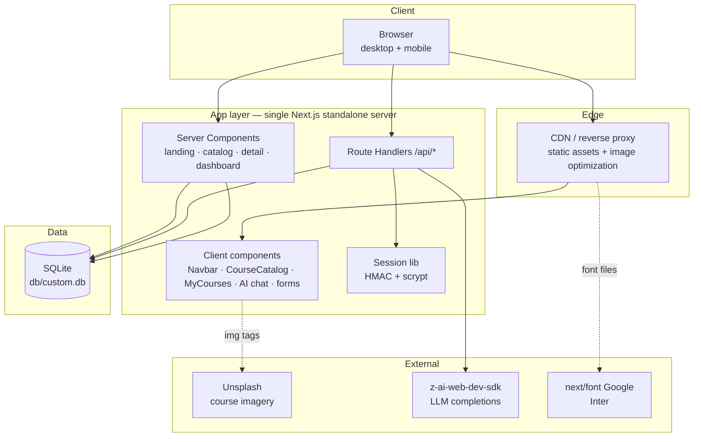
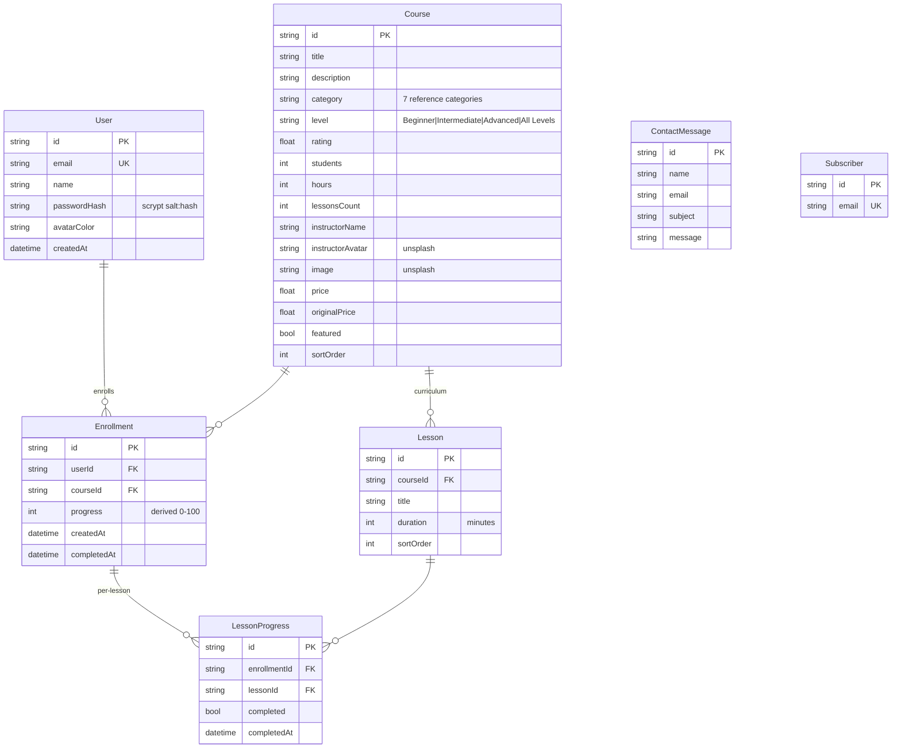

# NexusLearn — Master Project Architecture Document (PAD) v1.0

**Classification:** Internal Engineering Reference
**Status:** DEFINITIVE, PRODUCTION-LOCKED BLUEPRINT
**Companion Documents:** `README.md` (user-facing), `AGENTS.md` (agent gotchas), `CLAUDE.md` (workflow)
**Last Updated:** 2026-09-27
**Audience:** Senior Engineers, Tech Leads, DevOps, and Onboarding Engineers
**Rule:** Every architectural decision in this document traces to a specific rationale.
Nothing is here "because it's popular."

---

#### Revision Block — v1.0

- `[SYN]` Initial PAD for the NexusLearn clone build, generated after the full pipeline (recon → extraction → design spec → architecture → build → QA convergence) completed with all gates green: 26/26 computed-style assertions, 5/5 unit tests, 16/16 e2e tests, production build passing.
- `[SAN]` Three production defects found and remediated during QA are recorded as ADR-004 (Tailwind v4 HSL triplets), ADR-005 (pinned v3 palette), and §4.4 (SQLite path resolution).
- `[S3]` Session 3 parity pass (see `docs/remediation-plan-session3.md`): 11 residual gaps closed — landing AI section rebuilt as the reference 2-column layout (badge + `<br>` gradient h2 left, 4 glass cards right), instructor section rebuilt with image + floating "$12.5M+ Paid to Instructors" stat + CTA-after-features, pricing cards reworked (rounded-3xl, dark cosmic popular card, desc lines, check icons — landing + /Pricing), /Pricing hero rhythm (pt-16 pb-12) + FAQ single-column stack with CircleHelp icons + the 4 reference Q&As, category grid (sm:3/lg:4 + cursor-pointer overflow-hidden), eyebrows → text-sm spans, learning-path cards → borderless gray surface, newsletter centered 600px blur, hero "Start Learning" → /Courses, nav logo → /Home, login "Need an account? Sign up" single button. Test pyramid now 16 unit + 34 e2e (9 new parity specs, TDD red-first).

---

## Table of Contents

1. [System Overview & Decisions](#1-system-overview--decisions)
2. [High-Level System Topology](#2-high-level-system-topology)
3. [Application Architecture](#3-application-architecture)
4. [Data Architecture](#4-data-architecture)
5. [Design System Reference](#5-design-system-reference)
6. [Security Architecture](#6-security-architecture)
7. [Testing Strategy](#7-testing-strategy)
8. [Build & Deployment](#8-build--deployment)
9. [Developer Handbook](#9-developer-handbook)
10. [Known Issues & Outstanding Tasks](#10-known-issues--outstanding-tasks)
11. [Key Files Reference](#11-key-files-reference)
12. [Glossary](#12-glossary)

---

## 1. System Overview & Decisions

### 1.1 Document Metadata & Purpose

NexusLearn is a complete e-learning platform: marketing surface, course catalog, course detail with enrollment, a progress-tracking learner dashboard, and an AI study assistant. The application is a **fully-functional clone of a reference app** (`nexuslearn-template.base44.app`), which drives two hard requirements that shape this architecture: (a) **visual parity** — computed styles must match the reference byte-for-byte where physics allows; and (b) **functional completeness** — auth, enrollment, and progress are real, not mocked.

Use this document to onboard (§3, §9), to debug (§3.3, §10), to review tech choices (§1.3), and to replicate the stack elsewhere. For agent-tuned gotchas read `AGENTS.md` alongside this.

### 1.2 Technology Stack Summary

| Layer | Technology | Version | Key Rationale |
|---|---|---|---|
| Web framework | Next.js (App Router, Turbopack) | 16.3.6 | Server components for data-bound pages; route handlers for the API; `output: "standalone"` for deploy-portable builds |
| UI runtime | React | 19.3 | Function components, no forwardRef; streaming-friendly server rendering |
| Language | TypeScript | 5.9 (strict) | Compile-time safety across app, scripts, and tests |
| Styling | Tailwind CSS | 4.3.3 | CSS-first config (`@theme`) — no `tailwind.config.js` (validated in `docs/Tailwind-V4-Validation-Report.md`); v3-era palette pinned for parity (ADR-005) |
| Component primitives | Radix UI + CVA + tailwind-merge | latest | Accessible Select/Label/Slot primitives; shadcn/ui "new-york" style owned in-repo (`components.json`) |
| Icons | lucide-react | 0.525 | Exact icon set of the reference app |
| ORM | Prisma | 6.19 | Schema-first SQLite with a seeded reference catalog; `datasourceUrl` runtime resolution (§4.4) |
| Database | SQLite | via Prisma | Zero-config local dev; single-file; swap to PostgreSQL by changing provider + URL |
| Auth | first-party `node:crypto` | — | HMAC-SHA256 cookie sessions + scrypt hashing; no provider dependency (ADR-003) |
| AI | z-ai-web-dev-sdk | 0.0.18 | Server-only chat completions for the study assistant (ADR-006) |
| Unit tests | Vitest | 5.x | Fast node-environment tests for pure crypto seams |
| E2E tests | Playwright | 1.63 | Real-browser coverage of the production standalone build |
| Package manager / runtime | Bun | ≥ 1.1 | `bun.lock` authoritative; fast installs; runs seed + standalone server |

### 1.3 Architecture Decision Records (ADRs)

**ADR-001: Next.js App Router with server components for data pages**

- **Context:** The reference app is a client-rendered SPA; the clone must be production-grade and SEO-capable while keeping interactive islands (filters, chat, menu).
- **Decision:** One Next.js 16 app. Catalog, course detail, dashboard, and marketing pages are **server components** querying Prisma directly; interactivity lives in leaf client components (`CourseCatalog`, `EnrollButton`, `MyCourses`, `Navbar`, `ContactForm`, `LoginForm`, `AIAssistant`).
- **Rationale:** Removes an API-hop for first paint, keeps data fetching co-located with rendering, and preserves the reference's route casing (`/Courses`, `/CourseDetail?id=…`) so links behave identically.
- **Consequences:** Faster data-bound pages and simpler mental model; client components must receive serializable props (enrollment views are mapped in `Dashboard/page.tsx`).
- **Alternatives Rejected:** Full SPA + REST layer (double the surface, worse SEO); pages router (legacy).

**ADR-002: Route casing mirrors the reference app**

- **Context:** The original uses capitalized routes (`/Courses`, `/AIAssistant`, `/Dashboard`, `/CourseDetail?id=…`, `/BecomeInstructor`); lowercase "clean" URLs would break clone fidelity.
- **Decision:** Keep the exact casing as App Router directories; `/` is the canonical landing; `/Home` exists only as a redirect to `/`.
- **Rationale:** Link-level behavioral parity with the original, including the footer and nav hrefs.
- **Consequences:** Slightly unconventional URLs; documented so agents don't "fix" them.
- **Alternatives Rejected:** Kebab-case routes with redirects (drifts from the reference contract).

**ADR-003: First-party HMAC cookie sessions over an auth provider**

- **Context:** The app needs login-gated dashboards with demo credentials; the deploy target must stay dependency-light; no OAuth providers are in scope.
- **Decision:** `src/lib/session.ts` (pure) signs `base64url(JSON payload).base64url(HMAC-SHA256)` tokens with `AUTH_SECRET`; `src/lib/auth.ts` adapts them to Next `cookies()`. Passwords hash with scrypt (`salt:hash` hex). Session cookie `nexus_session`, httpOnly, sameSite=lax, 7 days.
- **Rationale:** Zero auth dependencies, unit-testable without Next runtime (pure module), timing-safe comparisons, and no vendor lock-in.
- **Consequences:** No SSO/social login without future work; secret management is on the operator (`AUTH_SECRET` required in production).
- **Alternatives Rejected:** Auth.js v5 (heavier than needed, session model mismatch); Better Auth (same); storing sessions in the DB (statelessness preferred).

**ADR-004: Tailwind v4 theme colors must be full `hsl()` values (bug remediation)**

- **Context:** During QA, `bg-background` computed to `rgba(0,0,0,0)` — the page looked unstyled.
- **Decision:** `:root` theme vars are written as full color values (`--background: hsl(0 0% 100%)`), never v3-style bare triplets (`0 0% 100%`).
- **Rationale:** Under Tailwind v4's `@theme inline`, `--color-background: var(--background)` is used *directly* as the color value; a bare HSL triplet is invalid CSS and silently resolves to transparent. This is the #1 shadcn-on-v4 migration bug.
- **Consequences:** The fix is one file (`globals.css`) and is regression-guarded by the parity assertions.
- **Alternatives Rejected:** Dropping `@theme inline` (breaks shadcn token wiring); defining colors as hex per utility (loses theming).

**ADR-005: Pin the Tailwind v3-era palette for pixel parity**

- **Context:** After ADR-004, `text-gray-900` still computed to `lab(8.11897 0.811279 -12.254)` instead of the reference's `rgb(17, 24, 39)` — Tailwind v4's default palette is oklch-based and drifts 1–3 sRGB units per channel from v3 hexes.
- **Decision:** `@theme` in `globals.css` pins the exact v3 hexes for every family the UI uses (gray, slate, cyan, purple, pink, blue, green, amber, red, yellow, orange, indigo).
- **Rationale:** Byte-identical computed colors with the reference (authored hex serializes back to `rgb()`), which also keeps the assertion gate trivial.
- **Consequences:** Upgrading palette families requires re-measuring against the reference; documented in `AGENTS.md`.
- **Alternatives Rejected:** Converting lab→sRGB in the test harness (imprecise; hides real drift); accepting oklch drift (fails parity).

**ADR-006: Server-only AI route with graceful degradation**

- **Context:** The AI study assistant must answer course questions; the SDK must never ship to the browser; the SDK may be unavailable in some environments.
- **Decision:** `POST /api/ai/chat` is the only importer of `z-ai-web-dev-sdk`. It trims history to the last 12 turns, caps message length, pins a tutor-flavored system prompt, and returns 502 + a friendly client message on failure. The client renders replies with a dependency-free markdown renderer (headings, bold/italic, inline code, lists).
- **Rationale:** Keeps credentials and model access server-side; bounds token usage; degrades visibly but gracefully.
- **Consequences:** No streaming (JSON response); acceptable for the chat UX.
- **Alternatives Rejected:** Client-side SDK import (credential exposure); streaming SSE (complexity not warranted).

**ADR-007: Playwright e2e against the production standalone build**

- **Context:** Mobile navigation is the highest-regression-risk chrome (Tailwind v4 display-mismatch class bugs), and dev-mode testing can hide production-only failures (hydration, standalone resolution).
- **Decision:** `bun run test:e2e` boots the **standalone production server** on `:3100` with an isolated, seeded `db/e2e.db`; global-setup resets enrollment state each run; specs sign in through the real `/login` form.
- **Rationale:** Tests exercise exactly what ships, including the standalone `chdir()` behavior that broke relative SQLite paths (§4.4).
- **Consequences:** Requires `bun run build` before e2e; runs are sequential (shared SQLite file).
- **Alternatives Rejected:** Dev-server testing (misses production failures); parallel workers (SQLite contention).

---

## 2. High-Level System Topology



**Layer annotations**

- **Client:** standard browser; the mobile menu is pure client state (no route-level JS beyond the nav component).
- **Edge/CDN:** static assets from `.next/static`; Unsplash hosts course imagery (allowlisted in `next.config.ts`).
- **App:** one Node process (standalone `server.js`); server components render data pages; route handlers own mutations; the session lib is shared by both.
- **Data:** single SQLite file; connection pooling is a single Prisma client per process (SQLite constraint).
- **External:** LLM completions via the server-only SDK; Inter self-hosted at build time via next/font.

---

## 3. Application Architecture

### 3.1 The Layer Model — the Golden Rule

```
Layer 0: Routes (src/app/**)        — pages + route handlers. May import Layers 1–3. Never imported by anything.
Layer 1: Feature components         — Navbar, Footer, CourseCard, CourseCatalog, ContactForm, LoginForm,
                                      course-detail/*, dashboard/*. May import Layers 2–3.
Layer 2: UI primitives (components/ui) — shadcn-style Button, Badge, Card, Input, Label, Select, Textarea,
                                      Skeleton. Import only cn() + Radix + CVA. No business logic.
Layer 3: Lib (src/lib, prisma)      — db (Prisma singleton), session/auth, utils, db-url resolver.
                                      Framework-boundary code only; no JSX.
```

**Golden Rule:** dependencies point strictly downward. A `ui/` primitive never imports a feature component; `lib/` never imports JSX; routes compose everything. The AI SDK import exists in exactly one file (`api/ai/chat/route.ts`).

### 3.2 Annotated Directory Structure

```
nexuslearn-template/
├── prisma/
│   ├── schema.prisma           # LMS domain: User, Course, Lesson, Enrollment, LessonProgress, ContactMessage, Subscriber
│   ├── seed.ts                 # The exact 9-course reference catalog + demo user (idempotent upserts)
│   └── db-url.ts               # SQLite file: URL resolver — one database everywhere (see §4.4)
├── src/
│   ├── app/
│   │   ├── layout.tsx          # Inter via next/font; viewport meta w/ viewport-fit=cover; metadata template
│   │   ├── globals.css         # Tailwind v4 CSS-first config: @theme inline tokens, pinned v3 palette, hsl() vars
│   │   ├── page.tsx            # Landing — hero, categories, featured, learning paths, AI, instructor,
│   │   │                       #   testimonials, pricing, newsletter CTA (server component, Prisma query)
│   │   ├── Home/page.tsx       # redirect → / (logo href parity with the reference)
│   │   ├── Courses/page.tsx    # server shell → <CourseCatalog> (client filters)
│   │   ├── CourseDetail/page.tsx  # ?id=… server page; curriculum + sidebar; <EnrollButton> client island
│   │   ├── Dashboard/page.tsx  # protected (redirect /login); stats + <MyCourses> progress cards
│   │   ├── AIAssistant/page.tsx   # client chat page + dependency-free markdown renderer
│   │   ├── login/page.tsx      # split card (Google button, divider, <LoginForm>)
│   │   ├── Pricing/ About/ Contact/ BecomeInstructor/   # static marketing pages (Contact has form island)
│   │   ├── not-found.tsx       # branded 404 (gradient "404", Go Home)
│   │   └── api/
│   │       ├── auth/{login,logout,me}/route.ts   # session lifecycle
│   │       ├── enrollments/route.ts              # GET mine / POST enroll (upsert)
│   │       ├── enrollments/progress/route.ts     # POST lesson complete → recompute %
│   │       ├── ai/chat/route.ts                  # server-only SDK, 12-turn window, graceful 502
│   │       ├── contact/route.ts · newsletter/route.ts  # lead capture (JSON + form-encoded)
│   │       └── health/route.ts                   # liveness probe
│   ├── components/
│   │   ├── ui/                 # button (rounded-xl variants), badge, card, input, label, select, textarea, skeleton
│   │   ├── Navbar.tsx          # fixed nav; transparent-over-hero ↔ white/95 blur states; mobile dropdown
│   │   ├── Footer.tsx          # dark #0a0a1a footer, 4 columns, socials
│   │   ├── CourseCard.tsx      # verbatim reference markup (hover lift, level badge, meta row, price footer)
│   │   ├── CourseCatalog.tsx   # client search + category/level/sort selects
│   │   ├── ContactForm.tsx · LoginForm.tsx
│   │   ├── course-detail/EnrollButton.tsx     # enroll → Continue Learning state machine
│   │   └── dashboard/MyCourses.tsx            # progress cards + lesson checklist + mark-done
│   └── lib/
│       ├── db.ts               # Prisma singleton with datasourceUrl: resolveDatabaseUrl()
│       ├── session.ts          # pure crypto: HMAC token sign/verify, scrypt hash/verify
│       ├── auth.ts             # cookies() adapter + re-exports (server-only)
│       └── utils.ts            # cn()
├── tests/
│   ├── auth.test.ts            # Vitest: token round-trip, tamper rejection, scrypt verify/salt
│   └── e2e/
│       ├── global-setup.ts     # push + seed db/e2e.db, reset enrollments
│       ├── mobile-navigation.spec.ts   # 6 specs — the Tailwind v4 regression guard
│       └── nexuslearn.spec.ts           # 28 specs — landing (incl. session-3 parity: AI/instructor/pricing sections, eyebrows, category grid), catalog, auth, enrollment, 404
├── docs/
│   ├── screenshots/            # QA captures (desktop + mobile + open mobile menu)
│   ├── DEPLOYMENT.md           # production deployment guide
│   └── Tailwind-V4-Validation-Report.md  # v3→v4 configuration validation
├── AGENTS.md · CLAUDE.md · README.md · Project_Architecture_Document.md
├── next.config.ts              # standalone output; Unsplash + supabase remotePatterns
├── playwright.config.ts        # :3100 webServer, db/e2e.db, single worker
└── vitest.config.ts            # *.test.ts only (node env, @ alias)
```

### 3.3 Critical Code Patterns

#### (a) The mobile menu — Tailwind v4 hardened

```tsx
// src/components/Navbar.tsx (excerpt)
// Symmetric breakpoints: the desktop row, the trigger, and the panel all key
// off the SAME `md:` boundary — mixing sm/lg here is the classic Class-B
// "ghost menu" bug (skills/avant-garde-design-v4 references 07/08).
<div className="hidden md:flex items-center gap-1"> …desktop links… </div>

<button
  type="button"
  aria-expanded={open}
  aria-controls={panelId}
  aria-label="Toggle navigation menu"
  onClick={() => setOpen((v) => !v)}
  className={cn("md:hidden p-2 rounded-lg transition-colors", overHero ? "text-white/80 …" : "text-gray-700 …")}
>
  {open ? <X className="h-6 w-6" /> : <Menu className="h-6 w-6" />}
</button>

<div
  id={panelId}
  className={cn("md:hidden bg-white overflow-hidden transition-[height,opacity] duration-300",
                open ? "border-t border-gray-100" : "border-t-0")}
  style={{ height: open ? `${panelRef.current?.scrollHeight ?? 420}px` : "0px", opacity: open ? 1 : 0 }}
  aria-hidden={!open}
  {...(!open ? { inert: true } : {})}
> …mobile links + full-width CTA… </div>
```

**Why this pattern:** the original app animates the dropdown via inline height/opacity on a panel that stays mounted; the clone keeps that animation but suppresses the 1px border artifact when closed (the original unmounts the panel instead). Body scroll lock (`overflow: hidden`) and Escape/route-change close are wired in effects. Every behavior is pinned by `tests/e2e/mobile-navigation.spec.ts`.

#### (b) Derived progress — never trust a stored percentage

```ts
// src/app/api/enrollments/progress/route.ts (excerpt)
await db.lessonProgress.upsert({
  where: { enrollmentId_lessonId: { enrollmentId, lessonId } },
  update: { completed: true, completedAt: new Date() },
  create: { enrollmentId, lessonId, completed: true, completedAt: new Date() },
});
const total = enrollment.course.lessons.length || 1;
const done = await db.lessonProgress.count({ where: { enrollmentId, completed: true } });
const progress = Math.min(100, Math.round((done / total) * 100));
await db.enrollment.update({ where: { id: enrollmentId },
  data: { progress, completedAt: progress >= 100 ? new Date() : null } });
```

**Why this pattern:** progress is a *derived* value recomputed from completed lessons on every mutation — a skipped lesson can never inflate it, and the dashboard stat cards (avg progress) stay consistent because they read the same recomputed field.

#### (c) Session tokens — pure core, framework shell

```ts
// src/lib/session.ts — no Next imports, unit-testable in node env
export function createSessionToken(user: SessionUser): string {
  const payload = Buffer.from(JSON.stringify({ ...user, iat: Date.now() })).toString("base64url");
  const mac = createHmac("sha256", getSecret()).update(payload).digest("base64url");
  return `${payload}.${mac}`;
}
// src/lib/auth.ts — the only Next-aware part
export async function getSession() {
  const store = await cookies();
  return verifySessionToken(store.get(SESSION_COOKIE)?.value);
}
```

**Why this pattern:** splitting the pure crypto from the `cookies()` adapter lets Vitest cover tamper-rejection and scrypt behavior without booting Next; the adapter stays three lines.

#### (d) One database, everywhere — the URL resolver

```ts
// prisma/db-url.ts (excerpt) — used via datasourceUrl in src/lib/db.ts + prisma/seed.ts
// The CLI resolves file: URLs against prisma/schema.prisma; the runtime against
// process CWD; the standalone server chdir()s into .next/standalone (which even
// contains its own traced prisma/schema.prisma). So: collect every ancestor with
// prisma/schema.prisma and prefer the FURTHEST whose resolved db file exists.
for (let i = candidates.length - 1; i >= 0; i--) {
  const abs = path.resolve(candidates[i], "prisma", rel);
  if (existsSync(abs)) return "file:" + abs;
}
```

**Why this pattern:** without it, `next dev`, the seed, and the standalone server silently used three different SQLite files — the e2e suite caught it as "Unable to open the database file" (see §10 history).

---

## 4. Data Architecture

### 4.1 Database Schema



**Uniques:** `Enrollment [userId, courseId]` (idempotent enrollment upsert), `LessonProgress [enrollmentId, lessonId]`. **Indexes:** course category/featured, lesson courseId, enrollment userId, progress lookups.

### 4.2 Data Models

Course rows carry display-only aggregates (`rating`, `students`) exactly as the reference catalog reports them; they are seeded, not computed. `Course.tags` holds the comma-separated "What You'll Learn" topics (SQLite has no scalar lists; parsed by `src/lib/course-tags.ts`, level appended at render time). The seed reproduces the reference curriculum model: `lessonsCount` Lesson rows per course, each titled `Lesson N: Module Content` (`prisma/seed-data.ts`). Progress (§3.3-b) is the only computed aggregate.

### 4.3 Persistence Strategy

Single Prisma client per process (`src/lib/db.ts` singleton on `globalThis` in non-production to survive HMR). SQLite means one writer; the e2e suite runs single-worker for the same reason. Migrations: `prisma migrate dev` for tracked history; `db:push` acceptable for local schema iteration.

### 4.4 SQLite Path Resolution (hard-won)

Relative `file:` URLs resolve differently per Prisma surface: **CLI** → against `prisma/schema.prisma`; **runtime** → against process CWD; the **standalone server** `chdir()`s into `.next/standalone/`, which even contains its own traced `prisma/schema.prisma` (a false anchor). `prisma/db-url.ts` therefore walks ancestors from CWD, collects every `prisma/schema.prisma` anchor, and prefers the **furthest anchor whose resolved database file exists** (falling back to the furthest anchor). Both `src/lib/db.ts` and `prisma/seed.ts` construct clients with `datasourceUrl: resolveDatabaseUrl()` — note Prisma 6 **ignores** the older `datasources: { db: { url } }` option. One more trap: a `DATABASE_URL` **exported in the shell** wins over the repo `.env` (standard precedence) — a stale export silently retargets `db:push`/`db:seed`/`dev` to another file. Production deployments should use an absolute `DATABASE_URL` (docs/DEPLOYMENT.md).

---

## 5. Design System Reference

Measured from the live reference app (computed styles + CSSOM); asserted by the parity gate.

### 5.1 Typographic System

| Role | Font | Size / weight / tracking | Evidence |
|---|---|---|---|
| Body | Inter (next/font) | 16px / 400 / lh 24px | computed body |
| Hero H1 | Inter | `text-4xl sm:text-5xl md:text-7xl` → 72px / 700 / ls −1.8px / white | computed h1 @1920 |
| Section H2 | Inter | `text-3xl md:text-5xl` → 48px / 700 / ls −1.2px / gray-900 | computed h2 |
| Card H3 | Inter | 16px / 600 (`text-sm md:text-base font-semibold`) | computed h3 |
| Micro-label | Inter | `text-xs font-semibold uppercase tracking-wider text-purple-600` ("EXPLORE", "TOP PICKS"…) | DOM |
| Nav link | Inter | 14px / 500; white/80 over hero, gray-700 on white, active purple-600 | DOM classes |

### 5.2 Color Tokens

| Token | Value | Usage | WCAG |
|---|---|---|---|
| `--primary-cyan` | `#18CCFC` | brand gradient start, hero accents | on #0a0a1a: contrast > 8:1 |
| `--primary-purple` | `#6344F5` | brand gradient end | decorative |
| `--primary-pink` | `#AE48FF` | gradient text end | decorative |
| Cosmic gradient | `#0a0a1a → #0d0d2b → #0a0a1a` (135°) | hero, AI section, CTA, dashboard hero | — |
| CTA gradient | `from-cyan-500 (#06b6d4) to-purple-600 (#9333ea)` | logo tile, all primary buttons | white text ≥ 4.5:1 |
| Stat icon tiles | blue-100/purple-100/green-100/amber-100 bg + -600 fg | dashboard stats | — |
| Level badges | green (Beginner), amber (Intermediate), red (Advanced), blue (All Levels) | course cards | — |

shadcn HSL base (`--background 0 0% 100%`, `--foreground 0 0% 3.9%`, `--radius .5rem`, …) is `hsl()`-wrapped per ADR-004, with the v3-era utility palette pinned per ADR-005 (`gray-900 #111827` etc. — computed values match the reference exactly).

### 5.3 Component Primitives

shadcn/ui "new-york" style, owned in-repo: Button (variants default/destructive/outline/secondary/ghost/link; **rounded-xl** with gradient CTA classes copied verbatim), Badge (level tints), Card, Input, Label, Select (Radix), Textarea, Skeleton. `cn()` merges; CVA drives variants; `data-slot` attributes for styling hooks.

### 5.4 Motion

Durations 300–700ms, `cubic-bezier(0.4, 0, 0.2, 1)`. Signature moves: nav state fade (500ms), card hover `-translate-y-2` + `shadow-2xl shadow-purple-500/10` + image `scale-110` (700ms), button `hover:scale-105` (300ms), mobile menu height/opacity transition (300ms). `html { scroll-behavior: smooth }`. No reduced-motion override yet (§10).

---

## 6. Security Architecture

### 6.1 Security Rules

| Rule | Enforcement |
|---|---|
| Session tokens are HMAC-signed and timing-safe compared | `session.ts` (`timingSafeEqual`); unit-tested |
| Passwords never stored or logged in plaintext | scrypt (`salt:hash`, 64-byte); no plaintext fields |
| Session cookie is httpOnly + sameSite=lax + secure in production | `sessionCookieOptions` in `auth.ts` |
| Protected pages deny at the server | `/Dashboard` server component `redirect("/login")` |
| Mutating APIs require a session | 401 in enrollments routes |
| Ownership checks on every mutation | progress route verifies `enrollment.userId === session.userId` |
| AI SDK credentials stay server-side | single import site (`api/ai/chat/route.ts`); no client bundle exposure |
| Secrets never committed | `.gitignore` rejects `.env`, `*.key`, `ssh-key.txt`; `.env.example` carries placeholders only |
| Input validated at every boundary | route handlers type-check + reject (400) malformed payloads; HTML5 required attrs client-side |

### 6.2 Security Utilities

`src/lib/session.ts` (token sign/verify, scrypt hash/verify) · `src/lib/auth.ts` (cookie adapter, options) · Prisma parameterized queries throughout (no raw SQL).

### 6.3 Authentication & Authorization

Single role (authenticated learner). `POST /api/auth/login` verifies scrypt, sets `nexus_session` (7d). `getSession()` reads it in RSC/route handlers. Logout clears the cookie. There is no RBAC or registration endpoint yet (§10) — accounts are seeded.

### 6.4 Threat Model

| Vector | Mitigation |
|---|---|
| Cookie forgery | HMAC-SHA256 + timing-safe compare; `AUTH_SECRET` required in prod |
| Password DB leak | scrypt with per-user salt |
| CSRF on mutations | sameSite=lax cookies + JSON-only endpoints (cross-site form posts can't set JSON content type); logout is the only state-changing form-POSTable route and is benign |
| Enrollment IDOR | progress route checks ownership; enrollments scoped to `session.userId` |
| Prompt abuse of AI route | 12-turn window, 4KB per message, system-prompt anchored; no tool use |
| SQL injection | Prisma parameterization only |
| Key/secret leakage | gitignore rules + wrapper-based push workflow (`docs/how-to-git-push-using-ssh-wrapper_SKILL.md`) |

---

## 7. Testing Strategy

### 7.1 Test Distribution

| Category | Files | Tests | Location | Framework |
|---|---|---|---|---|
| Unit (auth crypto) | 1 | 5 | `tests/auth.test.ts` | Vitest (node env) |
| Unit (course tags) | 1 | 5 | `tests/course-tags.test.ts` | Vitest (node env) |
| Unit (seed data shape) | 1 | 6 | `tests/seed-data.test.ts` | Vitest (node env) |
| E2E mobile navigation | 1 | 6 | `tests/e2e/mobile-navigation.spec.ts` | Playwright (Chromium, 375×667 touch) |
| E2E user journeys + parity | 1 | 19 | `tests/e2e/nexuslearn.spec.ts` | Playwright (Desktop Chrome) |
| Computed-style parity | harness | 26 assertions + VLM band comparisons | recorded vs `src/app/globals.css` + components | measured via browser (see §5) |

### 7.2 Test Patterns

- **Regression guards as specs:** the mobile-navigation suite pins the exact Tailwind v4 failure classes (display mismatch, scroll lock, ARIA, icon swap, route-change close).
- **Parity behaviors as specs:** sign-in landing on `/`, the signed-out dashboard render, the `/Home` landing render, the reference curriculum ("Lesson N: Module Content"), What-You'll-Learn topics, footer tagline and the reference content-page outlines are all pinned by e2e assertions.
- **Real-form authentication:** e2e signs in through `/login` with the seeded demo user — the auth flow itself is coverage.
- **Idempotent e2e:** global-setup pushes + seeds `db/e2e.db` and resets enrollments, so repeated runs start from the same baseline.
- **Production-fidelity e2e:** the suite boots the standalone build, which is how the SQLite path defect (§4.4) was caught.

### 7.3 Coverage Thresholds

No numeric gate configured; the required **pre-push gate** is the sequence `lint → typecheck → test → build → test:e2e` (all green as of v1.0).

### 7.4 Pre-PR / Pre-Deploy Checklist

- [ ] `bun run lint` clean
- [ ] `bun run typecheck` clean
- [ ] `bun run test` 16/16
- [ ] `bun run test:e2e` 34/34 (incl. 6 mobile-nav guards)
- [ ] `bun run build` compiles (standalone)
- [ ] Mobile menu manually eyeballed at 375×667 (screenshot diff vs `docs/screenshots/`)
- [ ] No new `tailwind.config.js` (Tailwind v4 is CSS-first)
- [ ] No SDK/secret imports in client components

---

## 8. Build & Deployment

### 8.1 Production Build

`bun run build` → `next build` (Turbopack) + copies `static/` and `public/` into `.next/standalone/`. Serve with `bun run start` (`NODE_ENV=production bun .next/standalone/server.js`). Static marketing pages prerender; data pages render on demand.

### 8.2 Environment Variables

| Name | Required | Description | Default |
|---|---|---|---|
| `DATABASE_URL` | yes | SQLite `file:../db/custom.db` (schema-relative; resolver pins runtime). **Use an absolute path in production.** | — |
| `AUTH_SECRET` | production | HMAC session secret (`openssl rand -hex 32`) | insecure dev fallback + warning |
| `NEXT_PUBLIC_SITE_URL` | optional | Canonical origin for metadata/sitemap | `http://localhost:3000` |

### 8.3 Docker

Not configured (see `docs/DEPLOYMENT.md` for the standalone-server path). The standalone output is a self-contained `server.js` + traced `node_modules` suitable for any Node/Bun host.

### 8.4 CI/CD

No hosted CI (no `.github/workflows`) — the local gate (§7.4) is the only gate. Push to `main` via the SSH wrapper workflow; the wrapper verifies the remote ref equals local HEAD.

---

## 9. Developer Handbook

### 9.1 Local Setup

```bash
bun install
bun run db:push     # schema → db/custom.db
bun run db:seed     # 9-course reference catalog + demo user
bun run dev         # http://localhost:3000
```

Sign in with `sepnetflix2023@outlook.com` / `$Abcd1234`.

### 9.2 Common Commands

| Command | Location | Purpose |
|---|---|---|
| `bun run dev` | repo root | Dev server :3000 (logs tee to `dev.log`) |
| `bun run db:seed` | repo root | Idempotent catalog + demo user seed |
| `bun run test` / `test:watch` | repo root | Vitest unit layer |
| `bun run test:e2e` | repo root | Playwright against the standalone build (:3100) |
| `bunx playwright show-trace <zip>` | repo root | Inspect a failed e2e trace |
| `bun run lint` / `typecheck` | repo root | ESLint / tsc --noEmit |

### 9.3 Code Style Rules

TypeScript strict; function-declaration components; `cn()` for classes; CVA for variants; early returns; no raw SQL. ESLint flat config relaxes several rules for parity markup (`no-img-element` off) — do not treat relaxations as invitations.

### 9.4 Git Workflow

`main` only. Commit after a green gate; push via the SSH wrapper (`docs/how-to-git-push-using-ssh-wrapper_SKILL.md`) — keys live outside the repo and are shredded after use.

---

## 10. Known Issues & Outstanding Tasks

| Priority | Issue | Impact | Status |
|---|---|---|---|
| LOW | No user self-registration (accounts are seeded) | New users must be created via seed/script | Open |
| LOW | "Continue with Google" is presentational (no OAuth wired) | Button matches reference; no provider behind it | Open (by design — parity scope) |
| LOW | No `prefers-reduced-motion` handling for hover/menu animations | Accessibility nicety missing | Open |
| LOW | AI chat is not streaming (JSON response) | Perceived latency on long answers | Open |
| INFO | Checkout is out of scope — enrollment is free/instant | Matches template semantics | By design |
| INFO | `skills/` directory ships as reference material | Excluded from tsconfig/eslint; no runtime impact | By design |
| INFO | Dashboard lesson checklist previews 12 rows with a "show all" expander | Keeps the DOM bounded for 95–375-lesson reference curricula | By design |

*Resolved during the build:* Tailwind v4 transparent-theme bug (ADR-004), oklch palette drift (ADR-005), multi-file SQLite resolution (§4.4), closed mobile-menu border artifact, stale standalone bundle in e2e.

*Resolved in session 2 (parity pass):* hero illustration replaced with the reference's flowing-lines SVG; Courses page reworked to the dark hero + floating filter card; CourseDetail reworked to the dark hero/price-card/tags layout with the 220-lesson reference curriculum; sign-in now returns to `/`; the dashboard renders for signed-out visitors; `/Home` renders the landing; About/Contact/BecomeInstructor/Footer aligned to the reference; `Course.tags` + seed-data parity; ORBITAL leftovers removed.

---

## 11. Key Files Reference

| File | Lines | Purpose |
|---|---|---|
| `src/app/globals.css` | ~200 | Tailwind v4 CSS-first config: tokens, pinned palette, hsl() vars |
| `src/components/Navbar.tsx` | ~210 | Fixed nav, two visual states, hardened mobile dropdown |
| `src/app/page.tsx` | ~560 | Landing page — all nine reference sections + flowing-lines hero SVG |
| `src/components/CourseCard.tsx` | ~100 | Verbatim reference course card |
| `src/components/CourseCatalog.tsx` | ~200 | Dark hero + glassy search + floating filter card + grid |
| `src/app/CourseDetail/page.tsx` | ~200 | Dark hero, price card, reference curriculum, tags sidebar |
| `src/app/Dashboard/page.tsx` | ~155 | Dashboard (renders signed-out too — reference behavior) |
| `src/components/dashboard/MyCourses.tsx` | ~185 | Progress cards, capped lesson checklist, mark-done flow |
| `src/components/AIAssistantChat.tsx` | ~260 | Chat UI + markdown renderer (client; page supplies metadata) |
| `src/lib/session.ts` | ~75 | Pure HMAC + scrypt crypto |
| `src/lib/auth.ts` | ~40 | cookies() adapter |
| `src/lib/course-tags.ts` | ~20 | What-You'll-Learn topic parsing (tags + level) |
| `src/lib/db.ts` | ~20 | Prisma singleton with resolved URL |
| `prisma/db-url.ts` | ~55 | SQLite path resolver (one DB everywhere) |
| `prisma/schema.prisma` | ~125 | LMS domain model (incl. Course.tags) |
| `prisma/seed-data.ts` | ~230 | Pure reference catalog + curriculum builder (test-pinned) |
| `prisma/seed.ts` | ~75 | Seed runner (demo user + 1,900 reference lessons) |
| `tests/e2e/mobile-navigation.spec.ts` | ~90 | The Tailwind v4 mobile-nav regression guard |

---

## 12. Glossary

| Term | Meaning |
|---|---|
| Reference app | The original `nexuslearn-template.base44.app` this repo clones |
| Parity gate | The 26 computed-style assertions recorded from the reference (colors, radii, typography, gradients) |
| Cosmic gradient | The `#0a0a1a → #0d0d2b → #0a0a1a` 135° dark section background |
| Pinned palette | The v3-era hex colors locked in `@theme` to keep v4 output byte-identical to the reference |
| Anchor | A directory containing `prisma/schema.prisma`; candidate root for SQLite URL resolution |
| Standalone build | `output: "standalone"` artifact — self-contained `server.js` + traced deps |
| Demo user | Seeded account `sepnetflix2023@outlook.com` used by e2e and manual QA |
