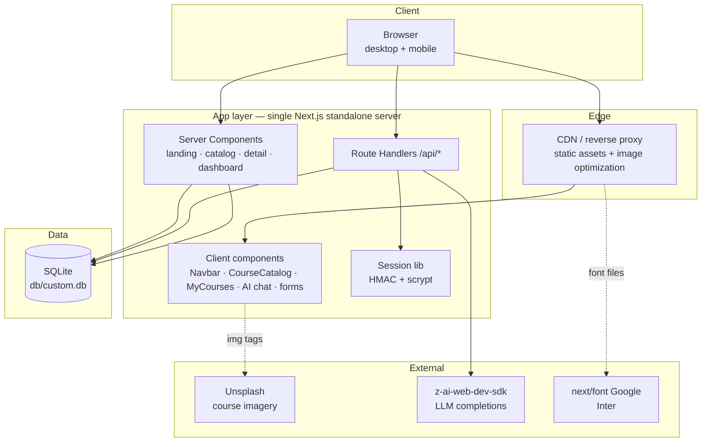

# NexusLearn — Master Project Architecture Document (PAD) v1.0

**Classification:** Internal Engineering Reference
**Status:** DEFINITIVE, PRODUCTION-LOCKED BLUEPRINT
**Companion Documents:** `README.md` (user-facing), `AGENTS.md` (agent gotchas), `CLAUDE.md` (workflow)
**Last Updated:** 2026-09-27
**Audience:** Senior Engineers, Tech Leads, DevOps, and Onboarding Engineers
**Rule:** Every architectural decision in this document traces to a specific rationale.
Nothing is here "because it's popular."

---

#### Revision Block — v1.0

- `[SYN]` Initial PAD for the NexusLearn clone build, generated after the full pipeline (recon → extraction → design spec → architecture → build → QA convergence) completed with all gates green: 26/26 computed-style assertions, 5/5 unit tests, 16/16 e2e tests, production build passing.
- `[SAN]` Three production defects found and remediated during QA are recorded as ADR-004 (Tailwind v4 HSL triplets), ADR-005 (pinned v3 palette), and §4.4 (SQLite path resolution).
- `[S3]` Session 3 parity pass (see `docs/remediation-plan-session3.md`): 11 residual gaps closed — landing AI section rebuilt as the reference 2-column layout (badge + `<br>` gradient h2 left, 4 glass cards right), instructor section rebuilt with image + floating "$12.5M+ Paid to Instructors" stat + CTA-after-features, pricing cards reworked (rounded-3xl, dark cosmic popular card, desc lines, check icons — landing + /Pricing), /Pricing hero rhythm (pt-16 pb-12) + FAQ single-column stack with CircleHelp icons + the 4 reference Q&As, category grid (sm:3/lg:4 + cursor-pointer overflow-hidden), eyebrows → text-sm spans, learning-path cards → borderless gray surface, newsletter centered 600px blur, hero "Start Learning" → /Courses, nav logo → /Home, login "Need an account? Sign up" single button. Test pyramid now 16 unit + 34 e2e (9 new parity specs, TDD red-first).
- `[S4]` Session 4 parity pass (see `docs/remediation-plan-session4.md`): 14 findings closed — every non-landing page rebuilt on the reference shell (root > `main.pt-20` > `div.min-h-screen.bg-gray-50`; the old shells rendered the /Courses + /Dashboard h1 at y=64 behind the 81px fixed navbar), CourseDetail "About This Course" expandable section (nullable `Course.longDescription`, 4 reference texts, Read More/Show Less toggle), seed imagery corrected (3 course covers + per-instructor avatar map), live lesson-count drift re-captured (Python 178, ML 245, WebDev 380, Business 156 → 1,904 total), hero rhythms (About/Contact/BecomeInstructor pt-16 pb-XX + direct-child blurs), Contact overlapping max-w-6xl container, AI assistant shell rework (max-w-3xl, Sparkles hero icon, min-h-[60vh] flex card, flex-1 messages, textarea composer, px-5 bubbles), nav Home → /Home, 5 footer href fixes, 404 rebuilt as the reference light-slate design with dynamic path. Test pyramid now 21 unit + 50 e2e (16 new session-4 specs, TDD red-first).
- `[S5]` Session 5 parity pass (see `docs/remediation-plan-session5.md`): 28 findings closed — full head parity (ONE root "SkillSphere…" description on every route, OG + Twitter cards, per-route canonicals incl. the CourseDetail query string, `/logo.png` favicon, `manifest.json`, apple web-app metas, viewport aligned to the reference's unlimited pinch zoom), login card rebuilt as the reference 5-view state machine (reset + reset-sent + signup + 6-digit verify views; slate Sign-in button; shadcn Alert errors; logo image with slate glow; OR divider) with three new routes (`/api/auth/signup`, `/api/auth/verify` with `User.emailVerified`, `/api/auth/forgot-password` — simulated email delivery, documented), newsletter converted to a client island (the native form POST navigated the browser to the raw JSON — real bug) with the reference in-place success state, CourseDetail unknown/missing id renders the in-page "Course not found" state (never the 404), EQ card eyebrow display map ("Personal Dev"), Home nav link active on `/` and `/Home`, Pricing FAQ answer paragraph (ml-7 + gray-600), About hero h1 base, BecomeInstructor structure (unwrapped h2s at md:text-4xl, left-aligned benefit cards with border hover, unwrapped CTA section, px-10 buttons). Test pyramid now 24 unit + 68 e2e (18 new session-5 specs, TDD red-first).
- `[S7]` Session 7 parity pass (see `docs/remediation-plan-session7.md`): 22 findings closed — the reference **display order** (the seed array now lists the courses in the live app's stable "Newest" order; ids `seed-1…9` + `sortOrder` follow the array index so the catalog's id-based "newest" sort and the landing featured subsequence both reproduce it), the category grid re-pinned (icons carry the reference's visually-dead `bg-gradient-to-r … bg-clip-text` classes — rendering near-black, with the `/10` tint wrappers carrying the color; Technology uses the monitor icon; tints pink/rose/emerald/violet for Marketing/Personal Development/Programming/AI), the featured section rebuilt as the reference flex header (`flex flex-col md:flex-row md:items-end md:justify-between mb-16` with the left title block + in-header "View All Courses" outline CTA — replacing the centered header + below-grid button), learning-path cards gained `border border-transparent hover:border-gray-100` + per-path icons (TrendingUp for Data Science, Target for Digital Marketing with the amber→orange gradient), the testimonials section redesigned to the reference cards (`relative bg-gray-50 rounded-3xl p-8 … hover:shadow-xl` + `lucide-quote h-10 w-10` + `img.w-11` avatar rows; order Sarah → Elena → Marcus with Elena's reference avatar), the landing button bases re-pinned (every button carries the shadcn `disabled:pointer-events-none disabled:opacity-50 [&_svg]:pointer-events-none [&_svg]:size-4 [&_svg]:shrink-0` trio + `hover:bg-primary/90` on gradient variants — hero, AI CTA, instructor CTA, pricing cards, path buttons, and the featured-header outline button), the Courses filter card (leading `lucide-sliders-horizontal` icon + `SelectTrigger` rebased on the v3-era reference string with `h-4 w-4` chevron — shared by /Contact), the level badge as a plain DIV with emerald Beginner + the reference class order, the CourseDetail lessons stat (CirclePlay), the Pricing page (hero h1 `text-3xl` base, FAQ `lucide-circle-help` inline SVG, plan buttons on the reference base), the Contact form (labels with the peer-disabled pair, `min-h-[60px]` textarea, the reference gradient Send button with the send icon, bare `text-gray-500` info anchors, `text-3xl` hero), the About stats (bare grid inside a `max-w-7xl` wrapper, `font-medium` labels), the BecomeInstructor hero (`text-3xl md:text-5xl`, 2-stop gradient text, Video icon, `font-bold text-lg` benefit h3s), the AI composer (`hover:bg-primary/90` + `[&_svg]` trio, `h-5 w-5` send icon) and the login Google icon (wrapped in the reference `div.-ml-4`). Mobile menu re-verified on both sites (no Tailwind v4 display bug; ARIA + scroll lock + route-close + Escape all green). Test pyramid now 32 unit + 107 e2e (22 new session-7 specs + 3 order unit tests, TDD red-first).
- `[S6]` Session 6 parity pass (see `docs/remediation-plan-session6.md`): 13 findings closed — per-route OG identity (og:title + twitter:title mirror the document title, og:url mirrors the canonical incl. the CourseDetail `?id=` query — new `routeMetadata()` helper in `src/lib/metadata.ts`; child openGraph/twitter objects replace the root's wholesale in Next.js, so the helper restates the full payload), CourseDetail "What You'll Learn" sidebar level row (`mt-6 pt-6 border-t` divider > Award icon text-amber-500 + "{level} Level" — every course), /Pricing cards overlap (`div.-mt-8` > `section.py-24.px-4.bg-gray-50`, desktop now byte-exact 2369), /Courses hero search input (`h-9` + `py-6` border-box collapse → reference 50px, type=text, `file:text-foreground`) + catalog fragment (hero/content are the gray wrapper's direct children), landing hero `min-h-[100vh]` + the reference classless main wrapper + grid bases (featured `grid-cols-1`, learning paths `lg:grid-cols-3` — was md, testimonials `grid-cols-1`), AI welcome bubble `py-16` + chat card without `overflow-hidden` (desktop byte-exact 1573), Enroll Now button verbatim shadcn base (`[&_svg]` trio, `hover:bg-primary/90`, `disabled:opacity-50`), card level badge variant classes (`hover:bg-primary/80 border-0`). Lesson counts re-verified (1,904 — no drift); mobile menu re-verified on both sites (no Tailwind v4 display bug). Test pyramid now 29 unit + 85 e2e (17 new session-6 specs + 5 metadata unit tests, TDD red-first).
- `[S8]` Session 8 parity pass (see `docs/remediation-plan-session8.md`): 3 findings closed — **seed idempotency** (Prisma's `update` skips undefined keys, so the session-7 reorder left the pre-reorder `longDescription` texts on seed-3/4/5 in BOTH `db/custom.db` and `db/e2e.db`, surfacing as phantom "About This Course" sections with the wrong texts — Cloud +203px / Business +203px / EQ +177px desktop drift; `prisma/seed.ts` now restates `longDescription: c.longDescription ?? null`, and the About-presence e2e matrix across all 9 courses guards it), the **tags-only "What You'll Learn" list** (the level rendered TWICE on the clone — once as the appended check row from the session-3 `whatYouLearnTopics()` helper and once in the session-6 Award divider; the live check list carries parsed tags ONLY with the level once in the divider — helper removed, CourseDetail uses `parseTags`), and **Dashboard class parity** (the bare reference stats grid without the `dashboard-stats` hook class, lucide-react stat icons `book-open/circle-play/award/trending-up` replacing hand-inlined svgs, and the MyCourses empty-state buttons on the shadcn base trio + `hover:bg-primary/90`). Both databases re-seeded and verified; desktop CourseDetail heights back to +1px; mobile menu re-verified on both sites (full battery — no Tailwind v4 display bug). Test pyramid now 31 unit + 122 e2e (15 new session-8 specs + the longDescription matrix unit guard + the topic-list spec re-pointed, TDD red-first).
- `[S9]` Session 9 parity pass (see `docs/remediation-plan-session9.md`): 6 findings closed — the **Tailwind v4 space-y engine trap** (v4 rewrote the space-y/space-x selector: v3's `.space-y-1 > :not([hidden]) ~ :not([hidden]) { margin-top }` at specificity (0,2,0) OVERRIDES a child's `.mt-3`, while v4's `:where(.space-y-1 > :not(:last-child)) { margin-block-end }` at ZERO specificity lets the child's `.mt-3` WIN — so any space-y container with an explicit-margin child renders different gaps despite byte-identical classes; the one case in this app was the mobile nav panel CTA `block mt-3`, which resurrected as a 12px gap + an 8px taller panel (413 vs the reference 405) — the clone now ships `block` without the mt-3, rendering the reference 4px gap and 405px panel, pinned by the session-9 e2e specs), plus the **navbar chrome drift** discovered via a NEW chrome-subtree (nav + footer) class diff the earlier `main *`-scoped audits could never catch: the desktop + panel "My Dashboard" buttons re-pinned with the shadcn base trio + `hover:bg-primary/90` (the live navbar received the same button-base sweep the landing got in session 7), the mobile trigger aligned to the BARE reference strings (`md:hidden p-2 rounded-lg text-white/80` / `text-gray-700` — the clone's hover/transition utilities removed; the ARIA wiring stays as documented a11y hardening), and the logo span normalized to the reference byte order. Test pyramid now 31 unit + 128 e2e (6 new session-9 specs, TDD red-first; 122 → 128).
- `[S10]` Session 10 parity pass (see `docs/remediation-plan-session10.md`): 2 findings closed — the **`/Home` hero-state navbar** (the live app renders `/Home` — the reference footer target — with the FULL landing hero treatment: `bg-transparent` navbar + `text-white` logo + `text-white/80` mobile trigger at scroll 0, flipping to the `bg-white/95` white-nav after scroll, byte-identical to `/`; the clone's `overHero` detection in `Navbar.tsx` covered only `/`, so `/Home` shipped the white-nav state at scroll 0 — fixed to cover both routes, pinned by 4 session-10 e2e specs incl. the scroll-flip and the mobile panel geometry on `/Home`), and the **404 wrapper hardening pin** (the live 404 ships a landmark-less `div.min-h-screen` inside `#root` with no nav/footer; the clone deliberately keeps the `main` landmark + the `min-h-dvh` page-root form per the documented URL-bar-warp hardening doctrine — the decision is now recorded in the component docblock AND pinned by a session-10 spec so a future chrome audit cannot "fix" it backwards). Audit-methodology addition: height sweeps must set BOTH agent-browser sessions' viewports in the same command (an initial CourseDetail sweep compared live@1920 vs clone@375 and produced a false +1300…+3300px drift). Test pyramid now 31 unit + 133 e2e (5 new session-10 specs, TDD red-first; 128 → 133).
- `[S11]` Session 11 parity pass (see `docs/remediation-plan-session11.md`): 3 findings closed via TWO new audit surfaces — the **visible-text content diff** (normalized `innerText` over `main` per route; catches copy + glyph drift that height and class sweeps structurally cannot) and **per-view state diffs** of the login card's 5 views. (1) The landing's Digital Marketing Pro learning-path card description drifted (`page.tsx` `LEARNING_PATHS[2]` shipped the pre-session-3 copy; the live string restored). (2) The testimonial quotes rendered typographic U+201C/U+201D via `&ldquo;`/`&rdquo;` entities where the live renders ASCII U+0022 (measured `charCodeAt` 8220/8221 vs 34/34). (3) **The login card-interior ownership**: the live 5-view state machine owns the WHOLE card interior — on reset/reset-sent/signup/verify the logo ring, h1, Google button and OR divider are ALL absent (each view is the card body, `div.w-full`-wrapped); the clone statically rendered the signin chrome around every view. The chrome moved into `LoginForm`'s signin branch (`login/page.tsx` is now the thin card shell), the non-signin views gained the `div.w-full` wrapper, and the reset email input got its own `text-base` variant (`RESET_INPUT_CLS` — the signup inputs keep `text-sm sm:text-base`, confirmed against the live DOM). Also NEW audit surface: the **breakpoint-zone sweep** (640/767/768/1024/1279/1280 — the trigger↔desktop-row flip happens at exactly 768px on both sites, grid columns flip identically; NO Tailwind v4 breakpoint bug). Test pyramid now 31 unit + 141 e2e (8 new session-11 specs, TDD red-first; 133 → 141).
- `[S12]` Session 12 parity pass (see `docs/remediation-plan-session12.md`): 1 High finding closed via TWO new audit surfaces — the **computed box-shadow + border-radius sweep** (walk every visible element per route, bucket the computed values, diff live vs clone) and the **hover-state computed-style diff** (Playwright-only: v4 wraps `hover:` variants in `@media (hover: hover)`, so touch-emulating headless sessions produce false negatives). **The Tailwind v4 shadow-scale shift (the FIFTH v4 trap)**: v4 renamed v3's `shadow-sm` (0 1px 2px rgb(0 0 0/0.05)) to `shadow-xs` and moved `shadow-sm` up to v3's bare-shadow geometry (0 1px 3px/0.1 + 0 1px 2px −1px/0.1) — every `shadow-sm` (the white navbar on every white-nav route, the login buttons, the hero secondary CTA, the ui primitives, 21 usages + every `hover:shadow-sm` incl. the 380-per-course lesson rows) rendered ONE NOTCH heavier with byte-identical classes; class diffs are structurally blind to token-value changes. Fix: the `--shadow-sm` token pin in `globals.css` `@theme inline` (the ADR-005 palette-pin precedent — one line, zero class changes); md/lg/xl/2xl were verified UNCHANGED and are pinned by GUARD specs. Also verified at parity (no action): `prefers-reduced-motion` (neither site ships an override), AI-chat streaming (the live's own chat is a one-shot `InvokeLLM` XHR rendering the complete answer in one frame), `rounded-sm` (both sites render 4px), the CourseDetail price card + lesson rows (identical shadows/radii like-for-like), and the v4 form variances (oklab color strings for alpha-modified colors, `calc(infinity*1px)` rounded-full, the empty shadow-composition slots, the 4-property `transition-transform` — all computed-identical to the reference). Dev-origins hardening: `next.config.ts` now carries `allowedDevOrigins: ["127.0.0.1"]` (Next 16's dev-origin protection was blocking dev chunks for the 127.0.0.1 origin — silent no-hydration; production unaffected). Test pyramid now 31 unit + 147 e2e (6 new session-12 specs, TDD red-first; 141 → 147).
- `[S13]` Session 13 parity pass (see `docs/remediation-plan-session13.md`): 3 findings closed via TWO new audit surfaces (both suggested by the session-12 transcript) — the **focus-ring parity sweep** (keyboard-focus every interactive element type, diff the computed ring/outline state) and the **scroll-behavior / scroll-reveal comparison**. (1) **The login inputs' focus-ring cascade flip (High)**: the reference (Tailwind v3 + the Base44 runtime) injects a page-level utility sheet AFTER its static build; on /login that sheet re-asserts `.focus:ring-slate-400:focus` at a later cascade position, winning `--tw-ring-color` over the static `.focus-visible:ring-ring` whenever both pseudos match — the reference's login inputs render a SLATE-400 keyboard-focus ring. The clone's single v4 sheet emits the focus-visible variant later, so the ring rendered near-black (`--ring`). A cascade-ORDER variance — byte-identical classes, invisible to class diffs (the third structural-blind-spot class, after the session-12 token VALUES and the session-13 nesting). Fix: the UNLAYERED cascade pin in `globals.css` (`.focus\:ring-slate-400:focus { --tw-ring-color: var(--color-slate-400); }` — unlayered beats every @layer rule; the selector matches only the login inputs' class strings). GUARD specs prove /Courses, /Contact and every button keep the `--ring` ring. (2) **The signin-view DOM nesting (Medium)**: the live ships `div.w-full > [div.space-y-3 (the Google button ONLY), the OR divider, the form]`; the clone nested the OR divider + form INSIDE the space-y-3 — the 24px gaps matched only by margin collapse (a latent v4 `:where()` space-y trap). Restructured to the reference nesting (byte-identical classes, gaps pinned at 24/24 by spec). (3) **The universal scroll-behavior (Low)**: the reference's runtime ships `* { scroll-behavior: smooth }` (every element computes smooth); the clone only smoothed `html` — the universal rule now lives in `@layer base`, also smoothing programmatic scrolls inside inner scrollers (Radix SelectContent keyboard nav). Audit-methodology additions: the UA-default `outline: auto` computes dynamic values (never probe it for parity); `transition-all` elements render focus rings mid-transition on immediate reads (wait ≥ 2× the duration); v4's ring composition prefixes empty slots (full-string reads required). Verified at parity (no action): the /Courses + /Contact form-control rings, every button ring, the nav links, html scroll-behavior + scroll-reveal (zero offscreen-hidden elements on either site). Test pyramid now 31 unit + 155 e2e (8 new session-13 specs, TDD red-first; 147 → 155).
- `[S14]` Session 14 parity pass (see `docs/remediation-plan-session14.md`): 7 findings closed via THREE new audit surfaces (suggested by the session-13 transcript) — the **print stylesheet comparison**, the **`::selection`/cursor/caret sweep**, and the **computed font/line-height surface + per-element space-y sibling-gap audit**. (1) **The rendered font differed — the reference ships NO webfont (High)**: `document.fonts` is empty on every live route (the Base44 runtime declares `body { Inter, system-ui, -apple-system, sans-serif }` inline but loads no @font-face — every visitor renders their system font); the clone's next/font Inter bundle rendered real Inter glyphs the reference never shows. This was the ROOT CAUSE of every documented "font-metric height band" (the −30/−49/−29 desktop and −299/−121/−46/−45/−22/−58/−22/−44 mobile bands, the CourseDetail +1/−25 bands) — after the fix (unbundling next/font + the `--font-sans` token in `@theme`), EVERY height measurement in the project is byte-exact for the first time: 11 routes × 2 viewports + all 9 CourseDetail pages. (2) **The v4 button-cursor preflight drop (High — the SIXTH v4 trap)**: v4 removed v3's `button, [role="button"] { cursor: pointer }` — 42 default-cursor elements on the clone's landing vs ZERO on the reference; restored in `@layer base` (a preflight delta is the FOURTH structural-blind-spot class with byte-identical classes). (3) **The line-height composition flip (High — the SEVENTH v4 trap)**: on elements carrying BOTH a responsive `text-*` and a plain `leading-*`, v3's variant-block emission makes the SIZE utility's own line-height win (hero H1 lh 1, hero P 1.75rem, CTA H2 1) while v4's `--tw-leading` composition makes `leading-*` win (1.25/1.625 — 90px vs 72px line boxes); four unlayered media-scoped pins restore the reference winners. (4) **The dead popular-card scale (High — the NINTH v4 trap + a session-13 record correction)**: the reference's scroll-reveal system pre-hides 35 landing elements (inline `opacity: 0; transform: translateY(20px)`) and, once revealed, leaves inline `transform: none` FOREVER — permanently killing the popular pricing card's `scale-105` (both live cards render unscaled, 498px); the clone applied v4's standalone `scale: 1.05` (5% larger). The unlayered `.scale-105 { scale: none }` pin replicates the resting state (hover variants untouched, GUARD-pinned). CORRECTION: session-13's "zero offscreen-hidden elements" record was wrong — the reveal system exists and fires on scroll; the entry ANIMATION stays a documented variance (end states match). (5) **The skills/docs/tests CSS leak (Medium)**: Tailwind v4's automatic source detection scanned the repo's agent documentation (283 class-bearing skills/ files + docs/ + tests/) and generated 1027 unused utility rules — 51% of the compiled sheet (canaries: the `.selection:bg-red-200` demo string from `skills/gift-evaluator/html_tools.py`); the `@source not` directives in `globals.css` restrict generation to app source (157KB → 82KB production CSS). (6) **The inline-label space-y gap loss (Medium — the EIGHTH v4 trap)**: v4's `:where()` engine assigns gaps to NON-LAST children as `margin-block-end` — INERT on the login form's inline `<label>`s (the 6px gap vanished; each field group 6px short, mobile /login −12px); a scoped follower-margin pin restores it. (7) **The overridden back-button gap (Medium — the TENTH v4 trap)**: a child's own margin utility replaces the `:where()` gap carrier (the login card's `-mb-2` back-button replaced the 16/24px header gap with −8px, pulling the view heading into the button on the signup/reset/verify views — desktop masked by the h-screen viewport clamp); the `-mb-2`-scoped follower pins restore the reference gaps. Verified at parity (no action): print (zero `@media print` rules on either side; print layout = screen layout), ::selection (inert everywhere — the live's 8 runtime-preset /login rules match nothing; accepted variance), caret-color (the documented `--ring` micro-delta family), cursor specials, user-select, the login signin/reset-sent views. Test pyramid now 31 unit + 171 e2e (16 new session-14 specs, TDD red-first; 155 → 171).

---

## Table of Contents

1. [System Overview & Decisions](#1-system-overview--decisions)
2. [High-Level System Topology](#2-high-level-system-topology)
3. [Application Architecture](#3-application-architecture)
4. [Data Architecture](#4-data-architecture)
5. [Design System Reference](#5-design-system-reference)
6. [Security Architecture](#6-security-architecture)
7. [Testing Strategy](#7-testing-strategy)
8. [Build & Deployment](#8-build--deployment)
9. [Developer Handbook](#9-developer-handbook)
10. [Known Issues & Outstanding Tasks](#10-known-issues--outstanding-tasks)
11. [Key Files Reference](#11-key-files-reference)
12. [Glossary](#12-glossary)

---

## 1. System Overview & Decisions

### 1.1 Document Metadata & Purpose

NexusLearn is a complete e-learning platform: marketing surface, course catalog, course detail with enrollment, a progress-tracking learner dashboard, and an AI study assistant. The application is a **fully-functional clone of a reference app** (`nexuslearn-template.base44.app`), which drives two hard requirements that shape this architecture: (a) **visual parity** — computed styles must match the reference byte-for-byte where physics allows; and (b) **functional completeness** — auth, enrollment, and progress are real, not mocked.

Use this document to onboard (§3, §9), to debug (§3.3, §10), to review tech choices (§1.3), and to replicate the stack elsewhere. For agent-tuned gotchas read `AGENTS.md` alongside this.

### 1.2 Technology Stack Summary

| Layer | Technology | Version | Key Rationale |
|---|---|---|---|
| Web framework | Next.js (App Router, Turbopack) | 16.3.6 | Server components for data-bound pages; route handlers for the API; `output: "standalone"` for deploy-portable builds |
| UI runtime | React | 19.3 | Function components, no forwardRef; streaming-friendly server rendering |
| Language | TypeScript | 5.9 (strict) | Compile-time safety across app, scripts, and tests |
| Styling | Tailwind CSS | 4.3.3 | CSS-first config (`@theme`) — no `tailwind.config.js` (validated in `docs/Tailwind-V4-Validation-Report.md`); v3-era palette pinned for parity (ADR-005) |
| Component primitives | Radix UI + CVA + tailwind-merge | latest | Accessible Select/Label/Slot primitives; shadcn/ui "new-york" style owned in-repo (`components.json`) |
| Icons | lucide-react | 0.525 | Exact icon set of the reference app |
| ORM | Prisma | 6.19 | Schema-first SQLite with a seeded reference catalog; `datasourceUrl` runtime resolution (§4.4) |
| Database | SQLite | via Prisma | Zero-config local dev; single-file; swap to PostgreSQL by changing provider + URL |
| Auth | first-party `node:crypto` | — | HMAC-SHA256 cookie sessions + scrypt hashing; no provider dependency (ADR-003) |
| AI | z-ai-web-dev-sdk | 0.0.18 | Server-only chat completions for the study assistant (ADR-006) |
| Unit tests | Vitest | 5.x | Fast node-environment tests for pure crypto seams |
| E2E tests | Playwright | 1.63 | Real-browser coverage of the production standalone build |
| Package manager / runtime | Bun | ≥ 1.1 | `bun.lock` authoritative; fast installs; runs seed + standalone server |

### 1.3 Architecture Decision Records (ADRs)

**ADR-001: Next.js App Router with server components for data pages**

- **Context:** The reference app is a client-rendered SPA; the clone must be production-grade and SEO-capable while keeping interactive islands (filters, chat, menu).
- **Decision:** One Next.js 16 app. Catalog, course detail, dashboard, and marketing pages are **server components** querying Prisma directly; interactivity lives in leaf client components (`CourseCatalog`, `EnrollButton`, `MyCourses`, `Navbar`, `ContactForm`, `LoginForm`, `AIAssistant`).
- **Rationale:** Removes an API-hop for first paint, keeps data fetching co-located with rendering, and preserves the reference's route casing (`/Courses`, `/CourseDetail?id=…`) so links behave identically.
- **Consequences:** Faster data-bound pages and simpler mental model; client components must receive serializable props (enrollment views are mapped in `Dashboard/page.tsx`).
- **Alternatives Rejected:** Full SPA + REST layer (double the surface, worse SEO); pages router (legacy).

**ADR-002: Route casing mirrors the reference app**

- **Context:** The original uses capitalized routes (`/Courses`, `/AIAssistant`, `/Dashboard`, `/CourseDetail?id=…`, `/BecomeInstructor`); lowercase "clean" URLs would break clone fidelity.
- **Decision:** Keep the exact casing as App Router directories; `/` is the canonical landing; `/Home` exists only as a redirect to `/`.
- **Rationale:** Link-level behavioral parity with the original, including the footer and nav hrefs.
- **Consequences:** Slightly unconventional URLs; documented so agents don't "fix" them.
- **Alternatives Rejected:** Kebab-case routes with redirects (drifts from the reference contract).

**ADR-003: First-party HMAC cookie sessions over an auth provider**

- **Context:** The app needs login-gated dashboards with demo credentials; the deploy target must stay dependency-light; no OAuth providers are in scope.
- **Decision:** `src/lib/session.ts` (pure) signs `base64url(JSON payload).base64url(HMAC-SHA256)` tokens with `AUTH_SECRET`; `src/lib/auth.ts` adapts them to Next `cookies()`. Passwords hash with scrypt (`salt:hash` hex). Session cookie `nexus_session`, httpOnly, sameSite=lax, 7 days.
- **Rationale:** Zero auth dependencies, unit-testable without Next runtime (pure module), timing-safe comparisons, and no vendor lock-in.
- **Consequences:** No SSO/social login without future work; secret management is on the operator (`AUTH_SECRET` required in production).
- **Alternatives Rejected:** Auth.js v5 (heavier than needed, session model mismatch); Better Auth (same); storing sessions in the DB (statelessness preferred).

**ADR-004: Tailwind v4 theme colors must be full `hsl()` values (bug remediation)**

- **Context:** During QA, `bg-background` computed to `rgba(0,0,0,0)` — the page looked unstyled.
- **Decision:** `:root` theme vars are written as full color values (`--background: hsl(0 0% 100%)`), never v3-style bare triplets (`0 0% 100%`).
- **Rationale:** Under Tailwind v4's `@theme inline`, `--color-background: var(--background)` is used *directly* as the color value; a bare HSL triplet is invalid CSS and silently resolves to transparent. This is the #1 shadcn-on-v4 migration bug.
- **Consequences:** The fix is one file (`globals.css`) and is regression-guarded by the parity assertions.
- **Alternatives Rejected:** Dropping `@theme inline` (breaks shadcn token wiring); defining colors as hex per utility (loses theming).

**ADR-005: Pin the Tailwind v3-era palette for pixel parity**

- **Context:** After ADR-004, `text-gray-900` still computed to `lab(8.11897 0.811279 -12.254)` instead of the reference's `rgb(17, 24, 39)` — Tailwind v4's default palette is oklch-based and drifts 1–3 sRGB units per channel from v3 hexes.
- **Decision:** `@theme` in `globals.css` pins the exact v3 hexes for every family the UI uses (gray, slate, cyan, purple, pink, blue, green, amber, red, yellow, orange, indigo).
- **Rationale:** Byte-identical computed colors with the reference (authored hex serializes back to `rgb()`), which also keeps the assertion gate trivial.
- **Consequences:** Upgrading palette families requires re-measuring against the reference; documented in `AGENTS.md`.
- **Alternatives Rejected:** Converting lab→sRGB in the test harness (imprecise; hides real drift); accepting oklch drift (fails parity).

**ADR-006: Server-only AI route with graceful degradation**

- **Context:** The AI study assistant must answer course questions; the SDK must never ship to the browser; the SDK may be unavailable in some environments.
- **Decision:** `POST /api/ai/chat` is the only importer of `z-ai-web-dev-sdk`. It trims history to the last 12 turns, caps message length, pins a tutor-flavored system prompt, and returns 502 + a friendly client message on failure. The client renders replies with a dependency-free markdown renderer (headings, bold/italic, inline code, lists).
- **Rationale:** Keeps credentials and model access server-side; bounds token usage; degrades visibly but gracefully.
- **Consequences:** No streaming (JSON response); acceptable for the chat UX.
- **Alternatives Rejected:** Client-side SDK import (credential exposure); streaming SSE (complexity not warranted).

**ADR-007: Playwright e2e against the production standalone build**

- **Context:** Mobile navigation is the highest-regression-risk chrome (Tailwind v4 display-mismatch class bugs), and dev-mode testing can hide production-only failures (hydration, standalone resolution).
- **Decision:** `bun run test:e2e` boots the **standalone production server** on `:3100` with an isolated, seeded `db/e2e.db`; global-setup resets enrollment state each run; specs sign in through the real `/login` form.
- **Rationale:** Tests exercise exactly what ships, including the standalone `chdir()` behavior that broke relative SQLite paths (§4.4).
- **Consequences:** Requires `bun run build` before e2e; runs are sequential (shared SQLite file).
- **Alternatives Rejected:** Dev-server testing (misses production failures); parallel workers (SQLite contention).

---

## 2. High-Level System Topology



**Layer annotations**

- **Client:** standard browser; the mobile menu is pure client state (no route-level JS beyond the nav component).
- **Edge/CDN:** static assets from `.next/static`; Unsplash hosts course imagery (allowlisted in `next.config.ts`).
- **App:** one Node process (standalone `server.js`); server components render data pages; route handlers own mutations; the session lib is shared by both.
- **Data:** single SQLite file; connection pooling is a single Prisma client per process (SQLite constraint).
- **External:** LLM completions via the server-only SDK; Inter self-hosted at build time via next/font.

---

## 3. Application Architecture

### 3.1 The Layer Model — the Golden Rule

```
Layer 0: Routes (src/app/**)        — pages + route handlers. May import Layers 1–3. Never imported by anything.
Layer 1: Feature components         — Navbar, Footer, CourseCard, CourseCatalog, ContactForm, LoginForm,
                                      course-detail/*, dashboard/*. May import Layers 2–3.
Layer 2: UI primitives (components/ui) — shadcn-style Button, Badge, Card, Input, Label, Select, Textarea,
                                      Skeleton. Import only cn() + Radix + CVA. No business logic.
Layer 3: Lib (src/lib, prisma)      — db (Prisma singleton), session/auth, utils, db-url resolver.
                                      Framework-boundary code only; no JSX.
```

**Golden Rule:** dependencies point strictly downward. A `ui/` primitive never imports a feature component; `lib/` never imports JSX; routes compose everything. The AI SDK import exists in exactly one file (`api/ai/chat/route.ts`).

### 3.2 Annotated Directory Structure

```
nexuslearn-template/
├── prisma/
│   ├── schema.prisma           # LMS domain: User, Course, Lesson, Enrollment, LessonProgress, ContactMessage, Subscriber
│   ├── seed.ts                 # The exact 9-course reference catalog + demo user (idempotent upserts)
│   └── db-url.ts               # SQLite file: URL resolver — one database everywhere (see §4.4)
├── src/
│   ├── app/
│   │   ├── layout.tsx          # Inter via next/font; viewport meta w/ viewport-fit=cover; metadata template
│   │   ├── globals.css         # Tailwind v4 CSS-first config: @theme inline tokens, pinned v3 palette, hsl() vars
│   │   ├── page.tsx            # Landing — hero, categories, featured, learning paths, AI, instructor,
│   │   │                       #   testimonials, pricing, newsletter CTA (server component, Prisma query)
│   │   ├── Home/page.tsx       # redirect → / (logo href parity with the reference)
│   │   ├── Courses/page.tsx    # server shell → <CourseCatalog> (client filters)
│   │   ├── CourseDetail/page.tsx  # ?id=… server page; curriculum + sidebar; <EnrollButton> client island
│   │   ├── Dashboard/page.tsx  # protected (redirect /login); stats + <MyCourses> progress cards
│   │   ├── AIAssistant/page.tsx   # client chat page + dependency-free markdown renderer
│   │   ├── login/page.tsx      # split card (Google button, divider, <LoginForm>)
│   │   ├── Pricing/ About/ Contact/ BecomeInstructor/   # static marketing pages (Contact has form island)
│   │   ├── not-found.tsx       # branded 404 (gradient "404", Go Home)
│   │   └── api/
│   │       ├── auth/{login,logout,me}/route.ts   # session lifecycle
│   │       ├── auth/{signup,verify,forgot-password}/route.ts  # reference signup state machine (simulated delivery) |
│   │       ├── enrollments/route.ts              # GET mine / POST enroll (upsert)
│   │       ├── enrollments/progress/route.ts     # POST lesson complete → recompute %
│   │       ├── ai/chat/route.ts                  # server-only SDK, 12-turn window, graceful 502
│   │       ├── contact/route.ts · newsletter/route.ts  # lead capture (JSON + form-encoded)
│   │       └── health/route.ts                   # liveness probe
│   ├── components/
│   │   ├── ui/                 # button (rounded-xl variants), badge, card, input, label, select, textarea, skeleton
│   │   ├── Navbar.tsx          # fixed nav; transparent-over-hero ↔ white/95 blur states; mobile dropdown
│   │   ├── Footer.tsx          # dark #0a0a1a footer, 4 columns, socials
│   │   ├── CourseCard.tsx      # verbatim reference markup (hover lift, level badge, meta row, price footer)
│   │   ├── CourseCatalog.tsx   # client search + category/level/sort selects
│   │   ├── ContactForm.tsx · LoginForm.tsx
│   │   ├── course-detail/EnrollButton.tsx     # enroll → Continue Learning state machine
│   │   └── dashboard/MyCourses.tsx            # progress cards + lesson checklist + mark-done
│   └── lib/
│       ├── db.ts               # Prisma singleton with datasourceUrl: resolveDatabaseUrl()
│       ├── session.ts          # pure crypto: HMAC token sign/verify, scrypt hash/verify
│       ├── auth.ts             # cookies() adapter + re-exports (server-only)
│       └── utils.ts            # cn()
├── tests/
│   ├── auth.test.ts            # Vitest: token round-trip, tamper rejection, scrypt verify/salt
│   └── e2e/
│       ├── global-setup.ts     # push + seed db/e2e.db, reset enrollments
│       ├── mobile-navigation.spec.ts   # 6 specs — the Tailwind v4 regression guard
│       └── nexuslearn.spec.ts           # 28 specs — landing (incl. session-3 parity: AI/instructor/pricing sections, eyebrows, category grid), catalog, auth, enrollment, 404
├── docs/
│   ├── screenshots/            # QA captures (desktop + mobile + open mobile menu)
│   ├── DEPLOYMENT.md           # production deployment guide
│   └── Tailwind-V4-Validation-Report.md  # v3→v4 configuration validation
├── AGENTS.md · CLAUDE.md · README.md · Project_Architecture_Document.md
├── next.config.ts              # standalone output; Unsplash + supabase remotePatterns
├── playwright.config.ts        # :3100 webServer, db/e2e.db, single worker
└── vitest.config.ts            # *.test.ts only (node env, @ alias)
```

### 3.3 Critical Code Patterns

#### (a) The mobile menu — Tailwind v4 hardened

```tsx
// src/components/Navbar.tsx (excerpt)
// Symmetric breakpoints: the desktop row, the trigger, and the panel all key
// off the SAME `md:` boundary — mixing sm/lg here is the classic Class-B
// "ghost menu" bug (skills/avant-garde-design-v4 references 07/08).
<div className="hidden md:flex items-center gap-1"> …desktop links… </div>

<button
  type="button"
  aria-expanded={open}
  aria-controls={panelId}
  aria-label="Toggle navigation menu"
  onClick={() => setOpen((v) => !v)}
  className={cn("md:hidden p-2 rounded-lg transition-colors", overHero ? "text-white/80 …" : "text-gray-700 …")}
>
  {open ? <X className="h-6 w-6" /> : <Menu className="h-6 w-6" />}
</button>

<div
  id={panelId}
  className={cn("md:hidden bg-white overflow-hidden transition-[height,opacity] duration-300",
                open ? "border-t border-gray-100" : "border-t-0")}
  style={{ height: open ? `${panelRef.current?.scrollHeight ?? 420}px` : "0px", opacity: open ? 1 : 0 }}
  aria-hidden={!open}
  {...(!open ? { inert: true } : {})}
> …mobile links + full-width CTA… </div>
```

**Why this pattern:** the original app animates the dropdown via inline height/opacity on a panel that stays mounted; the clone keeps that animation but suppresses the 1px border artifact when closed (the original unmounts the panel instead). Body scroll lock (`overflow: hidden`) and Escape/route-change close are wired in effects. Every behavior is pinned by `tests/e2e/mobile-navigation.spec.ts`.

#### (b) Derived progress — never trust a stored percentage

```ts
// src/app/api/enrollments/progress/route.ts (excerpt)
await db.lessonProgress.upsert({
  where: { enrollmentId_lessonId: { enrollmentId, lessonId } },
  update: { completed: true, completedAt: new Date() },
  create: { enrollmentId, lessonId, completed: true, completedAt: new Date() },
});
const total = enrollment.course.lessons.length || 1;
const done = await db.lessonProgress.count({ where: { enrollmentId, completed: true } });
const progress = Math.min(100, Math.round((done / total) * 100));
await db.enrollment.update({ where: { id: enrollmentId },
  data: { progress, completedAt: progress >= 100 ? new Date() : null } });
```

**Why this pattern:** progress is a *derived* value recomputed from completed lessons on every mutation — a skipped lesson can never inflate it, and the dashboard stat cards (avg progress) stay consistent because they read the same recomputed field.

#### (c) Session tokens — pure core, framework shell

```ts
// src/lib/session.ts — no Next imports, unit-testable in node env
export function createSessionToken(user: SessionUser): string {
  const payload = Buffer.from(JSON.stringify({ ...user, iat: Date.now() })).toString("base64url");
  const mac = createHmac("sha256", getSecret()).update(payload).digest("base64url");
  return `${payload}.${mac}`;
}
// src/lib/auth.ts — the only Next-aware part
export async function getSession() {
  const store = await cookies();
  return verifySessionToken(store.get(SESSION_COOKIE)?.value);
}
```

**Why this pattern:** splitting the pure crypto from the `cookies()` adapter lets Vitest cover tamper-rejection and scrypt behavior without booting Next; the adapter stays three lines.

#### (d) One database, everywhere — the URL resolver

```ts
// prisma/db-url.ts (excerpt) — used via datasourceUrl in src/lib/db.ts + prisma/seed.ts
// The CLI resolves file: URLs against prisma/schema.prisma; the runtime against
// process CWD; the standalone server chdir()s into .next/standalone (which even
// contains its own traced prisma/schema.prisma). So: collect every ancestor with
// prisma/schema.prisma and prefer the FURTHEST whose resolved db file exists.
for (let i = candidates.length - 1; i >= 0; i--) {
  const abs = path.resolve(candidates[i], "prisma", rel);
  if (existsSync(abs)) return "file:" + abs;
}
```

**Why this pattern:** without it, `next dev`, the seed, and the standalone server silently used three different SQLite files — the e2e suite caught it as "Unable to open the database file" (see §10 history).

---

## 4. Data Architecture

### 4.1 Database Schema

```mermaid
erDiagram
    User ||--o{ Enrollment : "enrolls"
    Course ||--o{ Enrollment : ""
    Course ||--o{ Lesson : "curriculum"
    Enrollment ||--o{ LessonProgress : "per-lesson"
    Lesson ||--o{ LessonProgress : ""

    User {
      string id PK
      string email UK
      string name
      string passwordHash "scrypt salt:hash"
      string avatarColor
      boolean emailVerified "signup flow; seeded users default true"
      datetime createdAt
    }
    Course {
      string id PK
      string title
      string description
      string? longDescription "About This Course (4 of 9 courses; null -> section not rendered)"
      string category "7 reference categories"
      string level "Beginner|Intermediate|Advanced|All Levels"
      float rating
      int students
      int hours
      int lessonsCount
      string instructorName
      string instructorAvatar "unsplash"
      string image "unsplash"
      float price
      float originalPrice
      bool featured
      int sortOrder
    }
    Lesson {
      string id PK
      string courseId FK
      string title
      int duration "minutes"
      int sortOrder
    }
    Enrollment {
      string id PK
      string userId FK
      string courseId FK
      int progress "derived 0-100"
      datetime createdAt
      datetime completedAt
    }
    LessonProgress {
      string id PK
      string enrollmentId FK
      string lessonId FK
      bool completed
      datetime completedAt
    }
    ContactMessage {
      string id PK
      string name
      string email
      string subject
      string message
    }
    Subscriber {
      string id PK
      string email UK
    }
```

**Uniques:** `Enrollment [userId, courseId]` (idempotent enrollment upsert), `LessonProgress [enrollmentId, lessonId]`. **Indexes:** course category/featured, lesson courseId, enrollment userId, progress lookups.

### 4.2 Data Models

Course rows carry display-only aggregates (`rating`, `students`) exactly as the reference catalog reports them; they are seeded, not computed. `Course.tags` holds the comma-separated "What You'll Learn" topics (SQLite has no scalar lists; parsed by `src/lib/course-tags.ts` — the check list is tags-only; the level renders once, in the Award-icon divider row). The seed reproduces the reference curriculum model: `lessonsCount` Lesson rows per course, each titled `Lesson N: Module Content` (`prisma/seed-data.ts`). The seed is fully idempotent: `prisma/seed.ts` restates `longDescription: c.longDescription ?? null` so re-seeds CLEAR removed optional values (session 8 — Prisma's `update` skips undefined keys). Progress (§3.3-b) is the only computed aggregate.

### 4.3 Persistence Strategy

Single Prisma client per process (`src/lib/db.ts` singleton on `globalThis` in non-production to survive HMR). SQLite means one writer; the e2e suite runs single-worker for the same reason. Migrations: `prisma migrate dev` for tracked history; `db:push` acceptable for local schema iteration.

### 4.4 SQLite Path Resolution (hard-won)

Relative `file:` URLs resolve differently per Prisma surface: **CLI** → against `prisma/schema.prisma`; **runtime** → against process CWD; the **standalone server** `chdir()`s into `.next/standalone/`, which even contains its own traced `prisma/schema.prisma` (a false anchor). `prisma/db-url.ts` therefore walks ancestors from CWD, collects every `prisma/schema.prisma` anchor, and prefers the **furthest anchor whose resolved database file exists** (falling back to the furthest anchor). Both `src/lib/db.ts` and `prisma/seed.ts` construct clients with `datasourceUrl: resolveDatabaseUrl()` — note Prisma 6 **ignores** the older `datasources: { db: { url } }` option. One more trap: a `DATABASE_URL` **exported in the shell** wins over the repo `.env` (standard precedence) — a stale export silently retargets `db:push`/`db:seed`/`dev` to another file. Production deployments should use an absolute `DATABASE_URL` (docs/DEPLOYMENT.md).

---

## 5. Design System Reference

Measured from the live reference app (computed styles + CSSOM); asserted by the parity gate.

### 5.1 Typographic System

| Role | Font | Size / weight / tracking | Evidence |
|---|---|---|---|
| Body | Inter (next/font) | 16px / 400 / lh 24px | computed body |
| Hero H1 | Inter | `text-4xl sm:text-5xl md:text-7xl` → 72px / 700 / ls −1.8px / white | computed h1 @1920 |
| Section H2 | Inter | `text-3xl md:text-5xl` → 48px / 700 / ls −1.2px / gray-900 | computed h2 |
| Card H3 | Inter | 16px / 600 (`text-sm md:text-base font-semibold`) | computed h3 |
| Micro-label | Inter | `text-xs font-semibold uppercase tracking-wider text-purple-600` ("EXPLORE", "TOP PICKS"…) | DOM |
| Nav link | Inter | 14px / 500; white/80 over hero, gray-700 on white, active purple-600 | DOM classes |

### 5.2 Color Tokens

| Token | Value | Usage | WCAG |
|---|---|---|---|
| `--primary-cyan` | `#18CCFC` | brand gradient start, hero accents | on #0a0a1a: contrast > 8:1 |
| `--primary-purple` | `#6344F5` | brand gradient end | decorative |
| `--primary-pink` | `#AE48FF` | gradient text end | decorative |
| Cosmic gradient | `#0a0a1a → #0d0d2b → #0a0a1a` (135°) | hero, AI section, CTA, dashboard hero | — |
| CTA gradient | `from-cyan-500 (#06b6d4) to-purple-600 (#9333ea)` | logo tile, all primary buttons | white text ≥ 4.5:1 |
| Stat icon tiles | blue-100/purple-100/green-100/amber-100 bg + -600 fg | dashboard stats | — |
| Level badges | green (Beginner), amber (Intermediate), red (Advanced), blue (All Levels) | course cards | — |

shadcn HSL base (`--background 0 0% 100%`, `--foreground 0 0% 3.9%`, `--radius .5rem`, …) is `hsl()`-wrapped per ADR-004, with the v3-era utility palette pinned per ADR-005 (`gray-900 #111827` etc. — computed values match the reference exactly).

### 5.3 Component Primitives

shadcn/ui "new-york" style, owned in-repo: Button (variants default/destructive/outline/secondary/ghost/link; **rounded-xl** with gradient CTA classes copied verbatim), Badge (level tints), Card, Input, Label, Select (Radix), Textarea, Skeleton. `cn()` merges; CVA drives variants; `data-slot` attributes for styling hooks.

### 5.4 Motion

Durations 300–700ms, `cubic-bezier(0.4, 0, 0.2, 1)`. Signature moves: nav state fade (500ms), card hover `-translate-y-2` + `shadow-2xl shadow-purple-500/10` + image `scale-110` (700ms), button `hover:scale-105` (300ms), mobile menu height/opacity transition (300ms). `html { scroll-behavior: smooth }`. No reduced-motion override yet (§10).

---

## 6. Security Architecture

### 6.1 Security Rules

| Rule | Enforcement |
|---|---|
| Session tokens are HMAC-signed and timing-safe compared | `session.ts` (`timingSafeEqual`); unit-tested |
| Passwords never stored or logged in plaintext | scrypt (`salt:hash`, 64-byte); no plaintext fields |
| Session cookie is httpOnly + sameSite=lax + secure in production | `sessionCookieOptions` in `auth.ts` |
| Protected pages deny at the server | `/Dashboard` server component `redirect("/login")` |
| Mutating APIs require a session | 401 in enrollments routes |
| Ownership checks on every mutation | progress route verifies `enrollment.userId === session.userId` |
| AI SDK credentials stay server-side | single import site (`api/ai/chat/route.ts`); no client bundle exposure |
| Secrets never committed | `.gitignore` rejects `.env`, `*.key`, `ssh-key.txt`; `.env.example` carries placeholders only |
| Input validated at every boundary | route handlers type-check + reject (400) malformed payloads; HTML5 required attrs client-side |

### 6.2 Security Utilities

`src/lib/session.ts` (token sign/verify, scrypt hash/verify) · `src/lib/auth.ts` (cookie adapter, options) · Prisma parameterized queries throughout (no raw SQL).

### 6.3 Authentication & Authorization

Single role (authenticated learner). `POST /api/auth/login` verifies scrypt, sets `nexus_session` (7d). `getSession()` reads it in RSC/route handlers. Logout clears the cookie. There is no RBAC or registration endpoint yet (§10) — accounts are seeded.

### 6.4 Threat Model

| Vector | Mitigation |
|---|---|
| Cookie forgery | HMAC-SHA256 + timing-safe compare; `AUTH_SECRET` required in prod |
| Password DB leak | scrypt with per-user salt |
| CSRF on mutations | sameSite=lax cookies + JSON-only endpoints (cross-site form posts can't set JSON content type); logout is the only state-changing form-POSTable route and is benign |
| Enrollment IDOR | progress route checks ownership; enrollments scoped to `session.userId` |
| Prompt abuse of AI route | 12-turn window, 4KB per message, system-prompt anchored; no tool use |
| SQL injection | Prisma parameterization only |
| Key/secret leakage | gitignore rules + wrapper-based push workflow (`docs/how-to-git-push-using-ssh-wrapper_SKILL.md`) |

---

## 7. Testing Strategy

### 7.1 Test Distribution

| Category | Files | Tests | Location | Framework |
|---|---|---|---|---|
| Unit (auth crypto) | 1 | 5 | `tests/auth.test.ts` | Vitest (node env) |
| Unit (course tags — parseTags seam) | 1 | 3 | `tests/course-tags.test.ts` | Vitest (node env) |
| Unit (course eyebrow display map) | 1 | 3 | `tests/course-eyebrow.test.ts` | Vitest (node env) |
| Unit (metadata helper) | 1 | 5 | `tests/metadata.test.ts` | Vitest (node env) |
| Unit (seed data shape + imagery + lesson counts + display order + longDescription matrix) | 1 | 15 | `tests/seed-data.test.ts` | Vitest (node env) |
| E2E mobile navigation | 1 | 12 | `tests/e2e/mobile-navigation.spec.ts` | Playwright (Chromium, 375×667 touch) |
| E2E user journeys + parity (sessions 2–13 blocks) | 1 | 143 | `tests/e2e/nexuslearn.spec.ts` | Playwright (Desktop Chrome) |
| Computed-style parity | harness | 32 assertions + VLM band comparisons + the session-12 computed-shadow pins | recorded vs `src/app/globals.css` + components | measured via browser (see §5) |

### 7.2 Test Patterns

- **Regression guards as specs:** the mobile-navigation suite pins the exact Tailwind v4 failure classes (display mismatch, scroll lock, ARIA, icon swap, route-change close).
- **Parity behaviors as specs:** sign-in landing on `/`, the signed-out dashboard render, the `/Home` landing render, the reference curriculum ("Lesson N: Module Content"), What-You'll-Learn topics, footer tagline and the reference content-page outlines are all pinned by e2e assertions. Session 4 added the page-shell guards (main.pt-20 + gray wrapper + navbar clearance on all 7 non-landing pages), the About-Course expand/collapse, footer/nav href targets, the AI chat shell (min-h-[60vh] flex card, textarea composer) and the light-slate 404. Session 5 added the head-metadata guards (root description, OG/Twitter, canonical, icon, manifest), the login 5-view state machine (reset + signup + 6-digit verify, duplicate-email + password-mismatch errors), the in-place newsletter success state, the CourseDetail in-page not-found state, the EQ eyebrow short label, the Home-active-on-`/` nav state and the BI/Pricing/About class parity pins.
- **Real-form authentication:** e2e signs in through `/login` with the seeded demo user — the auth flow itself is coverage.
- **Idempotent e2e:** global-setup pushes + seeds `db/e2e.db` and resets enrollments, so repeated runs start from the same baseline.
- **Production-fidelity e2e:** the suite boots the standalone build, which is how the SQLite path defect (§4.4) was caught.

### 7.3 Coverage Thresholds

No numeric gate configured; the required **pre-push gate** is the sequence `lint → typecheck → test → build → test:e2e` (all green as of v1.0).

### 7.4 Pre-PR / Pre-Deploy Checklist

- [ ] `bun run lint` clean
- [ ] `bun run typecheck` clean
- [ ] `bun run test` 31/31
- [ ] `bun run test:e2e` 141/141 (incl. 10 mobile-nav guards)
- [ ] `bun run build` compiles (standalone)
- [ ] Mobile menu manually eyeballed at 375×667 (screenshot diff vs `docs/screenshots/`)
- [ ] No new `tailwind.config.js` (Tailwind v4 is CSS-first)
- [ ] No SDK/secret imports in client components

---

## 8. Build & Deployment

### 8.1 Production Build

`bun run build` → `next build` (Turbopack) + copies `static/` and `public/` into `.next/standalone/`. Serve with `bun run start` (`NODE_ENV=production bun .next/standalone/server.js`). Static marketing pages prerender; data pages render on demand.

### 8.2 Environment Variables

| Name | Required | Description | Default |
|---|---|---|---|
| `DATABASE_URL` | yes | SQLite `file:../db/custom.db` (schema-relative; resolver pins runtime). **Use an absolute path in production.** | — |
| `AUTH_SECRET` | production | HMAC session secret (`openssl rand -hex 32`) | insecure dev fallback + warning |
| `NEXT_PUBLIC_SITE_URL` | optional | Canonical origin for metadata/sitemap | `http://localhost:3000` |

### 8.3 Docker

Not configured (see `docs/DEPLOYMENT.md` for the standalone-server path). The standalone output is a self-contained `server.js` + traced `node_modules` suitable for any Node/Bun host.

### 8.4 CI/CD

No hosted CI (no `.github/workflows`) — the local gate (§7.4) is the only gate. Push to `main` via the SSH wrapper workflow; the wrapper verifies the remote ref equals local HEAD.

---

## 9. Developer Handbook

### 9.1 Local Setup

```bash
bun install
bun run db:push     # schema → db/custom.db
bun run db:seed     # 9-course reference catalog + demo user
bun run dev         # http://localhost:3000
```

Sign in with `sepnetflix2023@outlook.com` / `$Abcd1234`.

### 9.2 Common Commands

| Command | Location | Purpose |
|---|---|---|
| `bun run dev` | repo root | Dev server :3000 (logs tee to `dev.log`) |
| `bun run db:seed` | repo root | Idempotent catalog + demo user seed |
| `bun run test` / `test:watch` | repo root | Vitest unit layer |
| `bun run test:e2e` | repo root | Playwright against the standalone build (:3100) |
| `bunx playwright show-trace <zip>` | repo root | Inspect a failed e2e trace |
| `bun run lint` / `typecheck` | repo root | ESLint / tsc --noEmit |

### 9.3 Code Style Rules

TypeScript strict; function-declaration components; `cn()` for classes; CVA for variants; early returns; no raw SQL. ESLint flat config relaxes several rules for parity markup (`no-img-element` off) — do not treat relaxations as invitations.

### 9.4 Git Workflow

`main` only. Commit after a green gate; push via the SSH wrapper (`docs/how-to-git-push-using-ssh-wrapper_SKILL.md`) — keys live outside the repo and are shredded after use.

---

## 10. Known Issues & Outstanding Tasks

| Priority | Issue | Impact | Status |
|---|---|---|---|
| LOW | Email delivery is simulated (signup verify code logged server-side; any 6-digit code verifies; forgot-password always ok) | Wire real SMTP + code comparison before production | Open (documented template simplification) |
| LOW | "Continue with Google" is presentational (the reference's button IS wired — it redirects to real Google OAuth through the base44 platform, which cannot transfer to this standalone repo without the operator's own OAuth client) | Button matches reference; no provider behind it | Open (by design — platform-locked) |
| LOW | No `prefers-reduced-motion` handling for hover/menu animations | Accessibility nicety missing (reference-matched: the live app ships no reduced-motion override either — verified session 12) | Open |
| LOW | AI chat is not streaming (JSON response) | Perceived latency on long answers (reference-matched: the live's own chat is a one-shot `InvokeLLM` XHR rendering the complete answer in a single frame — verified session 12) | Open |
| INFO | Checkout is out of scope — enrollment is free/instant | Matches template semantics | By design |
| INFO | `skills/` directory ships as reference material | Excluded from tsconfig/eslint; no runtime impact | By design |
| INFO | Dashboard lesson checklist previews 12 rows with a "show all" expander | Keeps the DOM bounded for 95–375-lesson reference curricula | By design |

*Resolved during the build:* Tailwind v4 transparent-theme bug (ADR-004), oklch palette drift (ADR-005), multi-file SQLite resolution (§4.4), closed mobile-menu border artifact, stale standalone bundle in e2e.

*Resolved in session 9 (parity pass):* the Tailwind v4 space-y engine trap (the mobile panel CTA's `mt-3` resurrection — v4's `:where()` zero-specificity engine vs the v3 override; now a documented gotcha + e2e guard), the navbar chrome drift (My Dashboard button bases, the bare trigger string, the logo span order — found by extending the audit to the chrome subtree outside `<main>`).

*Resolved in session 10 (parity pass):* the `/Home` white-nav navbar (the hero-state detection covered only `/`; `/Home` — the reference footer target — renders the FULL landing treatment on the live app and now on the clone too, incl. the scroll flip; pinned by the session-10 specs), the 404 wrapper hardening gap (the `main` landmark + `min-h-dvh` decisions are now documented in the component docblock and pinned by a spec so a future audit cannot "fix" them backwards to the reference's landmark-less div).

*Resolved in session 11 (parity pass):* copy + glyph drift on the landing (the Digital Marketing Pro path card description + the testimonial ASCII quotes — both invisible to height/class/computed-style audits; found by the new normalized `innerText` diff surface), and the login card-interior ownership (the 5-view state machine now owns the WHOLE card interior — the signin chrome renders only on the signin branch; the four non-signin views replace the entire card body, with the reset email input on its own `text-base` variant; found by per-view state diffs). Audit surfaces added: the breakpoint-zone sweep (640–1280; no Tailwind v4 breakpoint bug).

*Resolved in session 12 (parity pass):* the **Tailwind v4 shadow-scale shift** (the FIFTH v4 trap — v4 moved `shadow-sm` up to v3's bare-shadow geometry, one notch heavier, across 21 usages + every `hover:shadow-sm`; fixed by the `--shadow-sm` token pin in `@theme inline`, the ADR-005 precedent; found by the new computed box-shadow + border-radius sweep — class diffs are structurally blind to token-value changes), plus the dev-origins hardening (`allowedDevOrigins: ["127.0.0.1"]` — Next 16's dev-origin protection was silently blocking dev chunks for the 127.0.0.1 origin). Audit surfaces added: the computed shadow/radius sweep and the hover-state computed-style diff (with the `@media (hover: hover)` + translate/scale-property methodology rules).

*Resolved in session 13 (parity pass):* the **login inputs' focus-ring cascade flip** (the reference's runtime-injected v3 sheet re-asserts `.focus:ring-slate-400:focus` after the static build, winning the `--tw-ring-color` cascade on keyboard focus — the clone's single v4 sheet let `focus-visible:ring-ring` win; fixed by the UNLAYERED cascade pin in `globals.css`; a cascade-ORDER variance — the third structural-blind-spot class after token values and DOM nesting), the **signin-view DOM nesting drift** (the OR divider + form were nested inside the space-y-3 instead of being its siblings inside the `div.w-full` — visually identical only via margin collapse, a latent v4 `:where()` space-y trap; restructured to the reference nesting with the 24px gaps pinned), and the **universal scroll-behavior** (the reference's runtime ships `* { scroll-behavior: smooth }`; the clone now pins the universal rule). Audit surfaces added: the focus-ring parity sweep (site-CSS reads, post-transition timing) and the scroll-behavior/scroll-reveal comparison.
*Resolved in session 14 (parity pass):* the **rendered-font mismatch** (the reference ships no webfont — its runtime declares `Inter, system-ui, -apple-system, sans-serif` inline and every browser falls through to the system font; the clone's next/font Inter bundle rendered real Inter glyphs the reference never shows — the root cause of ALL the documented "font-metric height bands"; after the fix every height measurement in the project is byte-exact), the **v4 button-cursor preflight drop** (v3's `button, [role="button"] { cursor: pointer }` restored in `@layer base`), the **line-height composition flip** (the responsive text-* + plain leading-* combos pinned at the reference winners — hero H1 72px, hero P 28px, CTA H2 48px), the **dead popular-card scale** (the reference's scroll-reveal inline `transform: none` kills `scale-105` forever — replicated by an unlayered `scale: none` pin; hover variants stay live), the **skills/docs/tests CSS leak** (Tailwind v4's automatic source detection generated 1027 unused rules — 51% of the sheet — from the agent documentation folders; closed by `@source not` directives), and the **space-y follower-gap losses** (the inline-label and `-mb-2` back-button patterns restored to the reference gaps). Audit surfaces added: the print stylesheet comparison, the ::selection/cursor/caret sweep, the computed font/line-height probe, and the per-element space-y sibling-gap audit (incl. the per-view login pass).

*Resolved in session 2 (parity pass):* hero illustration replaced with the reference's flowing-lines SVG; Courses page reworked to the dark hero + floating filter card; CourseDetail reworked to the dark hero/price-card/tags layout with the 220-lesson reference curriculum; sign-in now returns to `/`; the dashboard renders for signed-out visitors; `/Home` renders the landing; About/Contact/BecomeInstructor/Footer aligned to the reference; `Course.tags` + seed-data parity; ORBITAL leftovers removed.

---

## 11. Key Files Reference

| File | Lines | Purpose |
|---|---|---|
| `src/app/globals.css` | ~200 | Tailwind v4 CSS-first config: tokens, pinned palette, hsl() vars |
| `src/components/Navbar.tsx` | ~210 | Fixed nav, two visual states, hardened mobile dropdown |
| `src/app/page.tsx` | ~560 | Landing page — all nine reference sections + flowing-lines hero SVG |
| `src/components/CourseCard.tsx` | ~100 | Verbatim reference course card |
| `src/components/CourseCatalog.tsx` | ~200 | Dark hero + glassy search + floating filter card + grid |
| `src/app/CourseDetail/page.tsx` | ~200 | Dark hero, price card, reference curriculum, tags sidebar |
| `src/app/Dashboard/page.tsx` | ~155 | Dashboard (renders signed-out too — reference behavior) |
| `src/components/dashboard/MyCourses.tsx` | ~185 | Progress cards, capped lesson checklist, mark-done flow |
| `src/components/AIAssistantChat.tsx` | ~260 | Chat UI + markdown renderer (client; page supplies metadata) |
| `src/lib/session.ts` | ~75 | Pure HMAC + scrypt crypto |
| `src/lib/auth.ts` | ~40 | cookies() adapter |
| `src/lib/course-tags.ts` | ~20 | What-You'll-Learn topic parsing (tags-only list) |
| `src/lib/db.ts` | ~20 | Prisma singleton with resolved URL |
| `prisma/db-url.ts` | ~55 | SQLite path resolver (one DB everywhere) |
| `prisma/schema.prisma` | ~125 | LMS domain model (incl. Course.tags) |
| `prisma/seed-data.ts` | ~230 | Pure reference catalog + curriculum builder (test-pinned) |
| `prisma/seed.ts` | ~75 | Seed runner (demo user + 1,904 reference lessons) |
| `tests/e2e/mobile-navigation.spec.ts` | ~90 | The Tailwind v4 mobile-nav regression guard |

---

## 12. Glossary

| Term | Meaning |
|---|---|
| Reference app | The original `nexuslearn-template.base44.app` this repo clones |
| Parity gate | The 26 computed-style assertions recorded from the reference (colors, radii, typography, gradients) |
| Cosmic gradient | The `#0a0a1a → #0d0d2b → #0a0a1a` 135° dark section background |
| Pinned palette | The v3-era hex colors locked in `@theme` to keep v4 output byte-identical to the reference |
| Anchor | A directory containing `prisma/schema.prisma`; candidate root for SQLite URL resolution |
| Standalone build | `output: "standalone"` artifact — self-contained `server.js` + traced deps |
| Demo user | Seeded account `sepnetflix2023@outlook.com` used by e2e and manual QA |
