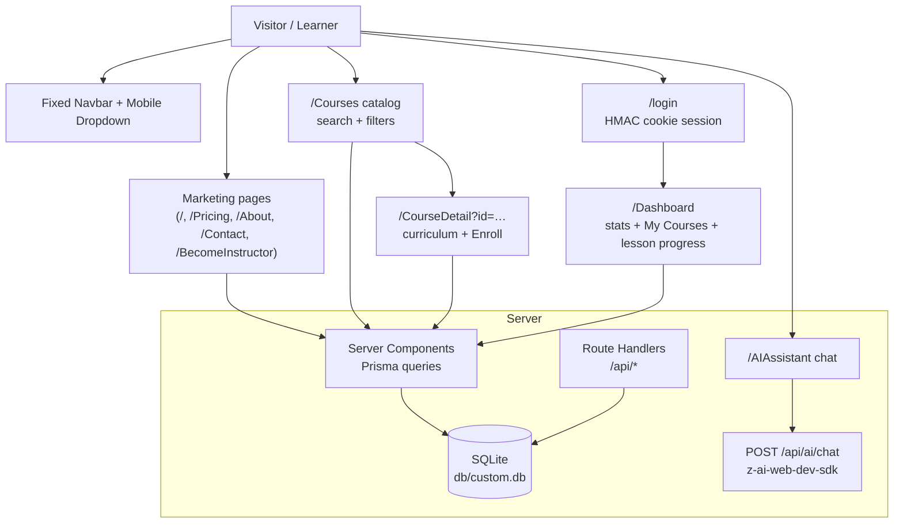

# NexusLearn


A production-grade e-learning platform — marketing site, searchable course catalog, enrollment with per-lesson progress tracking, a learner dashboard, and an AI study assistant. Built as a faithful, fully-functional clone of the NexusLearn reference app, rebuilt on the modern Next.js 16 stack.

## Overview

NexusLearn demonstrates a complete ed-tech product loop: visitors browse featured courses and learning paths on a dark, gradient-accented marketing site; learners sign in, enroll in expert-led courses, and work through curricula with live progress tracking on their dashboard; an AI study assistant answers questions 24/7. The problem it solves is the standard LMS boilerplate problem — this repo gives you a pixel-polished, fully working starting point with real authentication, a real database, and real progress semantics, not a static mock.

Everything runs from one Next.js app with a zero-config SQLite database, first-party cookie sessions, and an AI chat API — no external auth provider, no Redis, no Docker required for local development.

## Key Features

| Feature | Description |
|---|---|
| 🎓 Course catalog | 9 seeded expert-led courses with search, category/level filters and 5 sort modes |
| 📄 Course detail | Curriculum list, instructor profile, pricing with discount badge, enrollment |
| 📊 Learner dashboard | Enrolled/In-Progress/Completed/Avg-Progress stat cards + course progress cards |
| ✅ Progress tracking | Per-lesson completion that recomputes enrollment percentage server-side |
| 🤖 AI study assistant | Chat UI backed by a server-only LLM route with markdown-rendered answers |
| 💎 Reference pricing | Dark cosmic popular card, desc lines, FAQ stack with help icons — matched 1:1 |
| 🔐 First-party auth | HMAC-SHA256 signed cookie sessions + scrypt password hashing (no provider lock-in) |
| 📱 Mobile-first nav | Animated dropdown menu with ARIA wiring, scroll lock, symmetric breakpoints |
| ✉️ Lead capture | Contact form and newsletter subscription persisted to the database |

## Architecture

| Layer | Technology | Version | Purpose |
|---|---|---|---|
| Framework | Next.js (App Router) | 16.3.6 | Server components, route handlers, standalone output |
| UI runtime | React | 19.3 | Function components, no forwardRef |
| Language | TypeScript (strict) | 5.9 | Type safety across app and tests |
| Styling | Tailwind CSS | 4.3.3 | CSS-first config (`@theme`), v3-era palette pinned for pixel parity |
| Components | shadcn/ui-style + Radix | latest | Button/Badge/Card/Select/Label primitives, CVA variants |
| ORM | Prisma | 6.19 | SQLite schema, migrations, seeded catalog |
| Auth | first-party (`node:crypto`) | — | HMAC cookie sessions, scrypt hashing |
| AI | z-ai-web-dev-sdk (server-only) | 0.0.18 | Study assistant completions |
| Unit tests | Vitest | 5.x | Auth crypto seams |
| E2E tests | Playwright | 1.63 | Mobile nav + full user journeys on the production build |



## File Hierarchy

```
📂 nexuslearn-template/
├── 📂 src/app/                    # Routes (original app casing preserved)
│   ├── 📄 page.tsx                # Landing: hero, categories, featured, paths, AI, testimonials, pricing, CTA
│   ├── 📂 Courses/                # Catalog with search + filters
│   ├── 📂 CourseDetail/           # ?id=… curriculum + enroll + sidebar
│   ├── 📂 Dashboard/              # Protected learner dashboard
│   ├── 📂 AIAssistant/            # AI chat (client) 
│   ├── 📂 login/                  # Login card
│   ├── 📂 Pricing/ About/ Contact/ BecomeInstructor/
│   ├── 📂 api/                    # auth, enrollments, ai/chat, contact, newsletter, health
│   └── 📄 globals.css             # Tailwind v4 @theme tokens + pinned palette
├── 📂 src/components/             # Navbar, Footer, CourseCard, CourseCatalog, forms, ui/ primitives
├── 📂 src/lib/                    # db (Prisma singleton), session/auth, utils
├── 📂 prisma/                     # schema.prisma, seed.ts (reference catalog), db-url.ts resolver
├── 📂 tests/                      # auth.test.ts (Vitest), e2e/ (Playwright)
├── 📂 docs/                       # screenshots/, deployment, skills references
└── 📄 AGENTS.md · CLAUDE.md · Project_Architecture_Document.md
```

## Quick Start

Prerequisites: **Bun ≥ 1.1** (or Node ≥ 20 with npm — adjust commands), SQLite (bundled with Prisma).

```bash
git clone git@github.com:nordeim/nexuslearn-template.git
cd nexuslearn-template
bun install
bun run db:push     # create db/custom.db from the schema
bun run db:seed     # seed the 9-course catalog + demo user
bun run dev         # http://localhost:3000
```

### Verify Setup

1. `curl http://localhost:3000/api/health` → `{"ok":true,"service":"nexuslearn"}`
2. Open `http://localhost:3000/Courses` → 9 course cards render
3. Sign in at `/login` with `sepnetflix2023@outlook.com` / `$Abcd1234` → returned to the landing page (reference behavior)
4. Visit `/Dashboard` — signed in you'll see your stats; signed out it renders the zeroed "Welcome back" state (reference behavior — no redirect)
5. Enroll in any course → it appears on the dashboard with a progress bar; mark lessons done and watch the stat cards update

## Environment Variables

```bash
# SQLite path — schema-relative (prisma/), pinned at runtime by prisma/db-url.ts.
# Use an ABSOLUTE path in production (docs/DEPLOYMENT.md).
DATABASE_URL="file:../db/custom.db"

# Session signing secret for HMAC cookie auth — REQUIRED in production.
# Generate with: openssl rand -hex 32
AUTH_SECRET=""

# Canonical public origin (metadata, sitemap, robots).
NEXT_PUBLIC_SITE_URL=http://localhost:3000
```

## Testing

```bash
bun run test          # Vitest unit tests (auth crypto, tag parsing, seed shape)
bun run build         # required before e2e
bun run test:e2e      # Playwright: 34 specs incl. 6 mobile-navigation guards
```

The e2e suite boots the **production standalone server** on `:3100` with an isolated, seeded `db/e2e.db` and resets enrollment state on every run. The mobile-navigation specs pin the behaviors most prone to Tailwind v4 regressions: symmetric `md:` breakpoints, dropdown open/close, route-change close, Escape close, icon swap, and scroll lock.

## API Reference

| Endpoint | Method | Auth | Description |
|---|---|---|---|
| `/api/auth/login` | POST | public | Sign in, sets `nexus_session` cookie |
| `/api/auth/logout` | POST | session | Clear session cookie |
| `/api/auth/me` | GET | public | Current session user or `null` |
| `/api/enrollments` | GET | session | My enrollments with course data |
| `/api/enrollments` | POST | session | Enroll in a course (idempotent upsert) |
| `/api/enrollments/progress` | POST | session | Mark a lesson complete, recompute progress % (returns `completedLessonIds`) |
| `/api/ai/chat` | POST | public | AI study assistant (server-only SDK) |
| `/api/contact` | POST | public | Persist a contact message |
| `/api/newsletter` | POST | public | Subscribe an email |
| `/api/health` | GET | public | Liveness probe |

## Design System

| Token | Value | Usage |
|---|---|---|
| Brand cyan | `#18CCFC` (`cyan-400 #22d3ee` in utilities) | Gradient start, hero accents |
| Brand purple | `#6344F5` (`purple-600 #9333ea` in utilities) | Gradient end, CTAs, active states |
| Brand pink | `#AE48FF` | Gradient text end |
| Cosmic dark | `#0a0a1a` → `#0d0d2b` | Hero/AI/CTA/dashboard gradient sections |
| Typeface | Inter (next/font) | All UI |
| Radius | `rounded-xl` buttons (12px), `rounded-2xl` cards (16px) | Buttons/badges vs cards |
| Primary button | `bg-gradient-to-r from-cyan-500 to-purple-600` + `shadow-purple-500/25` glow | CTAs |

Full token reference with evidence: `Project_Architecture_Document.md` §5.

## Troubleshooting

| Issue | Solution |
|---|---|
| Everything renders transparent / no theme colors | `:root` vars must be `hsl()`-wrapped full values, not v3 bare triplets (Tailwind v4 `@theme inline` rule) |
| "Unable to open the database file" | Ensure every PrismaClient uses `datasourceUrl: resolveDatabaseUrl()`; check `db/` exists after `bun run db:push`; a stale `DATABASE_URL` shell export overrides the repo `.env` — unset it |
| E2E "Enroll Now" not found | Run `bun run build` before `test:e2e`; the suite resets enrollments in global-setup — a stale build is the usual culprit |
| Colors slightly off vs reference | The v3-era palette must stay pinned in `@theme` (do not revert to v4 oklch defaults) |
| Login fails on standalone build | `AUTH_SECRET` must be set (any 32-hex value) — sessions won't verify across restarts otherwise |

## Contributing

- Verification gate before every push: `bun run lint && bun run typecheck && bun run test && bun run build && bun run test:e2e`.
- Tailwind v4: CSS-first configuration only — no `tailwind.config.js`; custom tokens go in `src/app/globals.css`.
- React 19: no `forwardRef`; keep client components as leaf interactive widgets.
- Push via the SSH wrapper workflow (`docs/how-to-git-push-using-ssh-wrapper_SKILL.md`); keys stay outside the repo.

## License

Private project — all rights reserved by the repository owner.
