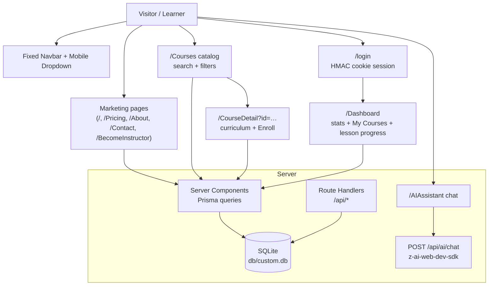

# NexusLearn


A production-grade e-learning platform — marketing site, searchable course catalog, enrollment with per-lesson progress tracking, a learner dashboard, and an AI study assistant. Built as a faithful, fully-functional clone of the NexusLearn reference app, rebuilt on the modern Next.js 16 stack.

## Overview

NexusLearn demonstrates a complete ed-tech product loop: visitors browse featured courses and learning paths on a dark, gradient-accented marketing site; learners sign in, enroll in expert-led courses, and work through curricula with live progress tracking on their dashboard; an AI study assistant answers questions 24/7. The problem it solves is the standard LMS boilerplate problem — this repo gives you a pixel-polished, fully working starting point with real authentication, a real database, and real progress semantics, not a static mock.

Everything runs from one Next.js app with a zero-config SQLite database, first-party cookie sessions, and an AI chat API — no external auth provider, no Redis, no Docker required for local development.

## Key Features

| Feature | Description |
|---|---|
| 🎓 Course catalog | 9 seeded expert-led courses with search, category/level filters and 5 sort modes |
| 📄 Course detail | Dark hero + price card, expandable "About This Course" (4 courses), curriculum, instructor profile, level row in the sidebar, enrollment |
| 📊 Learner dashboard | Enrolled/In-Progress/Completed/Avg-Progress stat cards + course progress cards |
| ✅ Progress tracking | Per-lesson completion that recomputes enrollment percentage server-side |
| 🤖 AI study assistant | Chat UI backed by a server-only LLM route with markdown-rendered answers |
| 💎 Reference pricing | Dark cosmic popular card, desc lines, FAQ stack with help icons — matched 1:1 |
| 🔐 First-party auth | HMAC-SHA256 signed cookie sessions + scrypt password hashing (no provider lock-in) |
| 👤 Signup + verify | In-card signup → 6-digit email verification → signed in (simulated delivery — no SMTP required) |
| 🗝 Forgot password | In-card reset view + check-your-email state (reference state machine) |
| 📱 Mobile-first nav | Animated dropdown menu with ARIA wiring, scroll lock, symmetric breakpoints |
| ✉️ Lead capture | Contact form and newsletter subscription persisted to the database |

## Architecture

| Layer | Technology | Version | Purpose |
|---|---|---|---|
| Framework | Next.js (App Router) | 16.3.6 | Server components, route handlers, standalone output |
| UI runtime | React | 19.3 | Function components, no forwardRef |
| Language | TypeScript (strict) | 5.9 | Type safety across app and tests |
| Styling | Tailwind CSS | 4.3.3 | CSS-first config (`@theme`), v3-era palette pinned for pixel parity |
| Components | shadcn/ui-style + Radix | latest | Button/Badge/Card/Select/Label primitives, CVA variants |
| ORM | Prisma | 6.19 | SQLite schema, migrations, seeded catalog |
| Auth | first-party (`node:crypto`) | — | HMAC cookie sessions, scrypt hashing |
| AI | z-ai-web-dev-sdk (server-only) | 0.0.18 | Study assistant completions |
| Unit tests | Vitest | 5.x | Auth crypto seams |
| E2E tests | Playwright | 1.63 | Mobile nav + full user journeys on the production build |



## File Hierarchy

```
📂 nexuslearn-template/
├── 📂 src/app/                    # Routes (original app casing preserved)
│   ├── 📄 page.tsx                # Landing: hero, categories, featured, paths, AI, testimonials, pricing, CTA
│   ├── 📂 Courses/                # Catalog with search + filters
│   ├── 📂 CourseDetail/           # ?id=… curriculum + enroll + sidebar
│   ├── 📂 Dashboard/              # Protected learner dashboard
│   ├── 📂 AIAssistant/            # AI chat (client) 
│   ├── 📂 login/                  # Login card
│   ├── 📂 Pricing/ About/ Contact/ BecomeInstructor/
│   ├── 📂 api/                    # auth, enrollments, ai/chat, contact, newsletter, health
│   └── 📄 globals.css             # Tailwind v4 @theme tokens + pinned palette
├── 📂 src/components/             # Navbar, Footer, CourseCard, CourseCatalog, forms, ui/ primitives
├── 📂 src/lib/                    # db (Prisma singleton), session/auth, utils
├── 📂 prisma/                     # schema.prisma, seed.ts (reference catalog), db-url.ts resolver
├── 📂 tests/                      # auth.test.ts (Vitest), e2e/ (Playwright)
├── 📂 docs/                       # screenshots/, deployment, skills references
└── 📄 AGENTS.md · CLAUDE.md · Project_Architecture_Document.md
```

## Quick Start

Prerequisites: **Bun ≥ 1.1** (or Node ≥ 20 with npm — adjust commands), SQLite (bundled with Prisma).

```bash
git clone git@github.com:nordeim/nexuslearn-template.git
cd nexuslearn-template
bun install
bun run db:push     # create db/custom.db from the schema
bun run db:seed     # seed the 9-course catalog + demo user
bun run dev         # http://localhost:3000
```

### Verify Setup

1. `curl http://localhost:3000/api/health` → `{"ok":true,"service":"nexuslearn"}`
2. Open `http://localhost:3000/Courses` → 9 course cards render
3. Sign in at `/login` with `sepnetflix2023@outlook.com` / `$Abcd1234` → returned to the landing page (reference behavior)
4. Visit `/Dashboard` — signed in you'll see your stats; signed out it renders the zeroed "Welcome back" state (reference behavior — no redirect)
5. Enroll in any course → it appears on the dashboard with a progress bar; mark lessons done and watch the stat cards update

## Environment Variables

```bash
# SQLite path — schema-relative (prisma/), pinned at runtime by prisma/db-url.ts.
# The .env declaration is ENFORCED: an absolute DATABASE_URL exported in the
# shell is ignored while .env declares this relative URL, so the database can
# never silently leave <repo>/db/ (stale sandbox/CI exports are the failure
# mode; the db:* scripts route through prisma/db-cli.ts for the same reason).
# Use an ABSOLUTE path in production — set it IN the .env (docs/DEPLOYMENT.md).
DATABASE_URL="file:../db/custom.db"

# Session signing secret for HMAC cookie auth — REQUIRED in production.
# Generate with: openssl rand -hex 32
AUTH_SECRET=""

# Canonical public origin (metadata, sitemap, robots).
NEXT_PUBLIC_SITE_URL=http://localhost:3000
```

## Testing

```bash
bun run test          # Vitest unit tests (41: auth crypto, tag parsing, eyebrow map, seed shape + display order + longDescription matrix, metadata helper, DATABASE_URL resolution — the pollution guard, SVG-prop console hygiene)
bun run build         # required before e2e
bun run test:e2e      # Playwright: 236 specs incl. 10 mobile-navigation guards
```

The e2e suite boots the **production standalone server** on `:3100` with an isolated, seeded `db/e2e.db` and resets enrollment state on every run. The mobile-navigation specs pin the behaviors most prone to Tailwind v4 regressions: symmetric `md:` breakpoints, dropdown open/close, route-change close, Escape close, icon swap, and scroll lock. The session-5 specs pin the login state machine (reset/signup/verify), the head metadata, the in-place newsletter success state and the CourseDetail not-found view. The session-6 specs pin the per-route OG identity (og:title/twitter:title/og:url mirroring the document title + canonical), the sidebar level row, the pricing `-mt-8` overlap, the reference `h-9` search input and the landing grid/AI-chat class parity. The session-7 specs pin the reference **display order** (catalog "Newest" + landing featured subsequence), the category grid's dead-gradient icon classes, the featured-section flex header with the in-header CTA, the testimonials card redesign, the landing button bases, the Courses filter card (sliders icon + old-style select triggers), the emerald level badge, the CourseDetail lessons-stat icon, the Pricing circle-help FAQ icon, the Contact form controls, the About stats structure, the BecomeInstructor hero and the AI composer button. The session-8 specs pin the **seed idempotency contract** (the About-section presence matrix — no stale `longDescription` rows can survive a re-seed), the **tags-only "What You'll Learn" list** (the level renders once, in the Award-icon divider row) and the Dashboard class parity (bare stats grid, lucide stat icons, empty-state button bases). The session-9 specs pin the **Tailwind v4 space-y engine trap** (the mobile panel's CTA link must render the reference 4px gap — v4's `:where()` zero-specificity engine resurrects a naive `mt-3` into a 12px gap — and the open panel must measure the reference 405px) plus the navbar chrome (the My Dashboard button bases on desktop + in the panel, the bare trigger string, the logo span byte order). The session-10 specs pin the **`/Home` hero-state navbar** (the reference footer target renders the FULL landing treatment — transparent navbar + white logo + `text-white/80` mobile trigger at scroll 0, flipping to the white-nav after scroll, byte-identical to `/`) and the 404 wrapper's deliberate `main.min-h-dvh` hardening (the live 404 ships a landmark-less `div.min-h-screen`; the clone keeps the `main` landmark + the dvh page-root form, pinned so a future audit cannot "fix" it backwards). The session-11 specs pin **copy + glyph fidelity and the login card-interior ownership**: the landing's Digital Marketing Pro path card carries the live description, the testimonial quotes render ASCII double quotes (U+0022, not typographic quotes), and the login card's 5-view state machine owns the WHOLE card interior — on reset / reset-sent / signup / verify the logo ring, the `Welcome to NexusLearn` h1, the Google button and the OR divider are absent (each view IS the card body, wrapped in `div.w-full`), with the reset email input on its own `text-base` variant and the chrome restored on the round trip back to sign-in. The session-12 specs pin the **Tailwind v4 shadow-scale shift** (the FIFTH v4 trap: v4 renamed v3's `shadow-sm` to `shadow-xs` and moved `shadow-sm` up to v3's bare-shadow geometry — one notch heavier; the `--shadow-sm` token pin in `globals.css` restores the v3 value with byte-identical classes, and the specs pin the COMPUTED box-shadows — the white navbar, the login Sign in button, the hero secondary CTA, the lesson-row hover — plus GUARD specs proving md/lg/xl/2xl were never shifted). The session-13 specs pin the **focus-ring + scroll + login-structure parity**: the login inputs' keyboard-focus ring renders the reference slate-400 (the reference's Base44 runtime injects a page-level utility sheet AFTER its static build, so `.focus:ring-slate-400:focus` wins the `--tw-ring-color` cascade on keyboard focus — an UNLAYERED cascade pin in `globals.css` restores the reference winner with byte-identical classes, while the /Courses, /Contact and button focus rings stay the `--ring` near-black, pinned by GUARD specs), the signin view's card nesting matches the reference DOM (`div.w-full > [div.space-y-3 (the Google button ONLY), the OR divider, the form]` — the previous all-inside-space-y-3 nesting rendered the same 24px gaps only by margin collapse, a latent v4 space-y trap), and every element computes `scroll-behavior: smooth` (the reference's runtime ships the universal `*` rule, not just `html`). The session-14 specs pin the **rendered-font + engine-cascade parity**: the body computes the reference's declared `Inter, system-ui, -apple-system, sans-serif` stack with NO bundled webfont (the reference ships no @font-face — its runtime declares the stack inline and every browser renders the system font; the previous next/font bundle rendered real Inter glyphs the reference never shows, the root cause of the 13-session "font-metric height bands" — after the fix every height measurement in the project is byte-exact: 11 routes x 2 viewports + all 9 CourseDetail pages), every button computes `cursor: pointer` (v4's preflight DROPPED v3's `button, [role="button"]` rule — the restored @layer base rule brings the hand cursor back; GUARD specs keep the labels default and the inputs text), the hero H1/P and CTA H2 compute the reference line-heights (v3's variant-order emission makes the responsive text-* utility's OWN line-height beat a plain leading-*; v4's --tw-leading composition flips the winner — four unlayered media-scoped pins restore 72px/28px/48px), the popular pricing card renders UNSCALED (the reference's scroll-reveal system leaves inline `transform: none` on every revealed element, permanently killing the card's scale-105; an unlayered `scale: none` pin replicates the resting state, with a GUARD proving the hover: variants stay live), the compiled CSS contains no skills/docs/tests-leaked utilities (Tailwind v4's automatic source detection scanned the repo's agent documentation — 1027 unused rules, 51% of the sheet; the `@source not` directives restrict generation to app source, pinned by canary selectors), and the login field groups + view headers carry their reference gaps (v4's space-y engine loses the gap when the gap carrier is an inline label or carries its own margin utility — two scoped follower-margin pins restore the 6px/16px/24px gaps, with the mobile /login page height pinned at the reference 762).

The session-15 specs pin the **scroll-reveal ENTRY animation** — the last documented visible behavioral variance. The live (Base44 + framer-motion) pre-hides 103 reveal targets across 9 routes with inline `opacity: 0; transform: translate…` styles at mount, reveals each element ONCE on scroll (any-pixel intersection, sibling cards staggered ~100ms) with measured per-section animation families (A "snappy": op ~310ms + transform spring with 12% overshoot; B "floaty": op ~310ms + slow back-loaded transform ~730ms; HERO: coupled ~770ms from y=30; FAQ: slower coupled from y=10; X: ±30px springs), and leaves `opacity: 1; transform: none;` inline FOREVER — the same mechanism that kills the popular card's `scale-105`. The clone ships the pre-hide in SSR markup + a zero-dependency WAAPI controller (`src/components/reveal/RevealController.tsx`) whose keyframe tables are baked from the live's measured curves; the session-15 specs pin the pre-hide strings, the gradual animation, the stagger, the one-way end state, the per-route target inventory (40/12/10/12/6/13/3/5/2/0), the controller-on-every-render-branch rule, and GUARDs proving the reveal moves no layout and keeps the session-14 pins. The session also closed the **post-gate worklog CSS leak** (the session-14 worklog entry quoted the `.selection:bg-red-200` canary after the final gate ran — `worklog.md` joins the `@source not` set, and the leak spec now re-runs LAST, after every doc write).

The session-16 specs pin the **navigation-transition surface**: back/forward scroll restoration lands INSTANTLY (the reference's CSR router never calls scrollTo — its popstate restoration is the browser-native snap; the clone's Next.js restore rides `window.scrollTo`, which the universal `* { scroll-behavior: smooth }` pin turned into a ~1s glide — `src/components/ScrollRestoreNormalizer.tsx` suppresses smooth for the popstate window via a scoped `html[data-scroll-restore]` rule, so the restoration snaps like the reference while every other programmatic scroll keeps the pinned smooth behavior), the footer-link mid-smooth-scroll restoration guard, the managed in-app navigation reset (a deliberate-better parity decision — the reference's SPA router carries the scroll position over, clamped by the new page's CSR loading shell, landing users mid-page), the per-route `document.title` update on soft navigation (the reference's router leaves the STALE title — another deliberate-better decision), and a zero-CLS guard (both sites measure CLS 0.0000 on every route).

The session-17 specs pin the **deep-link / query-parameter surface**: duplicate `?id=` keys take the FIRST value (Next.js delivers repeated params as `string[]` — the naive destructure passed the array to Prisma and rendered the error boundary; the reference's `URLSearchParams.get` semantics are restored by an explicit first-value normalization), the landing's Personal Development / AI & Innovation category cards link with the reference's UNDERSCORE slugs (`personal_development` / `ai_innovation` — the hyphen forms are unknown on the reference), an unknown `?category=` slug leaves the catalog filter in the reference's no-match state (EMPTY category trigger + 0 cards + "No courses found" — not a fallback to "All Categories"; an empty param value is absent → "all"), and the content routes match CASE-INSENSITIVELY like the reference's router (`/courses`, `/COURSES`, `/pricing` all render, URL preserved via the `src/proxy.ts` rewrite — `/login` stays exact-match, its case variants 404 like the reference's platform-level login route; the nav's active state is case-insensitive too). The session also VERIFIED at parity: the form-state persistence sweep (catalog search + login values reset identically on navigate-away + back) and the print-to-PDF comparison (page counts match on `/`, `/Courses`, `/Pricing` in both fresh and fully-revealed states — the reveal system's IntersectionObserver does not fire during print on either site).

The session-18 specs pin the **error/empty-state + element-tag/attribute + data-mutation surfaces** — three families no settled-DOM diff can see. The **transient pending states**: the AI chat's loading bubble is the reference `loader-circle` spinner + "Thinking..." text (not bouncing dots — the bubble only exists while the request is pending, so every class/text/screenshot audit after `networkidle` structurally missed it; pinned under a delayed route), and the newsletter/contact buttons replace their ENTIRE content with the literal "..." / "Sending..." (three ASCII periods, charCodes 46,46,46 — byte-verified; not the U+2026 ellipsis glyph) while disabled during flight. The **form-control attribute surface** (placeholders, ids, alts — invisible to innerText diffs which read rendered text nodes only): the /Contact message placeholder is "Tell us how we can help...", the form ids are the reference bare names (`name`/`email`/`message` with matching label wiring — also the stronger autofill hints), the CourseDetail instructor portrait ships `alt=""` (decorative — the name renders in the adjacent paragraph; `alt={name}` made screen readers announce it twice), and the catalog search input carries NO type attribute. The **element-tag surface**: the three /Pricing card CTAs are bare INERT `<button>`s (the live's clicks fire no navigation — verified with network monitoring; the previous `next/link` wrappers made each CTA double-focusable, two tab stops, and navigated to /login, which the live does not do). The **per-route token theme**: the Base44 runtime injects PER-PAGE token sheets — 10 of 11 routes carry the shadcn NEUTRAL theme (byte-equal to the clone's :root) but `/login` alone carries ZINC, rendering the card buttons' focus rings `rgb(9,9,11)` instead of `rgb(10,10,10)`; a `body:has(main[data-login-theme])` scoped zinc block in `globals.css` restores the reference ring (the same 1-3 sRGB-unit drift family as the palette pin). VERIFIED at parity: the login wrong-credentials error, the native HTML5 validation on both forms, the newsletter success swap, the select dropdowns' rendered values, and the tab order on every route. Deliberate-better decisions (documented + pinned): the clone's explicit AI-chat error bubble + retryable newsletter/contact buttons (the live's failures leave PERMANENTLY-STUCK "Thinking..."/"..."/"Sending..." states — verified at +12-15s) and the fully-functional enrollment flow (the live's "Enroll Now" is inert — it fires only analytics requests, no enrollment ever happens; the reference dashboard ships the empty state, VLM-verified against the reference image).

Session 19 was the **environment-integrity pass** (see `docs/remediation-plan-session19.md`): the database-location contract is now ENFORCED in code instead of documented as a manual workaround — `tests/db-url.test.ts` (8 Vitest specs) pins that `.env`'s `DATABASE_URL="file:../db/custom.db"` always resolves to `<repo>/db/custom.db` and that an absolute shell export pointing elsewhere (the sandbox/CI stale-export failure mode that silently created the database OUTSIDE the repository) is ignored; `prisma/db-cli.ts` extends the same guarantee to the Prisma CLI through every `db:*` script. The session also re-verified every standing surface at the byte-exact state (heights ×11 routes ×2 viewports including CourseDetail, the class-set diffs, the FULL mobile-menu battery — 405px panel, 8 links, 4px pre-CTA gap, toggle + route-change close, scroll lock, ARIA: **no Tailwind v4 bug**), the dashboard empty state against the reference image, and the AI chat end-to-end (a real SDK answer, captured in `docs/screenshots/aiassistant-answer--desktop.png`), plus three fresh-eyes audit surfaces — HTTP response headers (only CDN/proxy infrastructure differs), viewport-resize behaviors (the 768px breakpoint swap identical on both sites) and locale/intl number formatting (identical everywhere). One accepted variance documented: the /Contact subject select trigger's class ORDER differs from the live (token sets identical, rendering identical; the live's own /Courses triggers use the clone's appended form).

Session 20 was the **element-tag drift pass** (see `docs/remediation-plan-session20.md`): two new fresh-eyes probes — the line-by-line `innerText` comparison and the tag-of-shared-class map — exposed two tag-level drifts invisible to every class-diff, height and screenshot audit (identical class strings on DIFFERENT tags; the session-18 element-tag blind-spot family, one level deeper). The /Courses course count now renders on a `<span>` like the live (the old `<p>` produced Chrome-`innerText` DOUBLE line breaks — blank lines the live's `main.innerText` does not carry), and the /AIAssistant composer wrapper is a `<div>` like the live (no `<form>` element, the send button carries no `type` attribute; Enter-to-send was already driven by the textarea's own keydown handler — the form's `onSubmit` was dead code). Every standing surface re-verified byte-exact through the change (heights ×11×2, innerText 11/11 identical, tag drift 0, the mobile battery, the AI chat end-to-end through the Enter-key path).

Session 21 was the **console-hygiene + a11y-exposure pass** (see `docs/remediation-plan-session21.md`): five new fresh-eyes probes — the console-error surface, the full a11y-tree snapshot, the link/image inventory, the pseudo-element sweep and the SVG class-histogram diff — found one real defect and four accepted variances. The defect: the /Pricing FAQ icons declared KEBAB-CASE SVG props (`stroke-width` etc.), logging three React `Invalid DOM property` console errors on every dev-server /Pricing load (rendering-neutral — invisible to every DOM/class/height diff for 20 sessions; fixed to the camelCase forms, DOM byte-identical, dev console now clean). The variances: lucide-react's `aria-hidden="true"` icon default (the live ships its icons EXPOSED as nameless a11y img nodes — the clone's hidden form is the deliberate WCAG-correct hardening, now pinned by a spec), the `<next-route-announcer>` framework element, and the /login logo's CDN-vs-local hosting (byte-identical asset). The SVG inventory itself is proven identical on every route (per-class histograms) — the aria-hidden attribute is the sole svg difference. Every standing surface re-verified byte-exact through the change (heights ×11×2, innerText 11/11, tag drift 0, the class sweep, the mobile battery — no Tailwind v4 bug).

## API Reference

| Endpoint | Method | Auth | Description |
|---|---|---|---|
| `/api/auth/login` | POST | public | Sign in, sets `nexus_session` cookie |
| `/api/auth/logout` | POST | session | Clear session cookie |
| `/api/auth/me` | GET | public | Current session user or `null` |
| `/api/auth/signup` | POST | public | Create an account (unverified; code logged server-side) |
| `/api/auth/verify` | POST | public | Verify the 6-digit code, mark verified + sign in |
| `/api/auth/forgot-password` | POST | public | Request a reset link (always ok — no user enumeration) |
| `/api/enrollments` | GET | session | My enrollments with course data |
| `/api/enrollments` | POST | session | Enroll in a course (idempotent upsert) |
| `/api/enrollments/progress` | POST | session | Mark a lesson complete, recompute progress % (returns `completedLessonIds`) |
| `/api/ai/chat` | POST | public | AI study assistant (server-only SDK) |
| `/api/contact` | POST | public | Persist a contact message |
| `/api/newsletter` | POST | public | Subscribe an email |
| `/api/health` | GET | public | Liveness probe |

## Design System

| Token | Value | Usage |
|---|---|---|
| Brand cyan | `#18CCFC` (`cyan-400 #22d3ee` in utilities) | Gradient start, hero accents |
| Brand purple | `#6344F5` (`purple-600 #9333ea` in utilities) | Gradient end, CTAs, active states |
| Brand pink | `#AE48FF` | Gradient text end |
| Cosmic dark | `#0a0a1a` → `#0d0d2b` | Hero/AI/CTA/dashboard gradient sections |
| Typeface | Inter (next/font) | All UI |
| Radius | `rounded-xl` buttons (12px), `rounded-2xl` cards (16px) | Buttons/badges vs cards |
| Primary button | `bg-gradient-to-r from-cyan-500 to-purple-600` + `shadow-purple-500/25` glow | CTAs |

Full token reference with evidence: `Project_Architecture_Document.md` §5.

## Troubleshooting

| Issue | Solution |
|---|---|
| Everything renders transparent / no theme colors | `:root` vars must be `hsl()`-wrapped full values, not v3 bare triplets (Tailwind v4 `@theme inline` rule) |
| "Unable to open the database file" | Ensure every PrismaClient uses `datasourceUrl: resolveDatabaseUrl()`; check `db/` exists after `bun run db:push` — the database lives at `<repo>/db/custom.db`. A stale ABSOLUTE `DATABASE_URL` shell export is ignored by design while `.env` declares the relative URL (a one-time `[db-url]` note prints) — put production absolute URLs IN the `.env` |
| E2E "Enroll Now" not found | Run `bun run build` before `test:e2e`; the suite resets enrollments in global-setup — a stale build is the usual culprit |
| Colors slightly off vs reference | The v3-era palette must stay pinned in `@theme` (do not revert to v4 oklch defaults) |
| Login fails on standalone build | `AUTH_SECRET` must be set (any 32-hex value) — sessions won't verify across restarts otherwise |

## Contributing

- Verification gate before every push: `bun run lint && bun run typecheck && bun run test && bun run build && bun run test:e2e`.
- Tailwind v4: CSS-first configuration only — no `tailwind.config.js`; custom tokens go in `src/app/globals.css`.
- React 19: no `forwardRef`; keep client components as leaf interactive widgets.
- Push via the SSH wrapper workflow (`docs/how-to-git-push-using-ssh-wrapper_SKILL.md`); keys stay outside the repo.

## License

Private project — all rights reserved by the repository owner.
