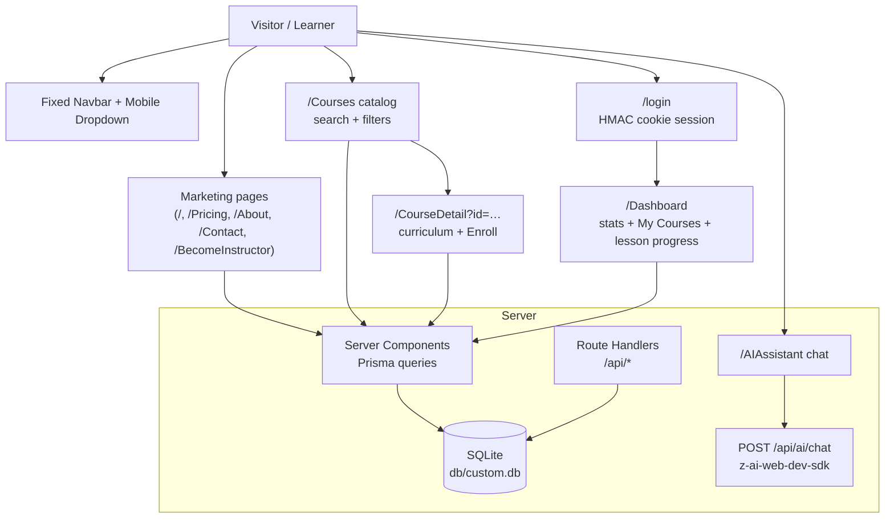

# NexusLearn


A production-grade e-learning platform — marketing site, searchable course catalog, enrollment with per-lesson progress tracking, a learner dashboard, and an AI study assistant. Built as a faithful, fully-functional clone of the NexusLearn reference app, rebuilt on the modern Next.js 16 stack.

## Overview

NexusLearn demonstrates a complete ed-tech product loop: visitors browse featured courses and learning paths on a dark, gradient-accented marketing site; learners sign in, enroll in expert-led courses, and work through curricula with live progress tracking on their dashboard; an AI study assistant answers questions 24/7. The problem it solves is the standard LMS boilerplate problem — this repo gives you a pixel-polished, fully working starting point with real authentication, a real database, and real progress semantics, not a static mock.

Everything runs from one Next.js app with a zero-config SQLite database, first-party cookie sessions, and an AI chat API — no external auth provider, no Redis, no Docker required for local development.

## Key Features

| Feature | Description |
|---|---|
| 🎓 Course catalog | 9 seeded expert-led courses with search, category/level filters and 5 sort modes |
| 📄 Course detail | Dark hero + price card, expandable "About This Course" (4 courses), curriculum, instructor profile, level row in the sidebar, enrollment |
| 📊 Learner dashboard | Enrolled/In-Progress/Completed/Avg-Progress stat cards + course progress cards |
| ✅ Progress tracking | Per-lesson completion that recomputes enrollment percentage server-side |
| 🤖 AI study assistant | Chat UI backed by a server-only LLM route with markdown-rendered answers |
| 💎 Reference pricing | Dark cosmic popular card, desc lines, FAQ stack with help icons — matched 1:1 |
| 🔐 First-party auth | HMAC-SHA256 signed cookie sessions + scrypt password hashing (no provider lock-in) |
| 👤 Signup + verify | In-card signup → 6-digit email verification → signed in (simulated delivery — no SMTP required) |
| 🗝 Forgot password | In-card reset view + check-your-email state (reference state machine) |
| 📱 Mobile-first nav | Animated dropdown menu with ARIA wiring, scroll lock, symmetric breakpoints |
| ✉️ Lead capture | Contact form and newsletter subscription persisted to the database |

## Architecture

| Layer | Technology | Version | Purpose |
|---|---|---|---|
| Framework | Next.js (App Router) | 16.3.6 | Server components, route handlers, standalone output |
| UI runtime | React | 19.3 | Function components, no forwardRef |
| Language | TypeScript (strict) | 5.9 | Type safety across app and tests |
| Styling | Tailwind CSS | 4.3.3 | CSS-first config (`@theme`), v3-era palette pinned for pixel parity |
| Components | shadcn/ui-style + Radix | latest | Button/Badge/Card/Select/Label primitives, CVA variants |
| ORM | Prisma | 6.19 | SQLite schema, migrations, seeded catalog |
| Auth | first-party (`node:crypto`) | — | HMAC cookie sessions, scrypt hashing |
| AI | z-ai-web-dev-sdk (server-only) | 0.0.18 | Study assistant completions |
| Unit tests | Vitest | 5.x | Auth crypto seams |
| E2E tests | Playwright | 1.63 | Mobile nav + full user journeys on the production build |



## File Hierarchy

```
📂 nexuslearn-template/
├── 📂 src/app/                    # Routes (original app casing preserved)
│   ├── 📄 page.tsx                # Landing: hero, categories, featured, paths, AI, testimonials, pricing, CTA
│   ├── 📂 Courses/                # Catalog with search + filters
│   ├── 📂 CourseDetail/           # ?id=… curriculum + enroll + sidebar
│   ├── 📂 Dashboard/              # Protected learner dashboard
│   ├── 📂 AIAssistant/            # AI chat (client) 
│   ├── 📂 login/                  # Login card
│   ├── 📂 Pricing/ About/ Contact/ BecomeInstructor/
│   ├── 📂 api/                    # auth, enrollments, ai/chat, contact, newsletter, health
│   └── 📄 globals.css             # Tailwind v4 @theme tokens + pinned palette
├── 📂 src/components/             # Navbar, Footer, CourseCard, CourseCatalog, forms, ui/ primitives
├── 📂 src/lib/                    # db (Prisma singleton), session/auth, utils
├── 📂 prisma/                     # schema.prisma, seed.ts (reference catalog), db-url.ts resolver
├── 📂 tests/                      # auth.test.ts (Vitest), e2e/ (Playwright)
├── 📂 docs/                       # screenshots/, deployment, skills references
└── 📄 AGENTS.md · CLAUDE.md · Project_Architecture_Document.md
```

## Quick Start

Prerequisites: **Bun ≥ 1.1** (or Node ≥ 20 with npm — adjust commands), SQLite (bundled with Prisma).

```bash
git clone git@github.com:nordeim/nexuslearn-template.git
cd nexuslearn-template
bun install
bun run db:push     # create db/custom.db from the schema
bun run db:seed     # seed the 9-course catalog + demo user
bun run dev         # http://localhost:3000
```

### Verify Setup

1. `curl http://localhost:3000/api/health` → `{"ok":true,"service":"nexuslearn"}`
2. Open `http://localhost:3000/Courses` → 9 course cards render
3. Sign in at `/login` with `sepnetflix2023@outlook.com` / `$Abcd1234` → returned to the landing page (reference behavior)
4. Visit `/Dashboard` — signed in you'll see your stats; signed out it renders the zeroed "Welcome back" state (reference behavior — no redirect)
5. Enroll in any course → it appears on the dashboard with a progress bar; mark lessons done and watch the stat cards update

## Environment Variables

```bash
# SQLite path — schema-relative (prisma/), pinned at runtime by prisma/db-url.ts.
# The .env declaration is ENFORCED: an absolute DATABASE_URL exported in the
# shell is ignored while .env declares this relative URL, so the database can
# never silently leave <repo>/db/ (stale sandbox/CI exports are the failure
# mode; the db:* scripts route through prisma/db-cli.ts for the same reason).
# Use an ABSOLUTE path in production — set it IN the .env (docs/DEPLOYMENT.md).
DATABASE_URL="file:../db/custom.db"

# Session signing secret for HMAC cookie auth — REQUIRED in production.
# Generate with: openssl rand -hex 32
AUTH_SECRET=""

# Verification-code delivery mode (session 35). UNSET = the simulated
# template contract (any 6-digit code verifies — no SMTP ships with the
# template; the code is logged server-side). "smtp" = the real code
# comparison + the 10-minute expiry window (the signup code is persisted
# as an HMAC-SHA256 hash either way — see docs/DEPLOYMENT.md §13).
# AUTH_DELIVERY=smtp

# Canonical public origin (metadata, sitemap, robots).
NEXT_PUBLIC_SITE_URL=http://localhost:3000
```

## Testing

```bash
bun run test          # Vitest unit tests (126: auth crypto incl. the session-32 iat-lifetime bounds + the session-34 per-user epoch, tag parsing, eyebrow map, seed shape + display order + longDescription matrix + the Advanced Python working-cover pin, metadata helper, DATABASE_URL resolution — the pollution guard, SVG-prop console hygiene, the img loading-attribute parity guard, the Accept-Language parser + locale-formatting source guards, the request-size guard, the per-IP throttle, the session-32 logout-cookie + dependency pins, the session-33 timing-equalizer + seven-route guard pin + secret-enforcement batteries, the session-35 verification-code seam + persistence/revoke source pins)
bun run build         # required before e2e
bun run test:e2e      # Playwright: 307 specs incl. 10 mobile-navigation guards + the session-22 keyboard/storage/media pins + the session-23 security-headers/axe-WCAG pins + the session-24 CSP/canonicalization/static-cache pins + the session-25 crawler/SEO-file pins + the session-26 verb-matrix/form-metadata pins + the session-27 compression/validator pins + the session-28 image-loading/form-constraint incl. client-view pins + the session-29 locale/print/resource-hints pins + the session-30 progress-integrity/router-scroll pins + the session-31 request-size/rate-limit pins + the session-32 session-lifetime/logout-symmetry/aria-live pins + the session-33 verify-guard/timing-equalizer/throttle pins + the session-34 revocation-epoch/bundle-budget pins
```

The e2e suite boots the **production standalone server** on `:3100` with an isolated, seeded `db/e2e.db` and resets enrollment state on every run. The mobile-navigation specs pin the behaviors most prone to Tailwind v4 regressions: symmetric `md:` breakpoints, dropdown open/close, route-change close, Escape close, icon swap, and scroll lock. The session-5 specs pin the login state machine (reset/signup/verify), the head metadata, the in-place newsletter success state and the CourseDetail not-found view. The session-6 specs pin the per-route OG identity (og:title/twitter:title/og:url mirroring the document title + canonical), the sidebar level row, the pricing `-mt-8` overlap, the reference `h-9` search input and the landing grid/AI-chat class parity. The session-7 specs pin the reference **display order** (catalog "Newest" + landing featured subsequence), the category grid's dead-gradient icon classes, the featured-section flex header with the in-header CTA, the testimonials card redesign, the landing button bases, the Courses filter card (sliders icon + old-style select triggers), the emerald level badge, the CourseDetail lessons-stat icon, the Pricing circle-help FAQ icon, the Contact form controls, the About stats structure, the BecomeInstructor hero and the AI composer button. The session-8 specs pin the **seed idempotency contract** (the About-section presence matrix — no stale `longDescription` rows can survive a re-seed), the **tags-only "What You'll Learn" list** (the level renders once, in the Award-icon divider row) and the Dashboard class parity (bare stats grid, lucide stat icons, empty-state button bases). The session-9 specs pin the **Tailwind v4 space-y engine trap** (the mobile panel's CTA link must render the reference 4px gap — v4's `:where()` zero-specificity engine resurrects a naive `mt-3` into a 12px gap — and the open panel must measure the reference 405px) plus the navbar chrome (the My Dashboard button bases on desktop + in the panel, the bare trigger string, the logo span byte order). The session-10 specs pin the **`/Home` hero-state navbar** (the reference footer target renders the FULL landing treatment — transparent navbar + white logo + `text-white/80` mobile trigger at scroll 0, flipping to the white-nav after scroll, byte-identical to `/`) and the 404 wrapper's deliberate `main.min-h-dvh` hardening (the live 404 ships a landmark-less `div.min-h-screen`; the clone keeps the `main` landmark + the dvh page-root form, pinned so a future audit cannot "fix" it backwards). The session-11 specs pin **copy + glyph fidelity and the login card-interior ownership**: the landing's Digital Marketing Pro path card carries the live description, the testimonial quotes render ASCII double quotes (U+0022, not typographic quotes), and the login card's 5-view state machine owns the WHOLE card interior — on reset / reset-sent / signup / verify the logo ring, the `Welcome to NexusLearn` h1, the Google button and the OR divider are absent (each view IS the card body, wrapped in `div.w-full`), with the reset email input on its own `text-base` variant and the chrome restored on the round trip back to sign-in. The session-12 specs pin the **Tailwind v4 shadow-scale shift** (the FIFTH v4 trap: v4 renamed v3's `shadow-sm` to `shadow-xs` and moved `shadow-sm` up to v3's bare-shadow geometry — one notch heavier; the `--shadow-sm` token pin in `globals.css` restores the v3 value with byte-identical classes, and the specs pin the COMPUTED box-shadows — the white navbar, the login Sign in button, the hero secondary CTA, the lesson-row hover — plus GUARD specs proving md/lg/xl/2xl were never shifted). The session-13 specs pin the **focus-ring + scroll + login-structure parity**: the login inputs' keyboard-focus ring renders the reference slate-400 (the reference's Base44 runtime injects a page-level utility sheet AFTER its static build, so `.focus:ring-slate-400:focus` wins the `--tw-ring-color` cascade on keyboard focus — an UNLAYERED cascade pin in `globals.css` restores the reference winner with byte-identical classes, while the /Courses, /Contact and button focus rings stay the `--ring` near-black, pinned by GUARD specs), the signin view's card nesting matches the reference DOM (`div.w-full > [div.space-y-3 (the Google button ONLY), the OR divider, the form]` — the previous all-inside-space-y-3 nesting rendered the same 24px gaps only by margin collapse, a latent v4 space-y trap), and every element computes `scroll-behavior: smooth` (the reference's runtime ships the universal `*` rule, not just `html`). The session-14 specs pin the **rendered-font + engine-cascade parity**: the body computes the reference's declared `Inter, system-ui, -apple-system, sans-serif` stack with NO bundled webfont (the reference ships no @font-face — its runtime declares the stack inline and every browser renders the system font; the previous next/font bundle rendered real Inter glyphs the reference never shows, the root cause of the 13-session "font-metric height bands" — after the fix every height measurement in the project is byte-exact: 11 routes x 2 viewports + all 9 CourseDetail pages), every button computes `cursor: pointer` (v4's preflight DROPPED v3's `button, [role="button"]` rule — the restored @layer base rule brings the hand cursor back; GUARD specs keep the labels default and the inputs text), the hero H1/P and CTA H2 compute the reference line-heights (v3's variant-order emission makes the responsive text-* utility's OWN line-height beat a plain leading-*; v4's --tw-leading composition flips the winner — four unlayered media-scoped pins restore 72px/28px/48px), the popular pricing card renders UNSCALED (the reference's scroll-reveal system leaves inline `transform: none` on every revealed element, permanently killing the card's scale-105; an unlayered `scale: none` pin replicates the resting state, with a GUARD proving the hover: variants stay live), the compiled CSS contains no skills/docs/tests-leaked utilities (Tailwind v4's automatic source detection scanned the repo's agent documentation — 1027 unused rules, 51% of the sheet; the `@source not` directives restrict generation to app source, pinned by canary selectors), and the login field groups + view headers carry their reference gaps (v4's space-y engine loses the gap when the gap carrier is an inline label or carries its own margin utility — two scoped follower-margin pins restore the 6px/16px/24px gaps, with the mobile /login page height pinned at the reference 762).

The session-15 specs pin the **scroll-reveal ENTRY animation** — the last documented visible behavioral variance. The live (Base44 + framer-motion) pre-hides 103 reveal targets across 9 routes with inline `opacity: 0; transform: translate…` styles at mount, reveals each element ONCE on scroll (any-pixel intersection, sibling cards staggered ~100ms) with measured per-section animation families (A "snappy": op ~310ms + transform spring with 12% overshoot; B "floaty": op ~310ms + slow back-loaded transform ~730ms; HERO: coupled ~770ms from y=30; FAQ: slower coupled from y=10; X: ±30px springs), and leaves `opacity: 1; transform: none;` inline FOREVER — the same mechanism that kills the popular card's `scale-105`. The clone ships the pre-hide in SSR markup + a zero-dependency WAAPI controller (`src/components/reveal/RevealController.tsx`) whose keyframe tables are baked from the live's measured curves; the session-15 specs pin the pre-hide strings, the gradual animation, the stagger, the one-way end state, the per-route target inventory (40/12/10/12/6/13/3/5/2/0), the controller-on-every-render-branch rule, and GUARDs proving the reveal moves no layout and keeps the session-14 pins. The session also closed the **post-gate worklog CSS leak** (the session-14 worklog entry quoted the `.selection:bg-red-200` canary after the final gate ran — `worklog.md` joins the `@source not` set, and the leak spec now re-runs LAST, after every doc write).

The session-16 specs pin the **navigation-transition surface**: back/forward scroll restoration lands INSTANTLY (the reference's CSR router never calls scrollTo — its popstate restoration is the browser-native snap; the clone's Next.js restore rides `window.scrollTo`, which the universal `* { scroll-behavior: smooth }` pin turned into a ~1s glide — `src/components/ScrollRestoreNormalizer.tsx` suppresses smooth for the popstate window via a scoped `html[data-scroll-restore]` rule, so the restoration snaps like the reference while every other programmatic scroll keeps the pinned smooth behavior), the footer-link mid-smooth-scroll restoration guard, the managed in-app navigation reset (a deliberate-better parity decision — the reference's SPA router carries the scroll position over, clamped by the new page's CSR loading shell, landing users mid-page), the per-route `document.title` update on soft navigation (the reference's router leaves the STALE title — another deliberate-better decision), and a zero-CLS guard (both sites measure CLS 0.0000 on every route).

The session-17 specs pin the **deep-link / query-parameter surface**: duplicate `?id=` keys take the FIRST value (Next.js delivers repeated params as `string[]` — the naive destructure passed the array to Prisma and rendered the error boundary; the reference's `URLSearchParams.get` semantics are restored by an explicit first-value normalization), the landing's Personal Development / AI & Innovation category cards link with the reference's UNDERSCORE slugs (`personal_development` / `ai_innovation` — the hyphen forms are unknown on the reference), an unknown `?category=` slug leaves the catalog filter in the reference's no-match state (EMPTY category trigger + 0 cards + "No courses found" — not a fallback to "All Categories"; an empty param value is absent → "all"), and the content routes match CASE-INSENSITIVELY like the reference's router (`/courses`, `/COURSES`, `/pricing` all render, URL preserved via the `src/proxy.ts` rewrite — `/login` stays exact-match, its case variants 404 like the reference's platform-level login route; the nav's active state is case-insensitive too). The session also VERIFIED at parity: the form-state persistence sweep (catalog search + login values reset identically on navigate-away + back) and the print-to-PDF comparison (page counts match on `/`, `/Courses`, `/Pricing` in both fresh and fully-revealed states — the reveal system's IntersectionObserver does not fire during print on either site).

The session-18 specs pin the **error/empty-state + element-tag/attribute + data-mutation surfaces** — three families no settled-DOM diff can see. The **transient pending states**: the AI chat's loading bubble is the reference `loader-circle` spinner + "Thinking..." text (not bouncing dots — the bubble only exists while the request is pending, so every class/text/screenshot audit after `networkidle` structurally missed it; pinned under a delayed route), and the newsletter/contact buttons replace their ENTIRE content with the literal "..." / "Sending..." (three ASCII periods, charCodes 46,46,46 — byte-verified; not the U+2026 ellipsis glyph) while disabled during flight. The **form-control attribute surface** (placeholders, ids, alts — invisible to innerText diffs which read rendered text nodes only): the /Contact message placeholder is "Tell us how we can help...", the form ids are the reference bare names (`name`/`email`/`message` with matching label wiring — also the stronger autofill hints), the CourseDetail instructor portrait ships `alt=""` (decorative — the name renders in the adjacent paragraph; `alt={name}` made screen readers announce it twice), and the catalog search input carries NO type attribute. The **element-tag surface**: the three /Pricing card CTAs are bare INERT `<button>`s (the live's clicks fire no navigation — verified with network monitoring; the previous `next/link` wrappers made each CTA double-focusable, two tab stops, and navigated to /login, which the live does not do). The **per-route token theme**: the Base44 runtime injects PER-PAGE token sheets — 10 of 11 routes carry the shadcn NEUTRAL theme (byte-equal to the clone's :root) but `/login` alone carries ZINC, rendering the card buttons' focus rings `rgb(9,9,11)` instead of `rgb(10,10,10)`; a `body:has(main[data-login-theme])` scoped zinc block in `globals.css` restores the reference ring (the same 1-3 sRGB-unit drift family as the palette pin). VERIFIED at parity: the login wrong-credentials error, the native HTML5 validation on both forms, the newsletter success swap, the select dropdowns' rendered values, and the tab order on every route. Deliberate-better decisions (documented + pinned): the clone's explicit AI-chat error bubble + retryable newsletter/contact buttons (the live's failures leave PERMANENTLY-STUCK "Thinking..."/"..."/"Sending..." states — verified at +12-15s) and the fully-functional enrollment flow (the live's "Enroll Now" is inert — it fires only analytics requests, no enrollment ever happens; the reference dashboard ships the empty state, VLM-verified against the reference image).

Session 19 was the **environment-integrity pass** (see `docs/remediation-plan-session19.md`): the database-location contract is now ENFORCED in code instead of documented as a manual workaround — `tests/db-url.test.ts` (8 Vitest specs) pins that `.env`'s `DATABASE_URL="file:../db/custom.db"` always resolves to `<repo>/db/custom.db` and that an absolute shell export pointing elsewhere (the sandbox/CI stale-export failure mode that silently created the database OUTSIDE the repository) is ignored; `prisma/db-cli.ts` extends the same guarantee to the Prisma CLI through every `db:*` script. The session also re-verified every standing surface at the byte-exact state (heights ×11 routes ×2 viewports including CourseDetail, the class-set diffs, the FULL mobile-menu battery — 405px panel, 8 links, 4px pre-CTA gap, toggle + route-change close, scroll lock, ARIA: **no Tailwind v4 bug**), the dashboard empty state against the reference image, and the AI chat end-to-end (a real SDK answer, captured in `docs/screenshots/aiassistant-answer--desktop.png`), plus three fresh-eyes audit surfaces — HTTP response headers (only CDN/proxy infrastructure differs), viewport-resize behaviors (the 768px breakpoint swap identical on both sites) and locale/intl number formatting (identical everywhere). One accepted variance documented: the /Contact subject select trigger's class ORDER differs from the live (token sets identical, rendering identical; the live's own /Courses triggers use the clone's appended form).

Session 20 was the **element-tag drift pass** (see `docs/remediation-plan-session20.md`): two new fresh-eyes probes — the line-by-line `innerText` comparison and the tag-of-shared-class map — exposed two tag-level drifts invisible to every class-diff, height and screenshot audit (identical class strings on DIFFERENT tags; the session-18 element-tag blind-spot family, one level deeper). The /Courses course count now renders on a `<span>` like the live (the old `<p>` produced Chrome-`innerText` DOUBLE line breaks — blank lines the live's `main.innerText` does not carry), and the /AIAssistant composer wrapper is a `<div>` like the live (no `<form>` element, the send button carries no `type` attribute; Enter-to-send was already driven by the textarea's own keydown handler — the form's `onSubmit` was dead code). Every standing surface re-verified byte-exact through the change (heights ×11×2, innerText 11/11 identical, tag drift 0, the mobile battery, the AI chat end-to-end through the Enter-key path).

Session 21 was the **console-hygiene + a11y-exposure pass** (see `docs/remediation-plan-session21.md`): five new fresh-eyes probes — the console-error surface, the full a11y-tree snapshot, the link/image inventory, the pseudo-element sweep and the SVG class-histogram diff — found one real defect and four accepted variances. The defect: the /Pricing FAQ icons declared KEBAB-CASE SVG props (`stroke-width` etc.), logging three React `Invalid DOM property` console errors on every dev-server /Pricing load (rendering-neutral — invisible to every DOM/class/height diff for 20 sessions; fixed to the camelCase forms, DOM byte-identical, dev console now clean). The variances: lucide-react's `aria-hidden="true"` icon default (the live ships its icons EXPOSED as nameless a11y img nodes — the clone's hidden form is the deliberate WCAG-correct hardening, now pinned by a spec), the `<next-route-announcer>` framework element, and the /login logo's CDN-vs-local hosting (byte-identical asset). The SVG inventory itself is proven identical on every route (per-class histograms) — the aria-hidden attribute is the sole svg difference. Every standing surface re-verified byte-exact through the change (heights ×11×2, innerText 11/11, tag drift 0, the class sweep, the mobile battery — no Tailwind v4 bug).

Session 22 was the **interaction-modality + persistence pass** (see `docs/remediation-plan-session22.md`): five new fresh-eyes probe families — the keyboard Tab-order inventory (static + REAL Tab-key walks), the storage surface (localStorage/sessionStorage/cookies), the network-request surface (fetch/XHR per route), the media-emulation sweep (reduced-motion / dark-scheme / print) and the text-scaling surface (root font-size 16→20→24px) — closed the audit's last never-probed interaction surfaces and found **zero source defects**: the clone's keyboard Tab order is IDENTICAL to the live on desktop and mobile (the collapsed mobile panel's links are empirically NOT tabbable — no invisible-focus bug), focus returns to the trigger on close on both sites, the clone persists ZERO client-side storage (the session lives exclusively in the HttpOnly cookie), fires ZERO client-side data calls (full SSR), and scales byte-identically under 125% text zoom. The documented variance set grew by the deliberate hardening family: stable aria-labels on the form controls the live names by placeholder/value (the /Courses search + three selects, the AI composer — pinned by specs), Escape-to-close on the mobile menu (the live keeps it open), the dev-only `nextjs-portal` Tab stop (absent in production, verified), and two cosmetic micro-variances (the live's empty animation-duration slot, a 1px rounding flip at 150% zoom on the landing). 8 new e2e pins, 285 tests green.

Session 23 was the **security-headers + axe-WCAG pass** (see `docs/remediation-plan-session23.md`): two new fresh-eyes probe families — the HTTP security-headers surface and the axe-core WCAG rules engine (the session-22 suggested sixth a11y family) — plus the standing parity re-audit. The headers probe found the one remediation of the session: the live's platform layer (Cloudflare + Caddy) ships `strict-transport-security`, `referrer-policy: strict-origin-when-cross-origin` and `x-content-type-options: nosniff` on every response while a bare Next.js app ships none — the baseline set now ships IN the app (`headers()` in `next.config.ts`, plus `x-frame-options: SAMEORIGIN` and a `permissions-policy` capability deny-list; no CSP this session — the nonce middleware pattern is documented as future work), pinned by an e2e spec. The axe scan established the WCAG parity contract: color-contrast + heading-order violations are the REFERENCE'S OWN DESIGN (identical node counts on every route — the gray lesson-row icons, the line-through price, the reference heading structure), while the live's `link-name` (its 4 footer social links) + `button-name` (its icon-only AI send) violations are ZERO on the clone — the aria-label hardening family, now quantified by axe and pinned by three e2e specs (the accessible-name guard, the reference-design rule-set contract, and the fully-clean /login scan). Every standing surface re-verified at the documented session-22 state: heights ×11 routes ×2 viewports byte-exact, innerText 11/11 identical, tag drift 0, the FULL mobile battery green (the open panel at 405px on both sites with identical link positions — the 4px pre-CTA gap present on both, carried by the v3 margin-top engine on the live vs the v4 margin-block-end engine on the clone — **no Tailwind v4 bug**), the console clean. 4 new e2e pins, 289 tests green.

Session 24 was the **CSP nonce + performance/canonicalization pass** (see `docs/remediation-plan-session24.md`): two new fresh-eyes probe families — the **performance / web-vitals + resource-inventory surface** (the session-23 suggested direction: TTFB/FCP/LCP + resource buckets per route on both sites — the clone is dramatically faster on every metric, the SSR-vs-SPA architecture difference; the 1.1MB logo ships as favicon + login logo on BOTH sites as the byte-identical asset, the reference's own design) and the **response-status / URL-canonicalization surface** (the live's SPA platform returns HTTP 200 for every path — trailing-slash variants render directly, unknown routes + /login case variants render the in-app 404 view with 200; the clone ships the canonical forms: a 308 redirect for trailing slashes and REAL 404 statuses, the SEO-correct deliberate-better family, now pinned by three e2e specs so a future audit cannot "fix" them backwards). The session's one remediation — the **CSP nonce pattern**, the session-23 documented future work: neither site shipped a Content-Security-Policy; the proxy now generates a per-request nonce and ships `script-src 'self' 'nonce-X' 'strict-dynamic'` (per-request nonces are the only script trust root) with the conservative directive set (object-src 'none', base-uri/form-action 'self', frame-ancestors 'self', img-src allowlisting images.unsplash.com, style-src 'unsafe-inline' for the inline style attributes, dev-only 'unsafe-eval' + ws: relaxations, and deliberately NO upgrade-insecure-requests — the standalone template runs plain HTTP locally). The companion fix: `export const dynamic = "force-dynamic"` in the root layout — static-prerendered pages bake nonce-less HTML at build time and their scripts BLOCK under strict-dynamic (the spike-verified unhydrated-`/login?` failure); with per-request rendering on every route (incl. /_not-found) the nonce reaches every script. Verified by the full-route battery (100% nonced scripts + zero CSP violations on all 11 routes incl. the 404, the login flow, the client islands) and pinned by three e2e specs; the static-cache pin guards the `/_next/static` immutable caching. Every standing surface re-verified byte-exact through the change (heights ×11×2, innerText 11/11, tag drift 0, the FULL mobile battery — 405/405 panels, identical link geometry, **no Tailwind v4 bug** — and the console clean). 7 new e2e pins, 296 tests green.

Session 25 was the **CSSOM inventory + crawler/SEO-file pass** (see `docs/remediation-plan-session25.md`): two new fresh-eyes probe families. The **CSSOM inventory surface** — the complete stylesheet STRUCTURE diff (the full custom-property map, the `@media` census, the `@keyframes` census across every sheet incl. runtime-injected ones) — found ZERO rendered drift: every delta falls in the documented engine/platform families (v4's `@theme` emits every theme value as a CSS var — 113 clone-only; the live's v3 engine vars; its unused shadcn library tokens; its platform /login bundle — 3 extra sheets, 786 platform vars, 43 platform keyframes). The probe's one actionable lead — v4's rem-based media queries vs the live's px-based — was PROVEN INERT: CSS media queries evaluate `rem` against the INITIAL font size, not the page root's, so page-level text scaling cannot shift either site's breakpoints (probed at 700–1300px × 16/20px roots: same nav flip, byte-identical mid-zone heights). The **crawler/SEO-file surface** — the FILE bodies (`robots.txt`, `sitemap.xml`, `manifest.json`) never body-compared before — found one real gap: the manifest's `scope` field was MISSING (the live's ninth field), now added in the relative portable form `"/"` (the same deliberate-better family as the relative `start_url`); the remaining file deltas (robots field casing, sitemap indentation + the `1`/`1.0` priority serialization) are the Next.js builder's canonical output vs the live platform generator's artifact forms — semantically identical to every parser, pinned by two e2e specs. Every standing surface re-verified (heights ×11×2 byte-exact, innerText 11/11, tag drift 0, class diffs byte-identical to the session-24 baseline, the FULL mobile battery — 405px panels, identical link geometry, **no Tailwind v4 bug** — and the console clean). 2 new e2e pins, 298 tests green.

Session 26 was the **HTTP verb-matrix + form-control-metadata pass** (see `docs/remediation-plan-session26.md`): two new fresh-eyes probe families. The **verb matrix surface** — the METHOD dimension of the response contract, never probed by the sessions-23/24/25 GET-only response audits — found the clone accepting what the live's platform rejects: the live 405s EVERY non-GET/HEAD verb on every non-API path, while the clone's App Router pages rendered full HTML with 200 for POST/PUT/DELETE, answered OPTIONS with 400, and let the static file handler crash with a 500 on POST `/logo.png`/`/manifest.json`. The **proxy method guard** restores the GET/HEAD-only page contract: non-GET/HEAD outside `/api/` returns 405 with `Allow: GET, HEAD` and the first-party `{error}` JSON body (the API route handlers keep their own verb semantics — 405 wrong-verb, 204 auto-OPTIONS — pinned as the first-party contract; the guard runs before the canonical rewrites so method beats path resolution like the live: POST on unknown paths 405s while GET keeps the session-24 real-404 pin). The **form-control metadata surface** — the autocomplete/inputMode family (password-manager + virtual-keyboard metadata, the never-swept extension of the session-18 attribute surface) — found the live ships NO metadata anywhere while the clone's login card carries a PARTIAL hardening: signin (`email`/`current-password`) and verify (`one-time-code` + numeric inputmode) were hardened but **signup carried nothing** (the one view where password managers generate new passwords); the signup inputs now carry `email`/`new-password`/`new-password`, and the whole contract is pinned (plus GUARDs proving the other forms stay reference-faithful bare). Every standing surface re-verified through both changes (heights ×11×2 byte-exact, innerText 11/11, tag drift 0, class diffs byte-identical, the FULL mobile battery — 405px panels, identical link geometry, **no Tailwind v4 bug** — and the console clean). 4 new e2e pins, 302 tests green.

Session 27 was the **compression + cache-revalidation/Range pass** (see `docs/remediation-plan-session27.md`): two new fresh-eyes probe families — the ENCODING and VALIDATOR dimensions of the response contract, both suggested by the session-26 transcript's next-directions. The **compression/content-encoding surface** (probed via raw Node HTTP — browser fetch cannot set `Accept-Encoding`, a forbidden header) found the app's standalone gzip tier correct and complete (dynamic pages + API JSON + `/_next/static` chunks, each `Vary: Accept-Encoding`-guarded) while **brotli and public/-static compression are proxy-layer capabilities** the live gets from its Cloudflare edge and a standalone Node server cannot carry — documented in `docs/DEPLOYMENT.md` §8 with the reverse-proxy recommendation (the same reasoning chain as the session-23 security headers, applied to the one layer that genuinely cannot move into the app), with `compress: true` now pinned explicitly in `next.config.ts`. The **cache-revalidation + Range surface** found the static tiers shipping the full production-grade validator contract (weak ETag + Last-Modified, 304 on both revalidators, `Accept-Ranges: bytes` + correct 206 partial bodies — on public/ statics AND `/_next/static` chunks) and the dynamic pages correctly carrying NO validators (`no-store` — the unavoidable companion of the per-request CSP nonce); all of it was previously unpinned. Zero source defects (the session-22 precedent — both families verified clean at the app layer); 5 new e2e pins + the config guard + the deployment documentation. 307 tests green.

Session 28 was the **image attribute/loading + form-validation constraint pass** (see `docs/remediation-plan-session28.md`): two new fresh-eyes probe families — the LOADING dimension of the rendered-image contract and the CONSTRAINT dimension of the form contract. The **image attribute/loading surface** found the session's one real source defect: the live ships ZERO loading-family attributes (no `loading`/`decoding`/`fetchpriority` on any of its 36 images — plain EAGER everywhere), while the clone had drifted to `loading="lazy"` on 33/36 images (the CourseCard cover + instructor avatar + the testimonial avatar) — undocumented drift that changed the FETCH BEHAVIOR itself (below-fold images deferred until scroll where the live fetches at page load), NOT the session-26 invisible-metadata hardening family. Fixed toward the live via a genuine RED→GREEN TDD cycle; the eager contract is pinned by the session-28 e2e block + a SOURCE-LEVEL unit guard (`tests/img-attributes.test.ts`, which also catches an accidental `next/image` migration — its default `loading="lazy"` would drift the whole surface silently). Inside the same probe: **the live's own Advanced Python cover is a BROKEN image** — its seed URL `photo-1515879218367-8466d910auj7` is a malformed Unsplash id (non-hex chars in the suffix) that 404s and renders broken on every page of the live (`naturalWidth === 0` on `/`, `/Courses` and its own CourseDetail); the clone ships the working image, now pinned in `tests/seed-data.test.ts` as the deliberate-better variance (the session-25 asset-re-host family: replicate the app's INTENT, not its data typos). The **form-validation constraint surface** (type/required/maxLength/pattern — the native validation semantics, the companion to the session-26 metadata sweep) verified IDENTICAL on every route of both sites and is now pinned (the constrained /login + /Contact set, the bare /Courses search + /AIAssistant composer, the control-free /BecomeInstructor). The **form-validation constraint surface** (type/required/maxLength/pattern — the native validation semantics, the companion to the session-26 metadata sweep) found the session's SECOND source defect during the capture-verification pass: the login card's signup + reset views are CLIENT-side state switches whose inputs don't exist in the DOM until the view flips, and the signup password had shipped `minLength={8}` since session 5 while the live ships no minlength anywhere — a FUNCTIONAL drift (the live enforces the 8-char minimum in JS with an in-DOM error; the attribute swapped the clone to the browser's native tooltip and made its own JS check dead code). Fixed toward the live (attribute removed + the live's exact error text adopted), pinned incl. the short-password in-DOM-error guard; the default-view contracts (constrained /login + /Contact, bare /Courses search + /AIAssistant composer, control-free /BecomeInstructor) verified IDENTICAL and pinned. Also documented: the HTTP protocol posture (the live speaks h2+h3 via its Cloudflare edge; the standalone server is HTTP/1.1 — the same proxy-layer family as brotli, added to `docs/DEPLOYMENT.md` §8) and the PWA surface (identical — no service worker on either site). Every standing surface re-verified (the full baseline gate 266/266, the mobile battery against the live — trigger byte-identical, panel geometry identical 405px, **no Tailwind v4 bug**). 6 new e2e pins + 3 new unit specs, 316 tests green.

Session 29 was the **locale / number-formatting + print + resource-hints pass** (see `docs/remediation-plan-session29.md`): three new fresh-eyes probe families — the LOCALE dimension of the rendered-number contract, the PRINT dimension of the rendering contract, and the PRELOAD dimension of the document head. The **locale surface** found the session's one real source defect: the student counts are the site's only locale-sensitive rendering (prices `toFixed(2)`, ratings `toFixed(1)` — invariant), and the live (a CSR SPA) formats every count with the **browser locale** (de-DE `12.450`, fr-FR `12\u202f450`), while the clone's **SSR surfaces baked the Node runtime's `en-US` format into the HTML regardless of the visitor** — the landing featured grid and CourseDetail rendered `12,450` under a de-DE visitor where the live renders `12.450`, and the clone was even internally inconsistent (its own client-rendered catalog said `12.450` while its landing said `12,450`). Worse: the /Courses catalog is a CLIENT boundary whose SSR pass disagreed with its own hydration render under every non-en-US visitor — React threw **"Hydration failed"** and regenerated the whole tree (a real page error, not a cosmetic one). The blind spot: every prior text audit ran under a default en-US context where the Node runtime locale and the browser locale AGREE — the drift only appears under a simulated non-en-US visitor (`test.use({ locale: "de-DE" })`, which also sets the Accept-Language header). Fixed via a genuine RED→GREEN TDD cycle: the new pure seam `src/lib/number-format.ts` (`pickLocale()` — q-weight Accept-Language parsing with the `en-US` fallback) resolves the visitor's locale from the request header and passes it EXPLICITLY into the count-formatting calls on ALL THREE surfaces (landing + CourseDetail RSC output AND the catalog's client boundary, whose SSR pass must format identically to the browser's hydration render); Playwright's default context sends NO Accept-Language header (echo-server verified) so the fallback keeps every existing expectation deterministic. Pinned by the session-29 e2e block (de-DE + fr-FR + default-context specs incl. the clean-console guard) + the SOURCE-LEVEL guard `tests/locale-format-source.test.ts` (no bare runtime-locale call anywhere in `src/` + the wiring guard). The **print surface** verified at parity and is now FROZEN by spec: the live ships zero `@media print` blocks and zero `media` attributes on every route, and emulated print media changes nothing on either site (the session-22 media-emulation family's print member — a future print stylesheet is beyond-reference drift requiring the documentation gate). The **resource-hints surface** documented + pinned: the live's CSR platform ships ZERO image preloads (it cannot preload data-dependent images in HTML), while the clone's React 19 SSR hoists a `<link rel="preload" as="image">` per unique rendered img src (the landing's 12 deterministic; the /Courses settled census the racy 10..16 — the SSR subset at 10, the client Float backfill at 16; every href an exact img src on every tier) — the deliberate-better SSR family behind the documented faster-FCP/LCP posture (session 24), pinned by the matching-contract specs (no double-fetch, no unknown asset, zero preconnect/dns-prefetch). Every standing surface re-verified (the full baseline gate 272/272, heights ×11 routes ×2 viewports byte-exact, innerText 11/11 identical, tag drift 0, the mobile battery against the live — trigger byte-identical, panels 375×469 identical, **no Tailwind v4 bug** — and the console clean). 6 new e2e pins + 9 new unit specs, 331 tests green (53 unit + 278 e2e).


Session 30 was the **request-payload-integrity + router-scroll pass** (see `docs/remediation-plan-session30.md`): two fresh-eyes probe families and two source fixes. The **request-payload-integrity surface** found that `POST /api/enrollments/progress` validated the enrollment's ownership but never the LESSON's membership in the enrollment's course — a signed-in user could POST a foreign-course `lessonId` and the route upserted a cross-course `LessonProgress` row (verified live: seed-2's lesson on a seed-1 enrollment returned 200 with `completedLessons: 1`; the percentage divides foreign completions by the own course's total, and the dashboard checklist never renders the foreign ids — silent data corruption). Fixed with the membership guard (the lessons are already loaded as the progress denominator, so the guard costs no extra query) and pinned by three e2e specs: the foreign id → 400 with zero persistence, the nonexistent id → 400, and a real own-course lesson → 200 with progress. The **router-scroll modality surface** found the missing Next.js router-scroll contract: the root `<html>` carried no `data-scroll-behavior="smooth"`, so the App Router's own scroll operations (the nav reset-to-top, the popstate restore) ran unsuppressed under the universal smooth-scroll parity pin — every in-app navigation reset **glided** (~600ms for 2000px), and the dev console carried the framework's `Detected scroll-behavior: smooth…` warning on the first client-side transition (invisible to per-route console sweeps, which use full page loads; the warning only fires on a client-side navigation). The fix is Next.js's documented declaration — `<html data-scroll-behavior="smooth">` — which scopes the suppression to the router's programmatic scrolls while user-facing smooth scrolls (anchor links, the Radix Select viewport) keep the reference behavior; the reset now lands at **0ms** (measured, three rounds). Pinned by two e2e specs (the attribute contract + the 250ms instant-reset landing window) plus the unit source guard `tests/layout-attribute.test.ts`. Also cleaned: three dead-code `{ }` JSX artifacts left in `CourseCard.tsx` and `MyCourses.tsx` by the session-28 loading-attribute removal. Every standing surface re-verified against the live (the full baseline gate, heights ×9 routes ×2 viewports byte-exact, innerText 18/18 identical, tag drift 0, the mobile battery — trigger byte-identical, panels 375×469, **no Tailwind v4 bug**). 5 new e2e pins + 1 new unit guard, 337 tests green (54 unit + 283 e2e).

Session 31 was the **request-size + rate-limit pass** (see `docs/remediation-plan-session31.md`): two fresh-eyes probe families and two source fixes, both in the deliberate-better hardening family. The **request-size / payload-depth surface** found the clone's public writing routes accepted and PERSISTED unbounded strings — `POST /api/newsletter` with a 1MB email returned 200 and persisted the row, `POST /api/contact` with a 2MB message likewise, and `POST /api/auth/signup` with a 1MB email created a User whose derived name was also ~1MB (one curl per row could bloat the SQLite file without limit; verified at the API level, the junk rows inspected in the dev database then cleaned). The live reference offers no contract for these shapes — its platform layer 405s every external POST to the writing APIs and demands "Security verification" on login (its SPA submits through the Base44 internal channel), so the clone owns this surface entirely. Fixed with a two-layer guard (`src/lib/request-guard.ts`): the `Content-Length` pre-check (strictly > 1MB → **413**, before any parse) + the field caps after extraction (**400** with the specific message — email 254 = the RFC 5321 practical max, password 1024, name/subject 200, message 10,000, ai-chat turns 100); the deep-JSON probes (5k/50k nesting, 10k-item arrays, non-object JSON) all fail cleanly into the existing 400 catch, so only the persisted-string length needed guarding. The **rate-limiting / abuse-throttle surface** found NEITHER site throttles (12-request rapid bursts ×4 sequences produced zero 429s anywhere) — but the live is protected by its platform wall while the clone's first-party API was wide open (any script could hammer `/api/auth/login` — a scrypt CPU burn per attempt — plus the newsletter/contact DB bloat and the ai-chat LLM cost). Fixed with the in-memory per-IP throttle (`src/lib/rate-limit.ts`: 429 + `Retry-After` + the house `{error}` body; login 30/min, signup + forgot-password 10, newsletter + contact 15, ai-chat 30; thresholds sized ≥ 4× the measured e2e load; the authed routes deliberately unthrottled; the map sweep bounds memory against spoofed `x-forwarded-for`; the store is per-process — see `docs/DEPLOYMENT.md` §9). Both fixes run genuine RED→GREEN TDD cycles: 8 new e2e pins (the field caps on all four routes incl. the zero-persistence assertion via the spec-side Prisma read, the 413 body pre-check, the ai-chat turn cap, the happy-path guards and the 20-request burst tripping 429 + `Retry-After` — the burst spec deliberately the suite's LAST API-touching spec) + 23 new unit specs (the limiter battery + the guard boundaries + the api-guard source pin proving all six public POST routes wire BOTH guards, limiter-first). Every standing surface re-verified against the live (the full baseline gate 283/283, heights ×9 routes ×2 viewports byte-exact 18/18, innerText 18/18 identical, tag drift 0, the mobile battery — trigger byte-identical, panels 375×469, **no Tailwind v4 bug** — and the console sweep 9/10 clean). 368 tests green (77 unit + 291 e2e).

Session 32 was the **auth-session-lifetime + dependency-hygiene pass** (see `docs/remediation-plan-session32.md`): three fresh-eyes probe families — the session-lifetime/cookie-hardening surface, the dependency-audit surface, and the aria-live politeness surface. The **session-lifetime surface** found the server NEVER enforced the advertised 7-day session window: `verifySessionToken` decoded the token's embedded `iat` but never bounded it, so the 7-day promise lived ONLY in the browser cookie jar — a restored, backed-up or exported `nexus_session` cookie authenticated FOREVER (verified: a token re-signed with the same secret but `iat` shifted 30 days into the past returned the user from `/api/auth/me`; the future-`iat` direction was equally unbounded). The live reference stores its JWT in `localStorage` with no server-visible expiry either, so this is deliberate-better hardening of the clone's own first-party-cookie contract. Fixed by enforcing the `iat` bounds server-side in `src/lib/session.ts` (missing/malformed → reject; future beyond the 60s clock-skew window → reject; older than the 7-day window → reject) with the constants hoisted to a single source of truth (`SESSION_MAX_AGE` / `SESSION_MAX_AGE_MS` / `SESSION_CLOCK_SKEW_MS` — the cookie `maxAge` and the verify window are the same number by construction; `src/lib/auth.ts` re-exports them). The **cookie-hardening sweep** also fixed the logout deletion-cookie attribute asymmetry (the clearing Set-Cookie now carries the same `HttpOnly`/`SameSite`/`Secure`/`Path` attributes the login cookie carries). The **dependency-audit surface** found `bun audit` flagging one HIGH (GHSA-ggr8-5vv4-36mx: `deepmerge-ts` < 8.0.0 stack exhaustion, via `prisma → @prisma/config → deepmerge-ts@7.1.5` exact-pin — a CLI-time config path never reachable over HTTP) — fixed with the bun `overrides` field forcing `deepmerge-ts@^8.0.2` (the same `deepmerge` named export; `bun audit` now clean, pinned by `tests/dependency-pin.test.ts`), plus the removal of the scaffold-era stale `package-lock.json` (it had silently drifted from `package.json`, missing later devDependencies; `bun.lock` stays the single authoritative lockfile). The **aria-live politeness surface** found NEITHER site announces the AI chat's async state to screen readers (a blind learner gets zero feedback after pressing Enter) — fixed deliberate-better: `aria-live="polite"` on the messages region + `role="status"` on the Thinking bubble, invisible to the class/height/innerText/tag parity surfaces. Both source fixes ran genuine RED→GREEN TDD cycles (15 new unit specs incl. the boundary battery and the source pins; 5 new e2e pins incl. the stale/future-token rejections minted with the e2e secret and the logout attribute-symmetry header check). Every standing surface re-verified against the live (the full baseline gate, heights ×9 routes ×2 viewports byte-exact 18/18, innerText 18/18 identical, tag drift 0, the mobile battery — trigger byte-identical, panels 375×469, **no Tailwind v4 bug** — and the console sweep 9/10 clean). 388 tests green (92 unit + 296 e2e).

Session 33 was the **verify-guard-net + timing-equalizer + enforced-secret pass** (see `docs/remediation-plan-session33.md`): four fresh-eyes probe families. The **seventh-public-POST-route surface** found `POST /api/auth/verify` — the signup-verification route that MINTS the session cookie — had escaped the session-31 guard net entirely: a 14-request burst returned 14× 200 (every request verified the account AND set a session cookie, zero 429s), a >1MB body was parsed (400, not the guarded 413), and a 100KB email passed the regex and reached the DB lookup un-capped. The route now carries the full guard stack (limiter-first + the 413 pre-check + the email field cap; `RATE_LIMITS.verify = 10`, signup's sibling) and the source pin asserts the exact **seven**-route set — any future public POST route must consciously touch the pin. The **login-timing enumeration surface** found the 401 path leaked user existence through response timing: the user-not-found path short-circuited in ~6ms while the user-exists path burned scrypt (~35ms) — a 29ms oracle, 12/12 probe pairs cleanly separated. `user?.passwordHash ?? timingEqualizerHash()` (a lazily-cached dummy scrypt hash) makes BOTH paths pay the same compare — the post-fix drift measured 0ms. The **forgeable-fallback surface** found a production deployment without `AUTH_SECRET` signed and verified tokens with the PUBLIC repo fallback constant — a token forged with nothing but the source code was accepted end-to-end (200 + the user). `resolveSessionSecret()` now throws the typed `SessionSecretError` in production (the login + verify routes rethrow it past their catch-alls so it fails LOUD with the actionable message instead of a muted 400); dev/test keep the zero-config fallback and anonymous public pages keep rendering — only auth-using requests fail fast, exactly where a smoke test looks. The **bundle-size surface** was recorded (live 727 KB SPA per route vs clone 766 KB total chunk pool with per-route subsets) with no action. All fixes ran genuine RED→GREEN TDD cycles (15 new unit specs + 4 new e2e pins incl. the scrypt-timing floor and the verify burst — deliberately the suite's last spec). Every standing surface re-verified after the changes (heights ×9 routes ×2 viewports byte-exact 18/18, innerText 18/18 identical, tag drift 0, the mobile battery identical — **no Tailwind v4 bug** — and the console sweep 9/10 clean). 406 tests green (106 unit + 300 e2e).

Session 34 was the **revocation-epoch + bundle-budget + SMTP-drill pass** (see `docs/remediation-plan-session34.md`): three fresh-eyes probe families. The **session-revocation / deleted-user surface** (the session-33 suggested direction): `getSession()` verified the HMAC signature + the iat bounds but never re-validated the user against the database — a DELETED user's token kept authenticating until its 7-day bound (`/api/auth/me` served the full user object after the row was gone; only the FK schema stopped ghost writes). The fix is the **per-user epoch**: `User.sessionVersion Int @default(0)`, embedded in the signed payload at mint (`ver`) and re-compared on every `getSession()` read — one indexed `findUnique` in the adapter (the pure `session.ts` stays DB-free). Pre-session-34 tokens read `ver: 0` and stay valid (no forced re-login wave). The operator levers: bumping a user's `sessionVersion` kills their outstanding tokens without rotating the global `AUTH_SECRET`; deleting the user kills them too. The session-32 e2e control had pinned the ghost behavior (it minted for a nonexistent userId and asserted 200) — updated to mint for the real seeded demo user. The **per-route delivered-JS budget** (the recorded s33 baseline converted into a spec): measured 536–662 KB per route on the production standalone vs the live's 727 KB SPA monolith — now pinned by a budget spec so a heavy shared-chunk import trips RED. The **SMTP-transport drill** (docs): the concrete swap-in drill for the simulated verify-code + reset deliveries now lives in `docs/DEPLOYMENT.md`. All fixes ran genuine RED→GREEN TDD cycles (7 new unit specs + 3 new e2e pins). Every standing surface re-verified after the changes (heights ×9 routes ×2 viewports byte-exact 18/18, innerText 18/18 identical, tag drift 0, the mobile battery identical — **no Tailwind v4 bug** — and the console sweep 9/10 clean). 416 tests green (113 unit + 303 e2e).

Session 35 was the **verification-code persistence + self-service revocation + TTFB-budget pass** (see `docs/remediation-plan-session35.md`): three fresh-eyes probe families — the session-68 suggested directions, each validated against the codebase before the plan. The **verification-code persistence surface** found the signup code was generated, logged, and DISCARDED while `/api/auth/verify` accepted any complete 6-digit code (a wrong code verified the account — the badge was decorative); the code is now persisted as an **HMAC-SHA256 hash keyed by AUTH_SECRET** with a 10-minute expiry, the verify route compares for real under the **`AUTH_DELIVERY=smtp` gate** (the simulated any-code contract stays the dev/test default — the DEPLOYMENT §13 drill's step 5, proven end-to-end on a dedicated smtp-mode standalone: the wrong code 400s, the real code 200s), and both fields clear on every successful verify. The **revoke-sessions lever** is the session-34 epoch made self-service: `POST /api/auth/revoke-sessions` (authed) bumps the caller's `sessionVersion` and clears the cookie — one route, zero visual footprint (the UI affordance is deliberately deferred to keep the byte-exact parity contract; the e2e spec uses a throwaway user because the seed's upsert preserves a bumped epoch across runs — the cross-run-state trap that would have broken the s32 control). The **per-route TTFB budget** converts the measured 7–31ms medians into a spec (median-of-3 < 500ms, 16–70x headroom) so an N+1 storm or a missing index trips RED. All fixes ran genuine RED→GREEN TDD cycles (13 new unit specs + 4 new e2e pins). Every standing surface re-verified after the changes (heights ×9 routes ×2 viewports byte-exact 18/18, innerText 18/18 identical, tag drift 0, the mobile battery identical — **no Tailwind v4 bug** — and the console sweep clean). 433 tests green (126 unit + 307 e2e).

## API Reference

| Endpoint | Method | Auth | Description |
|---|---|---|---|
| `/api/auth/login` | POST | public | Sign in, sets `nexus_session` cookie |
| `/api/auth/logout` | POST | session | Clear session cookie |
| `/api/auth/revoke-sessions` | POST | session | Sign out of every device (bumps the session epoch; the account survives) |
| `/api/auth/me` | GET | public | Current session user or `null` |
| `/api/auth/signup` | POST | public | Create an account (unverified; code logged server-side) |
| `/api/auth/verify` | POST | public | Verify the 6-digit code, mark verified + sign in |
| `/api/auth/forgot-password` | POST | public | Request a reset link (always ok — no user enumeration) |
| `/api/enrollments` | GET | session | My enrollments with course data |
| `/api/enrollments` | POST | session | Enroll in a course (idempotent upsert) |
| `/api/enrollments/progress` | POST | session | Mark a lesson complete, recompute progress % (returns `completedLessonIds`) |
| `/api/ai/chat` | POST | public | AI study assistant (server-only SDK) |
| `/api/contact` | POST | public | Persist a contact message |
| `/api/newsletter` | POST | public | Subscribe an email |
| `/api/health` | GET | public | Liveness probe |

## Design System

| Token | Value | Usage |
|---|---|---|
| Brand cyan | `#18CCFC` (`cyan-400 #22d3ee` in utilities) | Gradient start, hero accents |
| Brand purple | `#6344F5` (`purple-600 #9333ea` in utilities) | Gradient end, CTAs, active states |
| Brand pink | `#AE48FF` | Gradient text end |
| Cosmic dark | `#0a0a1a` → `#0d0d2b` | Hero/AI/CTA/dashboard gradient sections |
| Typeface | Inter, system-ui, -apple-system, sans-serif (declared stack, no bundled webfont) | All UI |
| Radius | `rounded-xl` buttons (12px), `rounded-2xl` cards (16px) | Buttons/badges vs cards |
| Primary button | `bg-gradient-to-r from-cyan-500 to-purple-600` + `shadow-purple-500/25` glow | CTAs |

Full token reference with evidence: `Project_Architecture_Document.md` §5.

## Troubleshooting

| Issue | Solution |
|---|---|
| Everything renders transparent / no theme colors | `:root` vars must be `hsl()`-wrapped full values, not v3 bare triplets (Tailwind v4 `@theme inline` rule) |
| "Unable to open the database file" | Ensure every PrismaClient uses `datasourceUrl: resolveDatabaseUrl()`; check `db/` exists after `bun run db:push` — the database lives at `<repo>/db/custom.db`. A stale ABSOLUTE `DATABASE_URL` shell export is ignored by design while `.env` declares the relative URL (a one-time `[db-url]` note prints) — put production absolute URLs IN the `.env` |
| E2E "Enroll Now" not found | Run `bun run build` before `test:e2e`; the suite resets enrollments in global-setup — a stale build is the usual culprit |
| Colors slightly off vs reference | The v3-era palette must stay pinned in `@theme` (do not revert to v4 oklch defaults) |
| Login fails on standalone build | `AUTH_SECRET` must be set (any 32-hex value) — sessions won't verify across restarts otherwise |

## Contributing

- Verification gate before every push: `bun run lint && bun run typecheck && bun run test && bun run build && bun run test:e2e`.
- Tailwind v4: CSS-first configuration only — no `tailwind.config.js`; custom tokens go in `src/app/globals.css`.
- React 19: no `forwardRef`; keep client components as leaf interactive widgets.
- Push via the SSH wrapper workflow (`docs/how-to-git-push-using-ssh-wrapper_SKILL.md`); keys stay outside the repo.

## License

Private project — all rights reserved by the repository owner.
